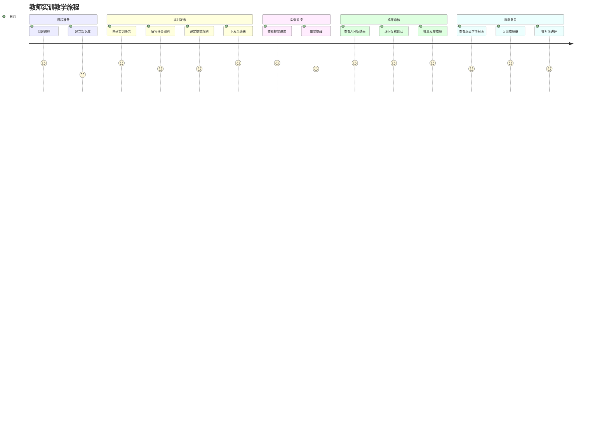
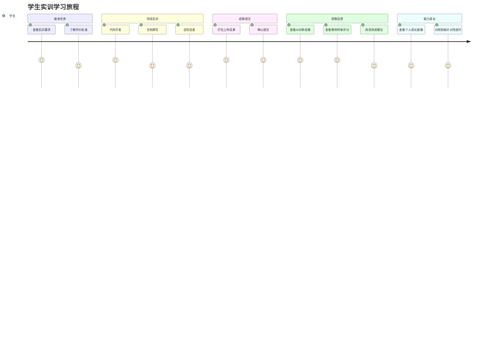
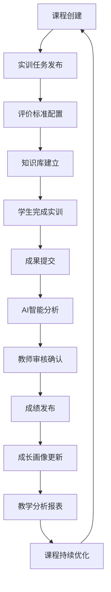
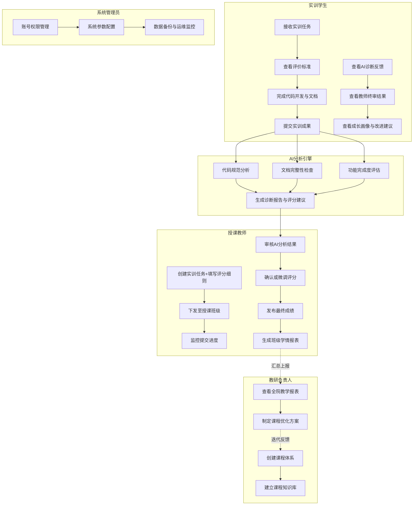
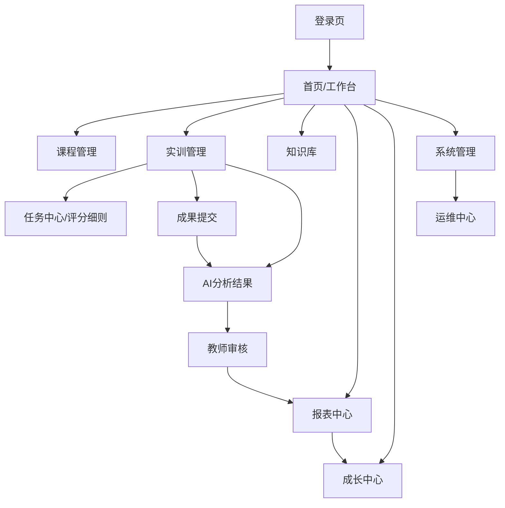

# 产品需求规格说明书（PRD）

## 基于大模型的软件实训教学检查评价与报表系统

| 文档信息 | |
|---|---|
| 文档版本 | v2.1 |
| 创建日期 | 2026-06-30 |
| 最后更新 | 2026-07-09 |
| 文档状态 | 评分融合版 |
| 撰写人 | 产品团队 |

> **v2.1 变更（2026-07-09）**：评分标准融合——移除教师端独立的"评价标准/标准库"页面，保留系统固定四维评价框架（雷达图/可追溯性），新增任务级 R/S/R 自定义评分细则，AI 评分时两者融合。详见 §8.3、§11.10。

---

# 1 项目背景

## 1.1 行业背景

高校软件类专业实训教学、课程设计、科创实训等环节是培养学生工程实践能力的核心环节。当前，全国开设软件工程、计算机科学与技术等相关专业的本科院校超过900所，职业院校超过1400所，年均参与软件实训的学生规模超过200万人。

然而，绝大多数院校的实训教学管理与成果评价仍依赖人工线下模式。教师需逐份下载、解压、核对学生的代码成果与实训报告，大班教学场景下单次实训的批改周期往往超过一周。随着职业教育扩招与实训项目多样化，传统模式已无法适配现代化教学管理需求。

## 1.2 政策背景

- **教育数字化战略**：教育部《教育信息化2.0行动计划》明确提出推进智慧教育创新发展，以人工智能、大数据等新技术驱动教学模式变革。
- **职业教育提质培优**：《职业教育提质培优行动计划（2020-2023年）》要求强化实践教学环节，提升实训教学质量监控能力。
- **工程教育认证**：中国工程教育专业认证协会（CEEAA）标准要求对学生达成度进行可量化的过程评价，传统人工评价方式难以满足认证数据要求。
- **新工科建设**：教育部推进新工科研究与改革实践项目，强调以信息技术重构工程实践教学体系。

## 1.3 软件实训痛点

| 序号 | 痛点 | 现状描述 |
|---|---|---|
| 1 | 成果核查效率低 | 教师逐份核对代码与报告，大班教学工作量呈指数级增长 |
| 2 | 评价标准不统一 | 不同教师、不同批次的评分尺度不一致，主观偏差大 |
| 3 | 学情数据无法沉淀 | 学生高频错误、能力薄弱点无法量化，教学过程缺乏数据支撑 |
| 4 | 报表生成繁琐 | 成绩统计、质量分析依赖人工整理，格式混乱，不满足归档要求 |
| 5 | 反馈周期过长 | 学生提交后需等待数日才能获得评价，实训效果打折扣 |
| 6 | 缺少成长跟踪 | 学生无法查看跨学期、跨课程的能力变化轨迹 |

## 1.4 行业发展趋势

- 教学评价从"结果导向"转向"过程+结果"双维度评估
- AI辅助教学从"概念验证"走向"规模化落地"
- 教育SaaS市场年复合增长率超过20%，垂直场景产品需求旺盛
- 实训管理从"单点工具"向"全流程平台"演进

---

# 2 产品定位

## 2.1 一句话定位

面向高校软件实训教学全流程的智能化管理与评价平台。

## 2.2 目标用户

| 用户角色 | 说明 |
|---|---|
| 授课教师 | 承担软件实训课程教学与成绩评定的任课教师 |
| 实训学生 | 高校软件相关专业在读本科生、专科生 |
| 教研负责人 | 教研室主任、专业负责人、实训中心负责人 |
| 系统管理员 | 院校信息化运维人员、实训中心管理员 |

## 2.3 产品价值

- **教师侧**：将批改工作量降低60%以上，聚焦教学设计与个性化辅导
- **学生侧**：实训成果提交后即时获得诊断反馈，明确改进方向
- **教研侧**：基于真实学情数据驱动课程迭代与教学改革决策
- **管理侧**：实训教学全流程数字化，满足教学归档与督导检查要求

## 2.4 核心理念

以**软件工程全生命周期**为主线，以**AI分析能力**为辅，构建"课程管理→实训发布→标准配置→成果提交→智能分析→教师审核→能力成长→教学复盘"的完整业务闭环。AI是平台能力而非系统主体，产品重心始终在软件实训教学本身。

---

# 3 产品目标

## 3.1 业务目标

| 目标 | 衡量指标 |
|---|---|
| 缩短实训批改周期 | 从平均7天降至2天以内 |
| 提升评价一致性 | 同批次评分方差缩小50%以上 |
| 报表生成自动化 | 教学报表一键生成，人工统计工作归零 |
| 学情数据可视化 | 班级/年级/全院实训数据实时可查 |

## 3.2 教学目标

- 建立标准化的软件实训评价体系，覆盖代码规范、功能完成度、设计质量、文档完整性四个维度
- 实现学生能力成长的可追踪、可量化、可对比
- 为工程教育认证提供过程评价数据支撑
- 支撑教研团队基于数据的实训课程持续优化

## 3.3 AI目标

AI在平台中的定位是**分析辅助工具**，具体目标包括：

- 对提交成果进行结构化问题诊断，输出可复核的扣分依据
- 基于评价标准自动生成初步评分建议
- 聚合学情数据，辅助识别教学薄弱环节
- 不替代教师决策，所有AI输出需经人工确认

---

# 4 商业价值

## 4.1 高校市场

面向本科院校、职业院校的计算机、软件工程、人工智能等相关专业，为院校实训中心、教务处提供一站式实训管理与评价服务。可对接高校智慧校园平台，替代传统人工考核模式，降低教学管理人力成本。

## 4.2 企业内训

适配互联网企业、软件公司的新员工岗前实训、技术培训考核场景。企业可自定义评价标准与知识库，实现新员工技术能力的标准化评估与成长跟踪。

## 4.3 职业教育

面向职业培训机构、软件技能培训班，提供轻量化的实训管理与能力认证服务。支持与职业技能等级证书培训体系对接。

## 4.4 SaaS商业模式

| 模式 | 说明 |
|---|---|
| 院校年度订阅 | 按院系规模分级定价，提供完整功能接入 |
| 院系按需采购 | 单院系轻量部署，按实训项目数或学生数计费 |
| 教师个人试用 | 免费基础版，支持单班级使用，降低获客门槛 |

## 4.5 未来商业拓展

- 实训学情数据脱敏后形成行业基准报告，面向教育研究机构提供数据服务
- 对接工程教育认证评估体系，为院校提供认证数据准备服务
- 实训竞赛评审模式，面向软件杯、蓝桥杯等赛事提供智能评审能力
# 5 用户画像

## 5.1 授课教师

| 维度 | 描述 |
|---|---|
| 职责 | 负责具体班级的实训课程教学、实训任务发布、进度跟进、成果审核与成绩评定 |
| 痛点 | 大班教学中代码与报告批改工作量大；纯AI评分不可信，需要人工复核机制；缺乏班级整体学情数据概览 |
| 需求 | 实训进度实时监控；AI辅助初评+人工确认的审核模式；班级成绩一键统计与导出 |
| 使用频率 | 实训周期内每日使用，高峰期集中在成果审核阶段 |
| 核心价值 | 减少60%以上重复性核查工作，聚焦教学设计与个性化辅导 |

## 5.2 实训学生

| 维度 | 描述 |
|---|---|
| 职责 | 按实训任务要求完成代码开发、文档撰写、成果提交，根据反馈进行改进 |
| 痛点 | 提交后反馈周期长（数日）；教师评语笼统，难以精准定位问题；无法查看个人能力成长轨迹 |
| 需求 | 多格式成果便捷提交；提交后即时获得问题诊断；分维度查看评分明细与改进建议；个人成长档案 |
| 使用频率 | 实训周期内高频使用，集中在开发与提交阶段 |
| 核心价值 | 即时反馈缩短学习循环，精准定位能力短板，形成可追踪的成长记录 |

## 5.3 教研负责人

| 维度 | 描述 |
|---|---|
| 职责 | 统筹专业课程体系、制定实训标准与评价指标、监控全院实训质量、推动课程改革 |
| 痛点 | 缺乏量化数据支撑教学决策；人工汇总报表效率低、准确性差；难以跨班级/跨学期对比分析 |
| 需求 | 统一配置评价标准模板；全院实训数据可视化总览；一键生成督导检查报表；跨学期对比分析 |
| 使用频率 | 学期初（标准配置）、学期末（数据复盘），阶段性使用 |
| 核心价值 | 基于真实学情数据驱动课程迭代，满足教学评估与认证数据要求 |

## 5.4 系统管理员

| 维度 | 描述 |
|---|---|
| 职责 | 系统初始化配置、账号权限管理、数据备份与安全运维、操作日志审计 |
| 痛点 | 多角色账号管理繁杂；实训数据量大，归档备份困难；权限混乱导致数据安全问题 |
| 需求 | 批量账号导入与管理；分级权限配置；全平台操作日志；数据自动备份与恢复 |
| 使用频率 | 学期初集中配置，日常低频维护 |
| 核心价值 | 保障系统稳定运行与数据安全，降低运维人力成本 |

---

# 6 用户旅程

## 6.1 教师用户旅程



## 6.2 学生用户旅程



---

# 7 业务流程

## 7.1 整体业务流程



## 7.2 泳道流程图



## 7.3 业务流程说明

**阶段一：课程筹备**
教研负责人创建课程体系，建立课程对应的知识库（含教学大纲、参考规范、常见问题等）。系统内置固定的四维评价框架，教师在创建实训任务时填写任务级评分细则（R/S/R）即可完成评分配置，无需单独维护标准模板。

**阶段二：实训执行**
教师创建实训任务并下发至班级，设定提交截止时间与提交格式要求。学生查看任务说明与评价标准后，完成代码开发、测试、文档撰写等实训工作，通过平台提交成果（支持ZIP压缩包、Git仓库地址、在线代码文本、PDF/Word文档、图片、视频等多种格式）。

**阶段三：智能分析**
系统接收学生提交成果后，自动触发AI分析引擎。分析引擎从代码规范、文档完整性、功能完成度等多个维度进行检查，生成结构化诊断报告与初步评分建议，标注具体问题位置与扣分依据。

**阶段四：教师审核**
教师查看AI分析结果，逐份复核诊断报告中的扣分项。教师可采纳AI建议、驳回不合理扣分、手动调整评分，并补充个性化评语。确认后发布最终成绩。

**阶段五：成长沉淀**
成绩发布后，系统自动更新学生的能力成长画像，生成个人实训成绩单与能力维度分析。同时聚合班级学情数据，生成教学分析报表。

**阶段六：教学优化**
教研负责人查看全院、跨班级的实训教学数据，识别共性薄弱环节，调整课程内容与实训设计，形成持续优化的教学闭环。
# 8 功能需求

## 8.1 课程管理模块

### 8.1.1 课程体系管理
- 创建、编辑、归档课程
- 课程基本信息维护（名称、代码、学期、学分、专业）
- 课程与授课教师、授课班级关联

### 8.1.2 课程大纲管理
- 录入课程教学目标与能力指标
- 关联实训项目与能力映射关系
- 课程资料（大纲、教材、参考资料）上传与管理

## 8.2 实训管理模块

### 8.2.1 实训任务管理
- 创建实训任务（名称、描述、要求、起止时间）
- 填写任务级评分细则（R/S/R，见 §8.3；系统自动关联固定四维框架）
- 配置提交规则（格式要求、截止时间、补交策略）
- 实训任务下发至指定班级

### 8.2.2 实训进度监控
- 班级提交进度实时统计（已提交/未提交/逾期）
- 学生个人提交状态跟踪
- 批量催交提醒（站内通知）

### 8.2.3 成果提交管理
- 多格式成果上传：ZIP压缩包、Git仓库地址、在线代码文本、PDF文档、Word文档、图片附件、视频链接
- 提交前格式校验与完整性检查
- 提交历史记录与覆盖提交
- 截止时间后提交自动标记逾期

## 8.3 评分标准与细则模块

> **v2.1 融合说明**：教师端不再单独维护"评价标准模板/标准库"页面。系统内置固定的四维评价框架（代码规范 / 功能完成度 / 设计质量 / 文档完整性），保证雷达图与可追溯性的结构统一；教师的个性化评分诉求在**创建任务时**以自由文本细则表达，两者在 AI 评分时融合。

### 8.3.1 系统默认四维框架
- 系统预置统一的四维评价标准（id=1000），为所有任务提供一致的评分骨架与权重
- 四维度：代码规范(30) / 功能完成度(30) / 设计质量(20) / 文档完整性(20)
- 框架固定不可由教师增删，确保跨教师、跨任务的评分尺度一致（雷达图/能力画像可横向对比）

### 8.3.2 任务级评分细则（R/S/R/O）
- 教师在新建/编辑任务时填写评分细则，采用 R/S/R/O 结构：
  - **Role**：阅卷者角色设定（如"资深阅卷教师"）
  - **Skill**：评分侧重能力（如"精准打分"）
  - **Rule**：具体扣分/加分规则（如"命名不规范扣2分"）
  - **Output Format**：由系统固定，教师无需填写
- 细则以原文保存于任务的 `grading_rule` 字段，编辑时可回填修改

### 8.3.3 AI 评分融合
- AI 分析时，在四维框架基础上追加任务级评分细则段落，共同构成系统提示词
- AI 输出仍为固定四维结构的评分明细，供雷达图展示与逐条追溯
- AI 只提供评分建议，最终决策权在教师

## 8.4 知识库模块

### 8.4.1 课程知识库
- 上传课程教学资料（大纲、课件、参考规范、优秀范例）
- 录入常见问题与标准答案
- 知识库与课程、实训任务关联

### 8.4.2 评价知识库
- 录入评分标准说明与示例
- 典型错误案例库（代码规范违规示例、文档缺陷示例）
- AI分析参考的领域知识文档

### 8.4.3 知识库检索
- 全文检索课程资料
- 按标签、分类筛选
- 知识库版本管理

## 8.5 AI分析模块

### 8.5.1 成果智能分析
- 代码规范检查（命名、结构、注释、异常处理）
- 文档完整性检查（格式、章节、图表、参考文献）
- 功能完成度评估（对照实训要求逐项核验）
- 设计质量分析（架构合理性、扩展性、复杂度）

### 8.5.2 诊断报告生成
- 按文件/章节定位具体问题
- 问题分类（规范类、逻辑类、完成度类）
- 逐条给出扣分依据与建议分值
- 生成结构化诊断报告

### 8.5.3 评分建议输出
- 综合各维度分析结果输出初步评分
- 评分明细可逐条追溯至具体问题
- 支持人工调整后重新计算

## 8.6 教师审核模块

### 8.6.1 审核工作台
- 班级学生提交列表（按提交时间/学号排序）
- 单个学生成果预览（代码、文档、附件在线查看）
- AI诊断报告展示（问题列表与扣分建议）

### 8.6.2 评分操作
- 逐条采纳/驳回AI扣分建议
- 手动增删扣分项
- 补充教师评语
- 总分自动计算

### 8.6.3 批量操作
- 批量确认无异常的提交
- 批量发布成绩
- 批量退回要求重交

## 8.7 报表中心模块

### 8.7.1 学生个人报表
- 实训成绩单（总分与各维度明细）
- 能力维度分析图
- 问题清单与改进建议
- 个人成长档案（跨学期成绩趋势）

### 8.7.2 班级学情报表
- 班级成绩分布统计
- 班级完成率与平均分
- 高频错误知识点统计
- 班级能力薄弱项分析

### 8.7.3 全院教学报表
- 全院实训质量总览
- 多班级横向对比
- 多学期纵向对比
- 教学质量趋势分析

### 8.7.4 报表导出
- 支持PDF、Excel格式导出
- 报表模板自定义
- 报表归档与历史查询

## 8.8 成长中心模块

### 8.8.1 能力画像
- 个人能力雷达图（多维度评分）
- 能力成长趋势图（按时间轴）
- 与班级/年级平均水平的对比

### 8.8.2 学习路径
- 基于短板分析推荐改进方向
- 关联知识库中的学习资料
- 实训项目与能力指标映射

## 8.9 系统管理模块

### 8.9.1 用户管理
- 批量导入/创建账号（学生、教师、教研负责人、管理员）
- 账号状态管理（启用、禁用、注销）
- 个人信息维护

### 8.9.2 权限管理
- 角色定义与权限分配
- 功能模块访问控制
- 数据权限隔离（班级/课程级）

### 8.9.3 系统配置
- 基础参数设置（学期、专业、班级）
- 全局评分规则初始化
- 通知与消息模板配置

## 8.10 运维中心模块

### 8.10.1 操作日志
- 全平台操作记录（用户、时间、操作类型、详情）
- 日志检索与筛选
- 异常操作告警

### 8.10.2 数据管理
- 实训数据备份与恢复
- 历史数据归档
- 数据导出与迁移

### 8.10.3 系统监控
- 系统运行状态面板
- 存储使用量监控
- API调用量统计

---

# 9 系统功能树

```
软件实训教学平台
├── 1. 课程管理
│   ├── 1.1 课程体系管理
│   │   ├── 课程创建与编辑
│   │   ├── 课程与教师/班级关联
│   │   └── 课程归档
│   └── 1.2 课程大纲管理
│       ├── 教学目标与能力指标配置
│       └── 课程资料上传与管理
│
├── 2. 实训管理
│   ├── 2.1 实训任务管理
│   │   ├── 实训任务创建与编辑
│   │   ├── 评分细则填写（R/S/R，融合固定四维框架）
│   │   ├── 提交规则配置
│   │   └── 任务下发至班级
│   ├── 2.2 实训进度监控
│   │   ├── 班级提交进度统计
│   │   ├── 学生提交状态跟踪
│   │   └── 批量催交提醒
│   └── 2.3 成果提交管理
│       ├── 多格式成果上传
│       ├── 格式校验与完整性检查
│       └── 提交历史管理
│
├── 3. 评分标准（融合于任务，无独立页面）
│   ├── 3.1 系统固定四维框架
│   │   └── 代码规范/功能完成度/设计质量/文档完整性
│   └── 3.2 任务级评分细则
│       ├── R/S/R 自由文本输入
│       └── AI 评分时与四维框架融合
│
├── 4. 知识库
│   ├── 4.1 课程知识库
│   │   ├── 教学资料管理
│   │   ├── 常见问题库
│   │   └── 知识库与课程关联
│   ├── 4.2 评价知识库
│   │   ├── 评分标准说明
│   │   └── 典型错误案例库
│   └── 4.3 知识库检索
│       ├── 全文检索
│       └── 标签分类筛选
│
├── 5. AI分析
│   ├── 5.1 成果智能分析
│   │   ├── 代码规范检查
│   │   ├── 文档完整性检查
│   │   ├── 功能完成度评估
│   │   └── 设计质量分析
│   ├── 5.2 诊断报告生成
│   │   ├── 问题定位与分类
│   │   └── 扣分依据输出
│   └── 5.3 评分建议输出
│       ├── 多维度综合评分
│       └── 明细逐条追溯
│
├── 6. 教师审核
│   ├── 6.1 审核工作台
│   │   ├── 提交成果列表
│   │   └── 成果预览与AI报告查看
│   ├── 6.2 评分操作
│   │   ├── 逐条审核AI建议
│   │   ├── 手动增删扣分项
│   │   └── 教师评语编辑
│   └── 6.3 批量操作
│       ├── 批量确认
│       ├── 批量发布成绩
│       └── 批量退回
│
├── 7. 报表中心
│   ├── 7.1 学生个人报表
│   │   ├── 实训成绩单
│   │   ├── 能力维度分析
│   │   └── 个人成长档案
│   ├── 7.2 班级学情报表
│   │   ├── 成绩分布统计
│   │   ├── 高频错误分析
│   │   └── 能力薄弱项报告
│   ├── 7.3 全院教学报表
│   │   ├── 全院质量总览
│   │   ├── 多班级对比
│   │   └── 多学期趋势分析
│   └── 7.4 报表导出
│       ├── PDF/Excel导出
│       └── 报表归档管理
│
├── 8. 成长中心
│   ├── 8.1 能力画像
│   │   ├── 能力雷达图
│   │   ├── 成长趋势图
│   │   └── 群体对比分析
│   └── 8.2 学习路径
│       ├── 短板分析
│       ├── 改进建议推荐
│       └── 学习资料关联
│
├── 9. 系统管理
│   ├── 9.1 用户管理
│   │   ├── 批量账号管理
│   │   └── 账号状态管控
│   ├── 9.2 权限管理
│   │   ├── 角色定义
│   │   └── 功能与数据权限
│   └── 9.3 系统配置
│       ├── 基础参数设置
│       └── 通知模板配置
│
└── 10. 运维中心
    ├── 10.1 操作日志
    │   ├── 全平台操作记录
    │   └── 日志检索与告警
    ├── 10.2 数据管理
    │   ├── 备份与恢复
    │   └── 数据归档
    └── 10.3 系统监控
        ├── 运行状态面板
        └── 资源用量统计
```

---

# 10 信息架构

## 10.1 整体架构

系统采用**统一入口+动态路由**的架构模式。所有用户通过同一登录页进入，系统根据角色权限动态呈现功能菜单与页面，避免角色孤岛，实现数据互通。

## 10.2 页面层级关系



## 10.3 角色页面映射

| 角色 | 可见页面 |
|---|---|
| 学生 | 首页、任务中心、成果提交、AI分析结果、报表中心（个人）、成长中心 |
| 教师 | 首页、课程管理、实训管理（任务级评分细则）、知识库、任务中心、成果提交（查看）、AI分析结果、教师审核、报表中心（班级） |
| 教研负责人 | 首页、课程管理、实训管理、知识库、报表中心（全院）、教师审核（只读） |
| 系统管理员 | 首页、系统管理、运维中心、用户管理、权限管理 |

---

# 11 页面原型说明

> 以下为页面业务框架描述，不涉及UI颜色、像素等视觉细节。

## 11.1 登录页

- **布局**：居中登录面板
- **功能区**：角色选择（学生/教师/教研负责人/管理员）、账号密码输入、登录按钮、忘记密码入口
- **核心交互**：选择角色后登录，系统校验权限并跳转至对应工作台
- **业务闭环**：统一入口实现角色权限隔离

## 11.2 首页

- **布局**：左侧导航菜单 + 顶部用户信息栏 + 中间数据看板
- **功能区**：
  - 数据统计卡片（根据角色展示不同指标）
  - 业务进度概览（实训任务状态、待审核数量等）
  - 待办事项提醒
  - 快捷入口
- **核心交互**：卡片点击可下钻至详情页
- **业务闭环**：角色差异化首页，快速触达核心业务

## 11.3 课程管理

- **布局**：左侧课程列表 + 右侧课程详情
- **功能区**：课程创建/编辑、课程与教师/班级关联、大纲管理、资料管理
- **核心交互**：创建课程后可关联教师与班级，配置教学目标与能力指标
- **业务闭环**：课程是实训的上层容器，建立课程-实训-评价的层级关系

## 11.4 实训管理

- **布局**：实训任务列表 + 进度监控面板
- **功能区**：实训任务创建/编辑、评分细则填写（R/S/R）、提交规则配置、任务下发、进度统计（已提交/未提交/逾期）
- **核心交互**：创建实训时在弹窗内填写任务级评分细则（自动关联固定四维框架），下发后实时监控提交进度，支持批量催交
- **业务闭环**：实训任务连接评分标准与学生提交，是业务流程的核心枢纽

## 11.5 任务中心

- **布局**：任务列表 + 筛选条件
- **功能区**：待完成/已完成/逾期任务分类展示、任务详情查看、截止时间提醒
- **核心交互**：点击任务进入成果提交页或查看已有评价结果
- **业务闭环**：学生统一入口查看所有实训任务状态

## 11.6 成果提交

- **布局**：任务信息区 + 成果提交区
- **功能区**：
  - 任务基本信息展示（名称、要求、截止时间）
  - 多格式提交入口：ZIP上传、Git地址输入、在线代码编辑、文档上传、图片上传、视频链接
  - 提交前格式校验提示
  - 保存草稿与确认提交按钮
- **核心交互**：选择提交方式后上传文件或输入地址，系统自动校验完整性
- **业务闭环**：多格式兼容降低提交门槛，提交后自动触发AI分析

## 11.7 AI分析结果

- **布局**：分析状态区 + 诊断报告区 + 评分明细区
- **功能区**：
  - 分析进度展示（排队中/分析中/已完成）
  - 诊断报告（按文件/章节列出问题，标注位置、类型、扣分依据）
  - 评分明细（各维度得分与总分）
- **核心交互**：学生查看诊断结果后可直接定位问题位置；教师进入审核工作台
- **业务闭环**：AI分析作为教师审核的辅助输入，所有结论可追溯

## 11.8 教师审核

- **布局**：学生列表 + 成果预览 + AI报告 + 评分操作区
- **功能区**：
  - 班级学生提交列表（按状态排序）
  - 成果在线预览（代码高亮、文档渲染）
  - AI诊断报告逐条展示（问题、位置、建议扣分）
  - 逐条采纳/驳回操作
  - 手动增删扣分项
  - 教师评语编辑区
  - 总分自动计算与显示
- **核心交互**：教师逐条审核AI建议，可采纳、驳回或调整，补充个性化评语后确认发布
- **业务闭环**：教师在AI辅助下保留最终裁决权，保障评分权威性

## 11.9 成长中心

- **布局**：能力画像区 + 成长趋势区 + 学习建议区
- **功能区**：
  - 个人能力雷达图（多维度评分可视化）
  - 能力成长趋势图（按时间轴展示历史成绩变化）
  - 与群体平均水平的对比
  - 短板分析与改进建议
  - 关联学习资料推荐
- **核心交互**：学生查看画像了解自身能力结构，点击建议链接跳转知识库学习
- **业务闭环**：实训评价结果沉淀为能力数据，驱动个性化学习路径

## 11.10 评分细则（融合于任务弹窗）

> **v2.1 融合说明**：原独立的"评价标准/标准库"页面已移除。评分标准分两部分：系统固定的四维框架（不可编辑）+ 任务级自定义细则（在任务弹窗内填写）。

- **布局**：内嵌于"新建/编辑任务"弹窗的评分细则区（GradingRuleForm 组件）
- **功能区**：
  - Role / Skill / Rule 三段自由文本输入
  - Output Format 系统固定，只读提示
  - 编辑任务时回填已存细则原文
- **核心交互**：教师在建/改任务时直接填写评分细则，无需跳转独立页面；AI 评分时与四维框架融合
- **业务闭环**：固定四维框架保证评分尺度统一（雷达图可比），任务级细则满足个性化评分诉求

## 11.11 知识库

- **布局**：分类目录 + 文档列表 + 文档预览区
- **功能区**：
  - 课程资料上传与管理
  - 常见问题库维护
  - 典型错误案例库维护
  - 全文检索
  - 标签分类筛选
- **核心交互**：教研与教师上传教学资料，AI分析引擎读取知识库辅助诊断，学生通过成长中心关联推荐学习
- **业务闭环**：知识库既是教学资源沉淀，也是AI分析的领域知识来源

## 11.12 教学分析

- **布局**：数据看板大屏布局
- **功能区**：
  - 全院实训质量总览（平均分、通过率、完成率）
  - 多班级横向对比图
  - 多学期纵向趋势图
  - 共性薄弱知识点统计
  - 一键生成督导检查报告
- **核心交互**：教研负责人查看全院宏观数据，导出标准化报表用于教学决策
- **业务闭环**：实训数据反哺教学，驱动课程体系持续优化

## 11.13 报表中心

- **布局**：报表类型选择 + 报表预览 + 导出操作区
- **功能区**：
  - 报表类型切换（个人/班级/全院）
  - 报表筛选条件（学期、课程、实训项目）
  - 报表预览（表格、图表混合展示）
  - PDF/Excel格式导出
  - 报表归档与历史查询
- **核心交互**：选择报表类型与筛选条件后生成预览，确认后一键导出
- **业务闭环**：满足不同角色、不同层级的报表需求，支撑教学归档与督导检查

## 11.14 系统管理

- **布局**：功能标签页切换
- **功能区**：
  - 用户管理（批量导入、账号状态管理）
  - 权限管理（角色定义、功能与数据权限矩阵）
  - 系统配置（学期、专业、班级基础参数）
- **核心交互**：管理员批量维护用户与权限，配置系统运行参数
- **业务闭环**：支撑多角色、多学期的系统持续运行

## 11.15 运维中心

- **布局**：监控面板 + 日志列表
- **功能区**：
  - 系统运行状态监控（服务状态、存储用量、API调用统计）
  - 全平台操作日志（按时间、用户、操作类型检索）
  - 数据备份与恢复操作
  - 异常告警配置
- **核心交互**：管理员实时监控系统运行，定期备份数据，审计异常操作
- **业务闭环**：保障系统安全稳定运行与数据完整性
# 12 AI能力设计

> AI是平台的底层分析能力，以多Agent协作方式嵌入业务流程，对用户透明。以下从产品能力角度说明各Agent的职责与业务价值，不涉及底层实现细节。

## 12.1 Document Agent（文档分析Agent）

- **职责**：分析学生提交的实训报告、设计文档、实验日志等文本类成果
- **分析维度**：文档结构完整性、章节逻辑连贯性、图表引用规范性、内容与实训要求匹配度
- **业务价值**：自动检查文档类成果的规范性，识别缺项漏项、格式错误、内容不匹配等问题，输出可追溯的诊断报告

## 12.2 Code Agent（代码分析Agent）

- **职责**：分析学生提交的源代码成果
- **分析维度**：代码结构规范性、命名规范、异常处理、资源管理、算法复杂度、设计模式运用
- **业务价值**：逐文件扫描代码质量，定位逻辑缺陷与不良实践，生成逐条可复核的扣分建议

## 12.3 Requirement Agent（需求对照Agent）

- **职责**：将实训任务要求与提交成果进行对照核验
- **分析维度**：功能点完成情况、需求覆盖率、核心功能实现验证
- **业务价值**：自动对比实训任务清单与学生成果，判断哪些需求已实现、哪些未完成，帮助教师快速判断完成度

## 12.4 Security Agent（安全检查Agent）

- **职责**：检测代码中的安全隐患与风险点
- **分析维度**：SQL注入风险、XSS漏洞、敏感信息硬编码、不安全的API调用、权限校验缺失
- **业务价值**：在教学中引入安全编码意识，自动标注潜在风险点，培养学生安全开发习惯

## 12.5 Summary Agent（汇总Agent）

- **职责**：聚合各Agent分析结果，生成统一的诊断报告与评分建议
- **分析维度**：去重合并各Agent输出、综合计算多维度评分、生成结构化诊断报告
- **业务价值**：将分散的分析结果整合为教师可直接审核的诊断报告，避免信息碎片化

## 12.6 RAG知识库

- **能力说明**：平台内置检索增强生成（RAG）能力，将课程知识库作为AI分析的领域知识来源
- **业务价值**：
  - AI分析时参考课程大纲、评分标准、典型范例，提升诊断准确性
  - 学生查询改进建议时，从知识库检索相关学习资料进行推荐
  - 支持教研持续更新知识库，分析效果随知识积累持续改善

## 12.7 规则引擎

- **能力说明**：平台内置可配置的规则引擎，支持教研自定义评分规则与策略
- **业务价值**：
  - 教研可通过可视化界面配置评分规则，无需编写代码
  - 规则支持组合、优先级、互斥等逻辑关系
  - 规则模板化，一次配置全院复用
  - AI分析结果与规则引擎联动，保证评分标准的一致性

## 12.8 能力画像

- **能力说明**：基于学生多次实训的多维度评分数据，聚合生成个人能力画像
- **业务价值**：
  - 学生直观了解自身能力结构与成长轨迹
  - 教师快速掌握班级整体能力分布
  - 教研基于全院能力数据优化课程设计
  - 为毕业达成度评价、工程教育认证提供数据支撑

## 12.9 学习路径

- **能力说明**：基于学生能力画像与短板分析，智能推荐个性化学习路径
- **业务价值**：
  - 针对学生能力薄弱点推荐知识库中的学习资料
  - 建议后续实训项目选择方向
  - 辅助教师制定差异化辅导方案

---

# 13 创新点设计

## 13.1 教学创新

| 创新点 | 说明 |
|---|---|
| 标准化评价体系 | 建立覆盖代码规范、完成度、设计质量、文档完整性的四维评价模型，评价标准模板化、可复用 |
| 过程性评价 | 从"只看最终分数"升级为"过程分析+结果评价"，学生可查看每个扣分点的问题与依据 |
| 能力成长追踪 | 跨学期、多课程的能力画像，学生可直观看到自身成长轨迹与群体定位 |
| 数据驱动教学优化 | 全院实训数据可视化，支撑教研团队的课程迭代与教改决策 |

## 13.2 软件工程创新

| 创新点 | 说明 |
|---|---|
| 多格式成果兼容 | 支持ZIP、Git、在线代码、PDF、Word、图片、视频等多种提交方式，适配不同实训类型 |
| 评价标准-规则引擎分离 | 评价标准是业务概念，规则引擎是技术实现，教研配置标准即可，无需接触底层规则 |
| 知识库驱动分析 | AI分析以课程知识库为参考依据，而非通用模型，保证诊断结果的领域相关性 |
| 完整的教学闭环 | 课程→实训→评价→成长→分析→优化的全链路管理，而非单点评分工具 |

## 13.3 AI创新

| 创新点 | 说明 |
|---|---|
| 多Agent协作 | Document Agent、Code Agent、Requirement Agent、Security Agent、Summary Agent分工协作，各司其职 |
| RAG知识库融合 | AI分析基于课程知识库进行检索增强，诊断结果有据可依，减少幻觉 |
| 可追溯诊断 | 每个扣分项标注具体位置、类型、依据，支持教师逐条复核，而非黑箱评分 |
| 人机协同模式 | AI给出建议，教师做出决策，保留教学主导权 |

## 13.4 商业创新

| 创新点 | 说明 |
|---|---|
| 垂直场景聚焦 | 专注软件实训这一细分赛道，不做泛化教学平台，功能深度优于覆盖广度 |
| SaaS分级服务 | 院校订阅、院系采购、教师试用三级服务体系，降低获客与转化门槛 |
| 认证数据输出 | 实训数据可对接工程教育认证体系，为院校提供认证数据准备能力 |
| 竞赛评审能力 | 可延伸至软件杯、蓝桥杯等编程竞赛的智能评审场景 |

---

# 14 MVP规划

## 14.1 P0（一期必须上线）

| 序号 | 功能模块 | 范围说明 |
|---|---|---|
| P0-1 | 多角色登录与权限隔离 | 学生、教师、教研负责人、管理员四角色，独立路由与功能菜单 |
| P0-2 | 课程管理 | 课程创建、编辑、与教师/班级关联 |
| P0-3 | 实训任务管理 | 实训创建、下发、提交规则配置 |
| P0-4 | 评分标准与细则 | 系统固定四维框架 + 任务级 R/S/R 自定义细则，AI 评分时融合 |
| P0-5 | 成果提交 | 支持ZIP上传与Git地址两种方式 |
| P0-6 | AI代码分析 | 代码规范、逻辑缺陷诊断，输出扣分建议 |
| P0-7 | AI文档分析 | 实训报告完整性、规范性检查 |
| P0-8 | 教师审核工作台 | AI诊断报告展示、逐条审核、评分确认 |
| P0-9 | 个人成绩报表 | 成绩单、维度评分明细、Excel导出 |
| P0-10 | 班级成绩报表 | 成绩分布统计、完成率统计、Excel导出 |

## 14.2 P1（二期迭代开发）

| 序号 | 功能模块 | 范围说明 |
|---|---|---|
| P1-1 | 知识库模块 | 课程资料管理、全文检索、AI分析引用知识库 |
| P1-2 | 规则引擎 | 可视化评分规则配置、规则模板管理 |
| P1-3 | 多Agent协作 | Requirement Agent需求对照、Security Agent安全检查、Summary Agent汇总 |
| P1-4 | 能力画像 | 个人能力雷达图、成长趋势图、群体对比 |
| P1-5 | 学习路径 | 短板分析、个性化学习资料推荐 |
| P1-6 | 扩展提交格式 | 在线代码、PDF、Word、图片、视频格式支持 |
| P1-7 | 全院教学报表 | 跨班级对比、跨学期趋势分析 |
| P1-8 | 运维中心 | 操作日志、数据备份、系统监控 |

## 14.3 P2（未来规划）

| 序号 | 功能模块 | 范围说明 |
|---|---|---|
| P2-1 | 在线代码编辑与实时反馈 | 平台内置在线IDE，编写过程中实时获得AI建议 |
| P2-2 | IDE插件集成 | VS Code/IntelliJ插件，本地开发时接入平台评价标准 |
| P2-3 | 实训查重检测 | 跨学生代码与文档相似度分析 |
| P2-4 | 知识图谱建模 | 课程知识点与能力指标的关联图谱 |
| P2-5 | 竞赛评审模式 | 支持软件杯等赛事的多评委独立评审与汇总 |
| P2-6 | API开放平台 | 允许第三方系统对接实训数据与评价能力 |
| P2-7 | 移动端适配 | 关键功能（进度查看、成绩查询）的移动端访问 |

---

# 15 产品演进路线

## 15.1 Version 1.0 — 基础闭环（当前版本）

**定位**：完成软件实训教学的核心业务闭环。

- 课程管理 + 实训管理 + 评价标准 + 成果提交 + AI分析 + 教师审核 + 报表生成
- 支持ZIP和Git两种提交方式
- Code Agent + Document Agent双Agent分析
- 四角色登录与权限隔离
- 个人与班级报表导出

**目标**：满足软件杯参赛作品验收标准，可在单院校完成试点部署。

## 15.2 Version 2.0 — 智能增强

**定位**：引入知识库、规则引擎与多Agent协作，提升分析深度与教学价值。

- 知识库模块上线，AI分析基于课程领域知识
- 规则引擎上线，教研可视化配置评分规则
- Requirement Agent、Security Agent、Summary Agent上线
- 能力画像与学习路径功能上线
- 扩展至6种提交格式
- 全院教学分析报表上线

**目标**：形成"评价标准→知识库→多Agent→能力画像"的智能教学增强链路。

## 15.3 Version 3.0 — 生态拓展

**定位**：从教学工具向教学生态平台演进。

- 在线IDE集成与实时反馈
- IDE插件生态（VS Code、IntelliJ）
- 实训查重与知识图谱
- 竞赛评审模式支持
- API开放平台
- 移动端适配
- 多院校SaaS化部署

**目标**：覆盖更多实训场景与用户群体，形成可持续运营的教学服务生态。

---

> **文档结束**
> 
> 版本：v2.0 | 日期：2026-06-30
