# 系统设计说明书（SDS）

## 基于大模型的软件实训教学检查评价与报表系统

| 文档信息 | |
|---|---|
| 文档版本 | v1.0 |
| 创建日期 | 2026-06-30 |
| 文档状态 | 初稿 |
| 撰写人 | 架构团队 |

---

# 1 总体架构设计

## 1.1 系统总体架构图

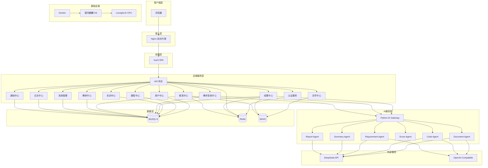

## 1.2 架构层次说明

| 层次 | 职责 | 关键技术 |
|---|---|---|
| 客户端层 | 用户交互界面 | 浏览器 |
| 接入层 | 反向代理、负载均衡、静态资源 | Nginx |
| 前端层 | 单页应用，动态路由与状态管理 | Vue3 + TypeScript + Vite |
| 后端服务层 | 业务逻辑处理，RESTful API | Spring Boot 3 + JDK21 |
| AI服务层 | AI分析引擎，多Agent协作 | Python + FastAPI |
| 数据层 | 持久化存储、缓存、对象存储 | MySQL + Redis + MinIO |
| 外部服务 | 大模型API调用 | DeepSeek / OpenAI Compatible |
| 基础设施 | 容器化部署，国产化适配 | Docker + 银河麒麟 + LoongArch |

## 1.3 模块划分

| 序号 | 模块 | 职责概述 |
|---|---|---|
| 1 | 用户中心 | 用户注册、登录、信息管理、角色权限 |
| 2 | 课程中心 | 课程创建、大纲管理、课程-教师-班级关联 |
| 3 | 实训中心 | 实训任务创建、下发、进度监控、提交管理 |
| 4 | 成果中心 | 多格式成果接收、存储、解析、预处理 |
| 5 | AI分析中心 | 多Agent协作分析，诊断报告生成 |
| 6 | 教师复核中心 | AI结果审核、评分调整、成绩发布 |
| 7 | 报表中心 | 个人/班级/全院报表生成与导出 |
| 8 | 教研中心 | 评价标准管理、知识库管理、教学数据分析 |
| 9 | 系统管理 | 用户管理、权限配置、系统参数 |
| 10 | 日志中心 | 操作日志、审计日志、AI调用日志 |
| 11 | 文件中心 | 文件上传下载、MinIO存储管理 |
| 12 | 通知中心 | 站内消息、催交通知、成绩发布通知 |

## 1.4 模块依赖关系

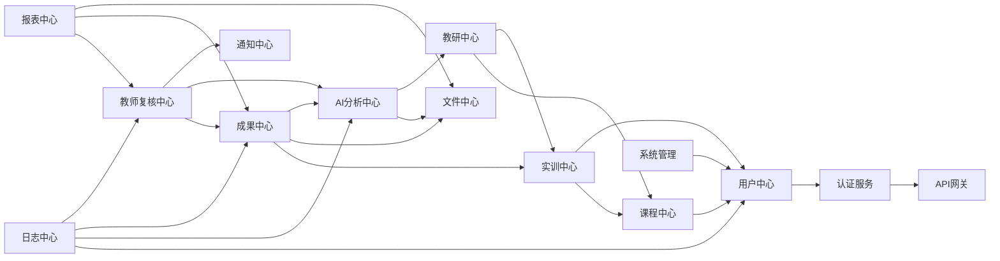

## 1.5 架构决策说明

**为什么采用微服务化的模块架构**

- 系统面向四类角色、十余个业务模块，单体架构耦合度高、扩展困难
- 模块化拆分后各中心独立开发、独立部署，支持团队并行
- AI服务使用Python生态（大模型SDK、文档解析库），独立部署避免语言冲突
- 前后端分离，前端专注交互体验，后端专注业务逻辑
- 各模块通过API网关统一入口，降低前端对接复杂度

---

# 2 技术架构

## 2.1 后端技术选型

### Spring Boot 3 + JDK21

| 维度 | 说明 |
|---|---|
| 选型理由 | 企业级Java主流框架，生态成熟，社区活跃 |
| JDK21 | 虚拟线程（Virtual Threads）显著提升AI调用等高I/O场景的并发能力 |
| 优势 | 自动配置、起步依赖、Actuator监控、与Spring Security/MyBatis Plus无缝集成 |
| 风险 | 启动速度较Go/Node.js慢，通过GraalVM Native Image可优化 |

### Spring Security + JWT

| 维度 | 说明 |
|---|---|
| 选型理由 | 无状态认证，适配前后端分离架构，无需服务端Session |
| 优势 | 跨服务传递用户身份，天然支持分布式部署；Token自带过期机制 |
| 风险 | Token泄露风险，通过HTTPS + 短有效期 + Refresh Token机制缓解 |

### MyBatis Plus

| 维度 | 说明 |
|---|---|
| 选型理由 | 简化CRUD，分页插件、逻辑删除、乐观锁开箱即用 |
| 优势 | 保留SQL灵活性，复杂查询不受ORM限制 |
| 风险 | 与JPA相比需手写部分SQL，通过代码生成器降低工作量 |

### MySQL 8

| 维度 | 说明 |
|---|---|
| 选型理由 | 全球最成熟的开源关系型数据库，高校教学系统事实标准 |
| 优势 | ACID事务保证数据一致性；InnoDB引擎支持行级锁与高并发；丰富索引类型（B+Tree/FullText）支撑复杂查询；成熟的主从复制与备份方案；与MyBatis Plus深度集成 |
| 风险 | 单点故障，通过主从复制 + 定期备份保障数据安全；后续可按需升级为MySQL Cluster或读写分离架构 |

### Redis

| 维度 | 说明 |
|---|---|
| 选型理由 | 高性能缓存，支撑JWT黑名单、验证码、报表缓存、分布式锁 |
| 优势 | 丰富数据结构（String/Hash/List/Set/ZSet），支持持久化 |
| 风险 | 内存成本，通过过期策略与淘汰策略控制 |

### MinIO

| 维度 | 说明 |
|---|---|
| 选型理由 | S3兼容的对象存储，私有化部署，无厂商锁定 |
| 优势 | 适合代码仓库文件、实训报告PDF、图片视频等非结构化数据存储 |
| 风险 | 单点故障，通过MinIO集群模式（Erasure Code）保证高可用 |

## 2.2 前端技术选型

### Vue3 + TypeScript + Vite

| 维度 | 说明 |
|---|---|
| 选型理由 | Vue3 Composition API与TypeScript结合提升大型项目可维护性 |
| Vite | 开发服务器秒级启动，HMR极速热更新 |
| Element Plus | 企业级UI组件库，Table/Form/Tree/Dialog等覆盖管理后台场景 |
| Pinia | Vue3官方推荐状态管理，模块化Store设计 |
| 风险 | TypeScript学习曲线，通过渐进式引入降低门槛 |

## 2.3 AI服务独立部署

| 维度 | 说明 |
|---|---|
| 选型理由 | AI服务依赖Python生态（LangChain、OpenAI SDK、Tika等），Java调用不便 |
| 架构 | Python FastAPI独立服务，通过HTTP/gRPC与Java后端通信 |
| 优势 | AI模型切换不影响主业务；AI服务可独立扩缩容 |
| 风险 | 跨语言调用增加网络延迟，通过异步消息队列（Redis Stream）解耦 |

## 2.4 Docker容器化

| 维度 | 说明 |
|---|---|
| 选型理由 | 统一开发/测试/生产环境，消除"在我机器上能跑"问题 |
| 优势 | Docker Compose一键编排全部服务（Nginx + Vue + SpringBoot + Python AI + MySQL + Redis + MinIO） |
| 国产化 | 适配银河麒麟操作系统与LoongArch架构的Docker镜像 |

---

# 3 系统分层设计

## 3.1 分层架构图

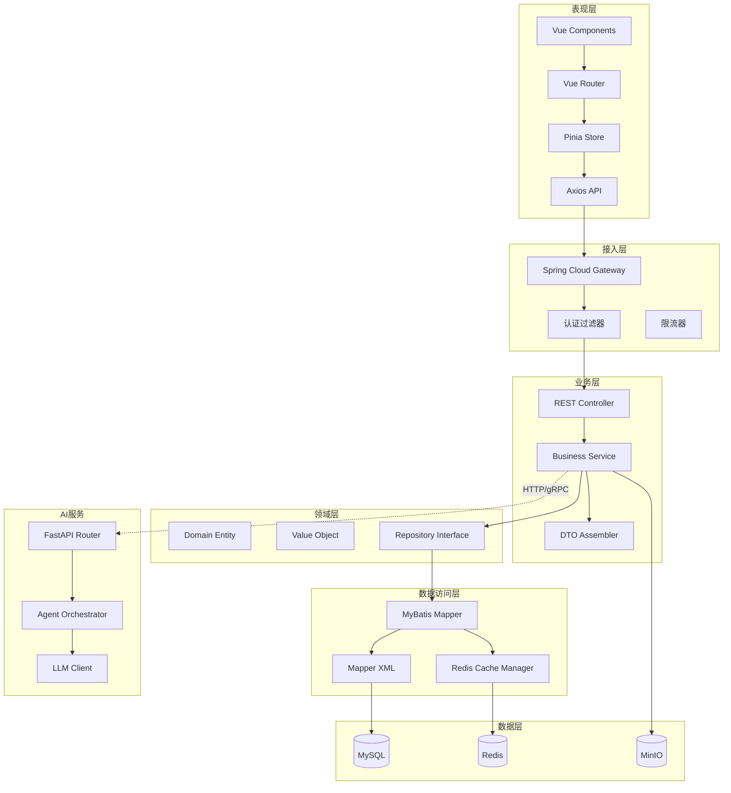

## 3.2 各层职责

| 层 | 职责 | 约束 |
|---|---|---|
| 表现层 | 页面渲染、用户交互、前端路由、状态管理 | 不直接访问数据库 |
| 接入层 | 统一入口、认证鉴权、限流熔断、请求路由 | 不包含业务逻辑 |
| 业务层 | 业务流程编排、事务管理、DTO转换、调用AI服务 | 不直接操作数据库连接 |
| 领域层 | 核心业务实体、值对象、仓储接口定义 | 不依赖框架特定注解 |
| 数据访问层 | SQL映射、缓存策略、数据库操作 | 不包含业务判断 |
| 数据层 | 数据持久化、缓存、文件存储 | 仅响应数据层调用 |
| AI服务 | 多Agent分析、LLM调用、诊断报告生成 | 不直接访问业务数据库 |

---

# 4 系统模块详细设计

## 4.1 用户中心（user-center）

| 维度 | 说明 |
|---|---|
| 职责 | 用户注册/登录/信息管理、角色权限验证、Token签发与刷新 |
| 输入 | 登录凭证（账号+密码+角色）、用户信息修改请求 |
| 输出 | JWT Token、用户信息、权限列表 |
| 依赖 | Redis（Token存储/黑名单）、MySQL（用户数据） |
| 核心接口 | POST /api/v1/auth/login、POST /api/v1/auth/refresh、GET /api/v1/auth/me、PUT /api/v1/user/profile |

## 4.2 课程中心（course-center）

| 维度 | 说明 |
|---|---|
| 职责 | 课程体系管理、课程创建/编辑/归档、课程-教师-班级关联 |
| 输入 | 课程基本信息、教学目标、能力指标 |
| 输出 | 课程详情、课程列表、关联教师与班级信息 |
| 依赖 | 用户中心（教师/学生信息） |
| 核心接口 | POST /api/course、GET /api/course/{id}、PUT /api/course/{id}、GET /api/course/list |

## 4.3 实训中心（training-center）

| 维度 | 说明 |
|---|---|
| 职责 | 实训任务创建/编辑/下发、提交规则配置、进度监控、催交管理 |
| 输入 | 实训任务信息、评价标准模板ID、提交规则 |
| 输出 | 实训任务详情、班级提交进度、学生提交状态 |
| 依赖 | 课程中心、教研中心（评价标准模板）、通知中心 |
| 核心接口 | POST /api/training、GET /api/training/{id}、PUT /api/training/{id}/publish、GET /api/training/{id}/progress |

## 4.4 成果中心（submission-center）

| 维度 | 说明 |
|---|---|
| 职责 | 多格式成果接收与校验、文件预处理、Git仓库拉取、提交管理 |
| 输入 | 学生提交成果（ZIP/Git/文本/PDF/Word/图片/视频） |
| 输出 | 提交记录、文件存储路径、预处理结果摘要 |
| 依赖 | 文件中心、AI分析中心 |
| 核心接口 | POST /api/submission、GET /api/submission/{id}、GET /api/submission/list |

## 4.5 AI分析中心（ai-center）

| 维度 | 说明 |
|---|---|
| 职责 | 多Agent协作分析、代码规范/文档完整性/需求完成度检查、诊断报告与评分建议生成 |
| 输入 | 提交成果文件路径、评价标准、知识库引用 |
| 输出 | 结构化诊断报告（问题定位+扣分依据+建议分值）、综合评分建议 |
| 依赖 | 文件中心、教研中心（知识库） |
| 核心接口 | POST /api/ai/analyze、GET /api/ai/status/{taskId}、GET /api/ai/result/{taskId} |

## 4.6 教师复核中心（review-center）

| 维度 | 说明 |
|---|---|
| 职责 | AI结果展示、逐条审核（采纳/驳回/调整）、评语编辑、成绩确认与发布 |
| 输入 | AI诊断报告、教师审核操作、评语 |
| 输出 | 最终成绩、审核状态、通知消息 |
| 依赖 | AI分析中心、通知中心、报表中心 |
| 核心接口 | GET /api/review/list、GET /api/review/{id}、PUT /api/review/{id}/item、POST /api/review/{id}/publish |

## 4.7 报表中心（report-center）

| 维度 | 说明 |
|---|---|
| 职责 | 个人/班级/全院多层级报表生成、图表渲染、PDF/Excel导出 |
| 输入 | 报表类型、筛选条件（学期/课程/实训项目） |
| 输出 | 报表预览数据、导出文件 |
| 依赖 | 成果中心、教师复核中心、文件中心 |
| 核心接口 | GET /api/report/student、GET /api/report/class、GET /api/report/college、POST /api/report/export |

## 4.8 教研中心（research-center）

| 维度 | 说明 |
|---|---|
| 职责 | 评价标准模板管理、评分维度与权重配置、知识库维护、全院教学数据分析 |
| 输入 | 评价标准配置、知识库文件上传、数据查询条件 |
| 输出 | 标准模板、知识库检索结果、教学分析数据 |
| 依赖 | 课程中心、文件中心 |
| 核心接口 | POST /api/standard、GET /api/standard/{id}、POST /api/knowledge、GET /api/knowledge/search、GET /api/research/analysis |

## 4.9 系统管理（system-center）

| 维度 | 说明 |
|---|---|
| 职责 | 用户批量管理、角色定义与权限分配、系统参数配置 |
| 输入 | 用户导入文件、权限矩阵配置、系统参数 |
| 输出 | 用户列表、权限树、配置信息 |
| 依赖 | 用户中心 |
| 核心接口 | POST /api/admin/user/batch、PUT /api/admin/role/{id}、GET /api/admin/config、PUT /api/admin/config |

## 4.10 日志中心（log-center）

| 维度 | 说明 |
|---|---|
| 职责 | 全平台操作日志采集、审计日志存储、AI调用记录、异常日志聚合 |
| 输入 | 各模块异步发送的日志事件 |
| 输出 | 日志检索结果、异常告警 |
| 依赖 | 无 |
| 核心接口 | GET /api/log/operation、GET /api/log/audit、GET /api/log/ai |

## 4.11 文件中心（file-center）

| 维度 | 说明 |
|---|---|
| 职责 | 文件上传/下载、MinIO存储管理、文件生命周期管理 |
| 输入 | 文件流、文件元数据 |
| 输出 | 文件访问URL、存储路径 |
| 依赖 | MinIO |
| 核心接口 | POST /api/file/upload、GET /api/file/download/{id}、DELETE /api/file/{id} |

## 4.12 通知中心（notify-center）

| 维度 | 说明 |
|---|---|
| 职责 | 站内消息推送、催交提醒、成绩发布通知、系统公告 |
| 输入 | 通知内容、目标用户、触发事件 |
| 输出 | 消息推送状态、用户未读计数 |
| 依赖 | 用户中心 |
| 核心接口 | POST /api/notify/send、GET /api/notify/list、PUT /api/notify/{id}/read |

---

# 5 AI架构设计

## 5.1 AI服务整体架构

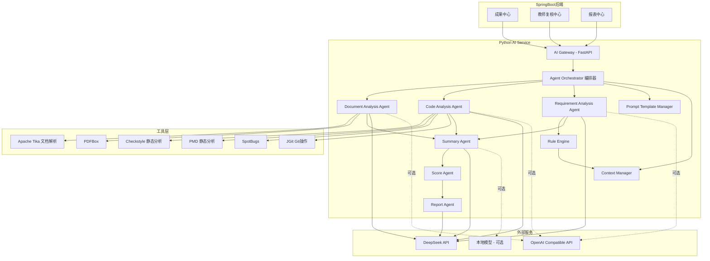

## 5.2 Agent 职责说明

### Document Analysis Agent（文档分析Agent）

| 维度 | 说明 |
|---|---|
| 职责 | 解析实训报告、设计文档、实验日志等文本类成果 |
| 分析维度 | 文档结构完整性、章节逻辑连贯性、图表规范、内容与实训要求匹配度 |
| 输入 | 文档文件（PDF/Word/Markdown）+ 实训要求描述 + 文档评分标准 |
| 输出 | 结构化问题列表（位置、类型、严重程度、扣分建议） |
| 工具 | Apache Tika（格式解析）、PDFBox（PDF提取）、POI（Word处理） |

### Code Analysis Agent（代码分析Agent）

| 维度 | 说明 |
|---|---|
| 职责 | 分析源代码质量、结构、安全性 |
| 分析维度 | 命名规范、代码结构、异常处理、资源管理、复杂度、安全漏洞 |
| 输入 | 源代码文件/仓库 + 代码评分标准 + 规则配置 |
| 输出 | 逐文件问题列表（行号、规则ID、描述、建议扣分） |
| 工具 | Checkstyle（规范检查）、PMD（代码质量）、SpotBugs（缺陷检测）、JGit（仓库拉取） |

### Requirement Analysis Agent（需求对照Agent）

| 维度 | 说明 |
|---|---|
| 职责 | 将实训任务要求与提交成果进行自动对照核验 |
| 分析维度 | 功能点完成情况、需求覆盖率、核心功能实现验证 |
| 输入 | 实训任务需求清单 + 提交成果（代码+文档）+ 需求对照规则 |
| 输出 | 需求完成状态矩阵（已完成/部分完成/未完成 + 证据位置） |
| 工具 | 规则引擎（自定义需求匹配规则） |

### Score Agent（评分Agent）

| 维度 | 说明 |
|---|---|
| 职责 | 综合三个分析Agent的输出，计算多维度评分 |
| 输入 | DocAgent问题列表 + CodeAgent问题列表 + ReqAgent需求矩阵 + 评价标准权重 |
| 输出 | 各维度评分明细（规范分、完成度分、设计分、文档分）+ 综合总分 |
| 策略 | 基于评价标准模板的权重配置进行加权计算，每个扣分项可追溯至源Agent |

### Summary Agent（汇总Agent）

| 维度 | 说明 |
|---|---|
| 职责 | 聚合所有Agent输出，去重合并，生成统一的结构化诊断报告 |
| 输入 | DocAgent + CodeAgent + ReqAgent + ScoreAgent 全部输出 |
| 输出 | 统一诊断报告JSON（问题分类汇总、评分明细、改进建议） |
| 策略 | 按文件/模块归并问题，同一位置多Agent发现问题时合并展示 |

### Report Agent（报告Agent）

| 维度 | 说明 |
|---|---|
| 职责 | 将诊断报告转换为可读的文本描述，生成教师审核视图与学生反馈视图 |
| 输入 | SummaryAgent统一诊断报告 + 知识库参考 |
| 输出 | 教师端审核报告（含扣分依据与建议）、学生端反馈报告（含改进建议与学习资料推荐） |
| 策略 | 教师端侧重逐条可审核的专业诊断，学生端侧重可操作的学习建议 |

## 5.3 Agent协同流程

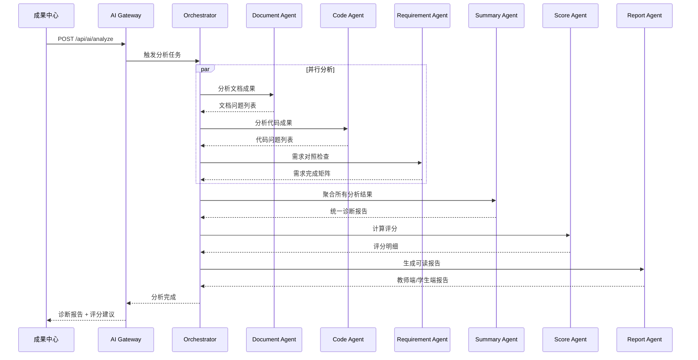

## 5.4 避免大模型幻觉的策略

| 策略 | 说明 |
|---|---|
| 静态分析优先 | CodeAgent先通过Checkstyle/PMD/SpotBugs进行确定性检查，仅将语义问题交给大模型 |
| 规则引擎约束 | 明确可量化的检查项（文件存在性、目录结构、命名规范）由规则引擎处理，不经过大模型 |
| 知识库锚定 | AI分析时注入课程知识库（教学大纲、评分标准、典型范例）作为参考上下文 |
| 结构化输出约束 | 大模型输出严格遵循JSON Schema，包含文件路径、行号等可验证的定位信息 |
| 教师复核机制 | 所有AI结论需经教师逐条审核确认，AI不直接发布成绩 |
| 置信度标注 | 每个AI分析结论附带置信度评分，低置信度结论高亮提示教师重点关注 |
| 多模型交叉验证 | 关键分析项可同时调用DeepSeek与OpenAI，结果不一致时标记为"需人工判断" |

## 5.5 教师复核流程

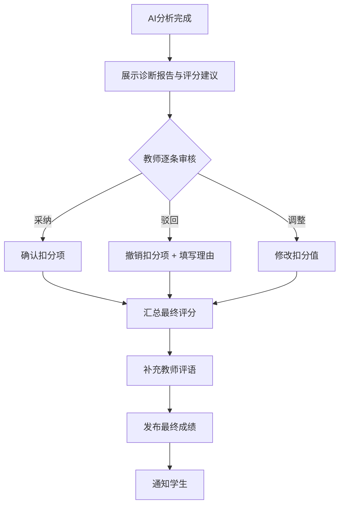

---

# 6 系统流程设计

## 6.1 登录流程

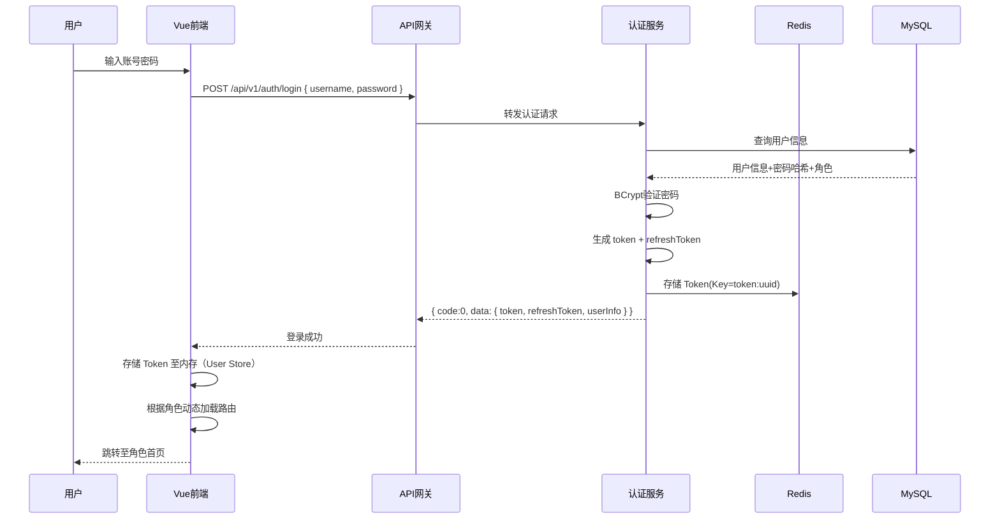

## 6.2 创建课程流程

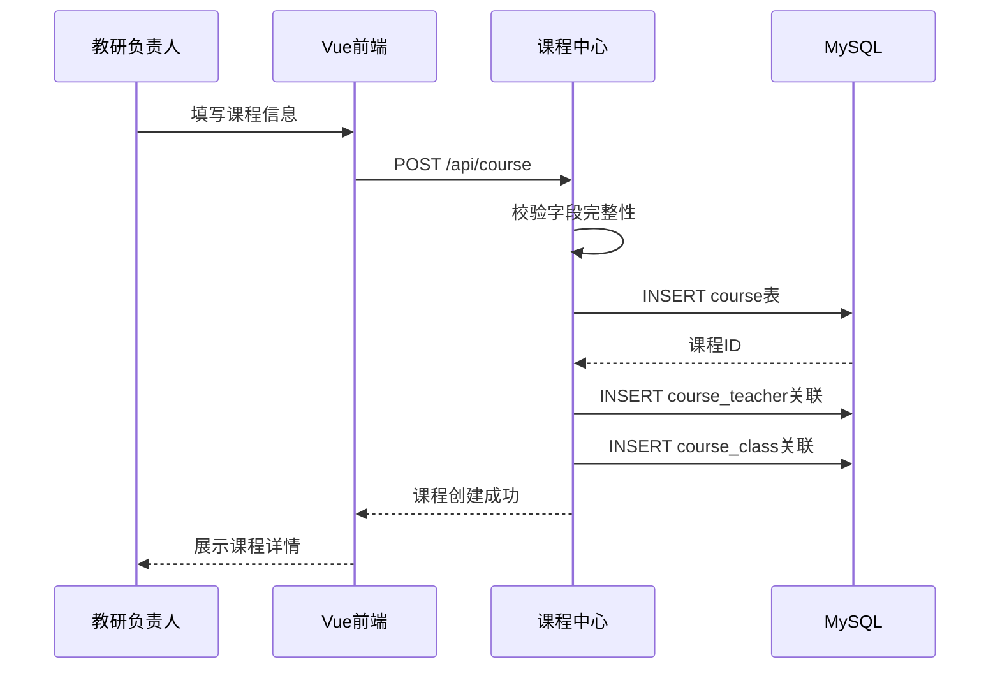

## 6.3 发布实训流程

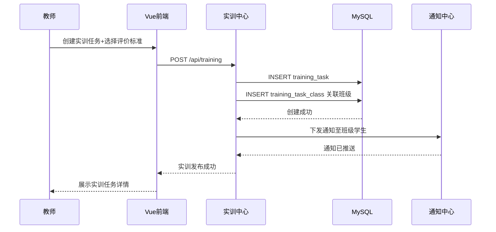

## 6.4 学生提交流程

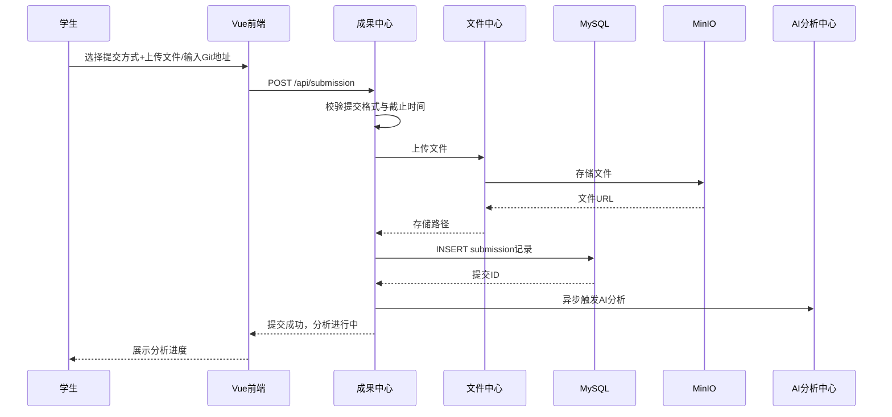

## 6.5 AI分析流程

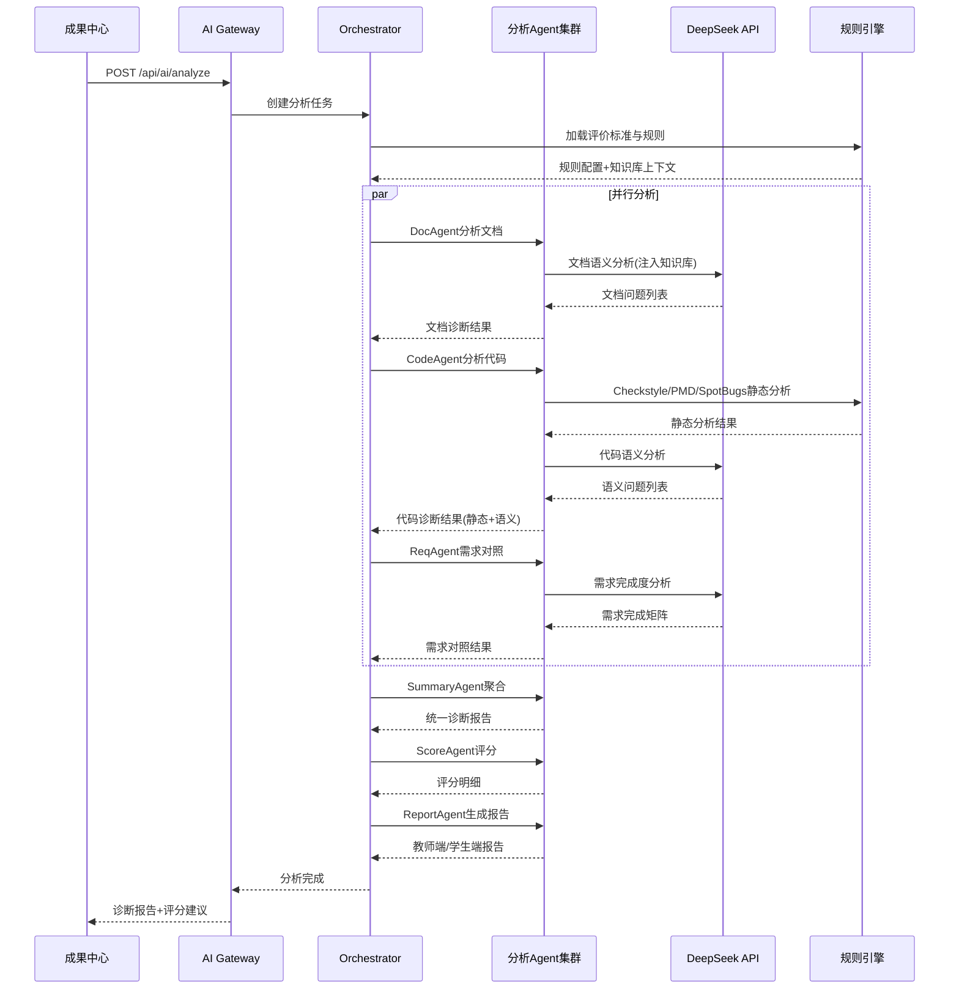

## 6.6 教师审核流程

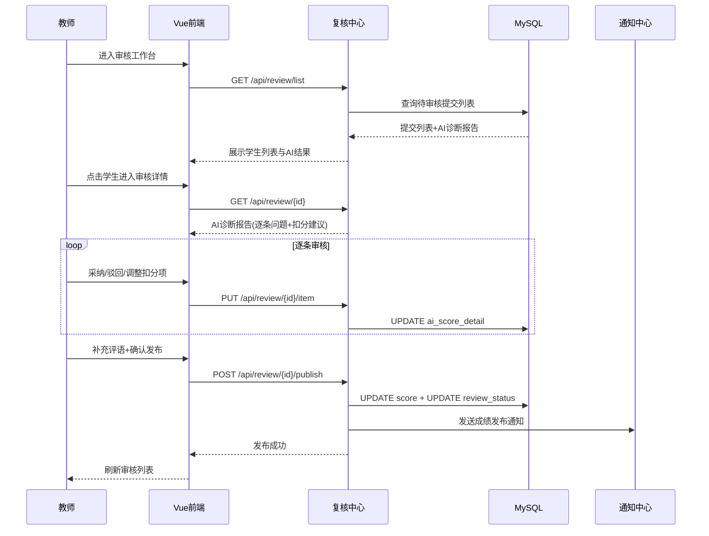

## 6.7 成绩发布流程

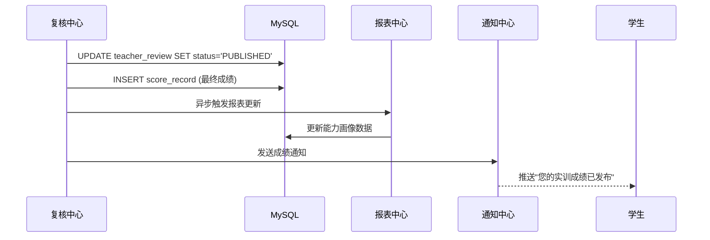

## 6.8 PDF导出流程

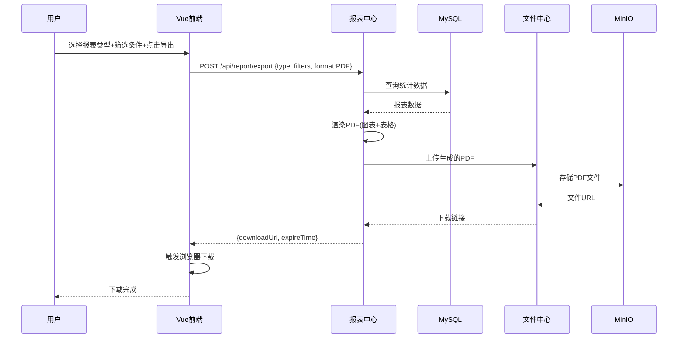

---

# 7 部署架构

## 7.1 部署架构图

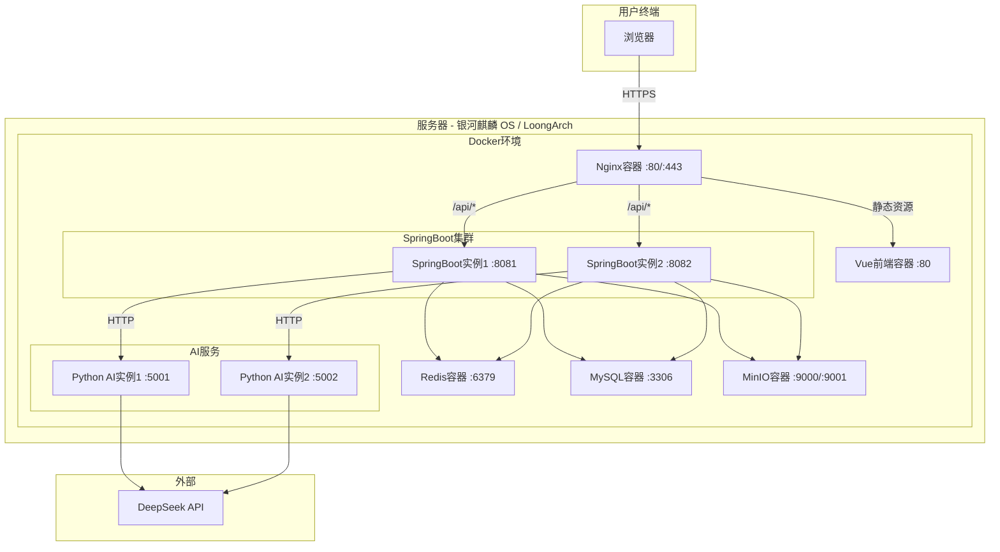

## 7.2 部署组件说明

| 组件 | 端口 | 实例数 | 说明 |
|---|---|---|---|
| Nginx | 80/443 | 1 | 反向代理 + 静态资源 + HTTPS |
| Vue前端 | 80（内部） | 1 | Nginx内嵌静态文件 |
| SpringBoot | 8081-8082 | 2 | 负载均衡，支持水平扩展 |
| Redis | 6379 | 1 | 缓存 + Session共享 |
| MySQL | 3306 | 1 | 主库，可扩展主从 |
| MinIO | 9000/9001 | 1 | API端口9000，控制台9001 |
| Python AI | 5001-5002 | 2 | AI服务独立扩缩容 |

## 7.3 国产化适配

| 组件 | 适配说明 |
|---|---|
| 银河麒麟OS | 基于Linux内核，Docker官方支持，所有容器镜像兼容 |
| LoongArch | SpringBoot通过OpenJDK for LoongArch运行，Python通过龙芯优化版运行 |
| Docker镜像 | 优先使用loongarch64架构镜像，无官方镜像时通过Docker Buildx交叉编译 |

## 7.4 Docker Compose 编排

```
服务编排顺序：
1. MySQL（数据库初始化 + 表结构迁移）
2. Redis（缓存服务启动）
3. MinIO（对象存储启动 + Bucket创建）
4. Python AI Service（AI引擎启动 + 模型预热）
5. SpringBoot（后端服务启动 + 健康检查）
6. Nginx + Vue（前端与反向代理启动）
```
# 8 数据库设计

## 8.1 ER图

```mermaid
erDiagram
    User ||--o{ UserRole : has
    Role ||--o{ UserRole : assigned
    User ||--o{ CourseTeacher : teaches
    User ||--o{ CourseStudent : enrolls
    User ||--o{ Submission : submits
    User ||--o{ TeacherReview : reviews
    User ||--o{ OperationLog : generates
    User ||--o{ Notification : receives

    Course ||--o{ CourseTeacher : assigned
    Course ||--o{ CourseStudent : enrolled
    Course ||--o{ TrainingTask : contains
    Course ||--o{ KnowledgeBase : has

    TrainingTask ||--o{ TrainingClass : published_to
    TrainingTask ||--o{ Submission : receives
    TrainingTask ||--o{ EvaluationStandard : uses

    Class ||--o{ CourseStudent : has
    Class ||--o{ TrainingClass : receives

    Submission ||--o{ SubmissionFile : contains
    Submission ||--o{ AIScore : analyzed_by
    Submission ||--o{ TeacherReview : reviewed_by

    AIScore ||--o{ AIScoreDetail : consists_of

    TeacherReview ||--o{ ScoreDetail : adjusted_by
    TeacherReview ||--o{ FinalScore : produces

    EvaluationStandard ||--o{ StandardDimension : defines
    StandardDimension ||--o{ StandardRule : contains

    FileStorage ||--o{ SubmissionFile : stores
    FileStorage ||--o{ KnowledgeBase : stores

    KnowledgeBase ||--o{ KnowledgeDocument : contains
    
    Report ||--o{ User : belongs_to
    Report ||--o{ TrainingTask : based_on
```

## 8.2 实体关系说明

| 实体 | 核心关系 |
|---|---|
| User | 通过UserRole关联Role，形成多对多RBAC |
| Course | 关联多个教师(CourseTeacher)和学生(CourseStudent)，包含多个实训任务 |
| TrainingTask | 属于一个Course，通过TrainingClass下发至多个Class |
| Submission | 属于一个学生和一个TrainingTask，包含多个File，产生一份AIScore |
| AIScore | 包含多条AIScoreDetail（每个扣分项一条记录） |
| TeacherReview | 教师对一份Submission的审核，产生FinalScore |
| EvaluationStandard | 包含多个StandardDimension，每个维度包含多条StandardRule |
| KnowledgeBase | 关联Course，包含多个KnowledgeDocument |
| Report | 关联User和TrainingTask，支持缓存与导出 |
| OperationLog | 记录全平台用户操作，关联User |
| Notification | 推送至User，关联触发事件 |

---

# 9 数据库表设计

## 9.1 字段规范

| 规范项 | 说明 |
|---|---|
| 主键 | 统一使用 `id BIGINT AUTO_INCREMENT` |
| 逻辑删除 | 统一使用 `is_deleted TINYINT DEFAULT 0` |
| 创建/更新时间 | 统一使用 `create_time` / `update_time DATETIME` |
| 枚举字段 | 使用 `VARCHAR(32)` 存储枚举值名称，代码层映射 |
| 状态字段 | 使用 `TINYINT` 存储状态码 |
| 命名规范 | 表名小写下划线，字段名小写下划线 |
| 字符集 | 统一 `utf8mb4` |
| 引擎 | 统一 `InnoDB` |

## 9.2 核心数据表

### 9.2.1 user（用户表）

| 字段 | 类型 | 非空 | 默认值 | 说明 |
|---|---|---|---|---|
| id | BIGINT | Y | AUTO | 主键 |
| username | VARCHAR(64) | Y | - | 登录账号（学号/工号） |
| password | VARCHAR(256) | Y | - | BCrypt加密 |
| real_name | VARCHAR(64) | Y | - | 真实姓名 |
| email | VARCHAR(128) | N | NULL | 邮箱 |
| phone | VARCHAR(20) | N | NULL | 手机号 |
| avatar_url | VARCHAR(512) | N | NULL | 头像URL |
| status | TINYINT | Y | 1 | 0禁用 1启用 |
| is_deleted | TINYINT | Y | 0 | 逻辑删除 |
| create_time | DATETIME | Y | NOW() | 创建时间 |
| update_time | DATETIME | Y | NOW() | 更新时间 |

**索引**：`uk_username (username)` UNIQUE, `idx_status (status)`, `idx_create_time (create_time)`

### 9.2.2 role（角色表）

| 字段 | 类型 | 非空 | 默认值 | 说明 |
|---|---|---|---|---|
| id | BIGINT | Y | AUTO | 主键 |
| role_code | VARCHAR(32) | Y | - | 角色编码（admin/teacher/student） |
| role_name | VARCHAR(64) | Y | - | 角色名称 |
| description | VARCHAR(256) | N | NULL | 角色描述 |
| is_deleted | TINYINT | Y | 0 | 逻辑删除 |
| create_time | DATETIME | Y | NOW() | 创建时间 |
| update_time | DATETIME | Y | NOW() | 更新时间 |

**索引**：`uk_role_code (role_code)` UNIQUE

### 9.2.3 user_role（用户角色关联表）

| 字段 | 类型 | 非空 | 默认值 | 说明 |
|---|---|---|---|---|
| id | BIGINT | Y | AUTO | 主键 |
| user_id | BIGINT | Y | - | 用户ID |
| role_id | BIGINT | Y | - | 角色ID |
| create_time | DATETIME | Y | NOW() | 创建时间 |

**索引**：`uk_user_role (user_id, role_id)` UNIQUE, `idx_role_id (role_id)`

### 9.2.4 course（课程表）

| 字段 | 类型 | 非空 | 默认值 | 说明 |
|---|---|---|---|---|
| id | BIGINT | Y | AUTO | 主键 |
| course_code | VARCHAR(32) | Y | - | 课程代码 |
| course_name | VARCHAR(128) | Y | - | 课程名称 |
| semester | VARCHAR(32) | Y | - | 学期（2026-春） |
| credits | DECIMAL(3,1) | N | NULL | 学分 |
| description | TEXT | N | NULL | 课程描述 |
| status | TINYINT | Y | 1 | 0归档 1进行中 2未开始 |
| is_deleted | TINYINT | Y | 0 | 逻辑删除 |
| create_by | BIGINT | Y | - | 创建人ID |
| create_time | DATETIME | Y | NOW() | 创建时间 |
| update_time | DATETIME | Y | NOW() | 更新时间 |

**索引**：`uk_course_code (course_code)` UNIQUE, `idx_semester (semester)`, `idx_create_by (create_by)`

### 9.2.5 class（班级表）

| 字段 | 类型 | 非空 | 默认值 | 说明 |
|---|---|---|---|---|
| id | BIGINT | Y | AUTO | 主键 |
| class_code | VARCHAR(32) | Y | - | 班级编号 |
| class_name | VARCHAR(128) | Y | - | 班级名称 |
| grade | VARCHAR(16) | N | NULL | 年级 |
| major | VARCHAR(128) | N | NULL | 专业 |
| is_deleted | TINYINT | Y | 0 | 逻辑删除 |
| create_time | DATETIME | Y | NOW() | 创建时间 |
| update_time | DATETIME | Y | NOW() | 更新时间 |

**索引**：`uk_class_code (class_code)` UNIQUE

### 9.2.6 course_teacher（课程-教师关联表）

| 字段 | 类型 | 非空 | 默认值 | 说明 |
|---|---|---|---|---|
| id | BIGINT | Y | AUTO | 主键 |
| course_id | BIGINT | Y | - | 课程ID |
| user_id | BIGINT | Y | - | 教师用户ID |
| create_time | DATETIME | Y | NOW() | 创建时间 |

**索引**：`uk_course_teacher (course_id, user_id)` UNIQUE

### 9.2.7 course_student（课程-学生关联表）

| 字段 | 类型 | 非空 | 默认值 | 说明 |
|---|---|---|---|---|
| id | BIGINT | Y | AUTO | 主键 |
| course_id | BIGINT | Y | - | 课程ID |
| user_id | BIGINT | Y | - | 学生用户ID |
| class_id | BIGINT | Y | - | 班级ID |
| create_time | DATETIME | Y | NOW() | 创建时间 |

**索引**：`uk_course_student (course_id, user_id)` UNIQUE, `idx_class_id (class_id)`

### 9.2.8 training_task（实训任务表）

| 字段 | 类型 | 非空 | 默认值 | 说明 |
|---|---|---|---|---|
| id | BIGINT | Y | AUTO | 主键 |
| course_id | BIGINT | Y | - | 所属课程ID |
| task_name | VARCHAR(256) | Y | - | 任务名称 |
| description | TEXT | N | NULL | 任务描述 |
| requirement | TEXT | N | NULL | 实训要求（Markdown） |
| standard_id | BIGINT | N | NULL | 评价标准模板ID |
| start_time | DATETIME | Y | - | 开始时间 |
| end_time | DATETIME | Y | - | 截止时间 |
| allow_late | TINYINT | Y | 0 | 是否允许补交 |
| late_penalty | DECIMAL(3,2) | N | NULL | 补交扣分比例（如0.8=扣20%） |
| status | TINYINT | Y | 0 | 0草稿 1已发布 2已结束 |
| create_by | BIGINT | Y | - | 创建人ID |
| is_deleted | TINYINT | Y | 0 | 逻辑删除 |
| create_time | DATETIME | Y | NOW() | 创建时间 |
| update_time | DATETIME | Y | NOW() | 更新时间 |

**索引**：`idx_course_id (course_id)`, `idx_status (status)`, `idx_end_time (end_time)`

### 9.2.9 training_class（实训-班级关联表）

| 字段 | 类型 | 非空 | 默认值 | 说明 |
|---|---|---|---|---|
| id | BIGINT | Y | AUTO | 主键 |
| training_id | BIGINT | Y | - | 实训任务ID |
| class_id | BIGINT | Y | - | 班级ID |
| create_time | DATETIME | Y | NOW() | 创建时间 |

**索引**：`uk_training_class (training_id, class_id)` UNIQUE

### 9.2.10 submission（成果提交表）

| 字段 | 类型 | 非空 | 默认值 | 说明 |
|---|---|---|---|---|
| id | BIGINT | Y | AUTO | 主键 |
| training_id | BIGINT | Y | - | 实训任务ID |
| user_id | BIGINT | Y | - | 学生ID |
| submit_type | VARCHAR(32) | Y | - | ZIP/GIT/CODE/PDF/WORD/IMAGE/VIDEO |
| git_url | VARCHAR(512) | N | NULL | Git仓库地址 |
| git_branch | VARCHAR(128) | N | 'main' | Git分支 |
| online_code | LONGTEXT | N | NULL | 在线代码文本 |
| summary | TEXT | N | NULL | 实训总结 |
| submit_time | DATETIME | Y | NOW() | 提交时间 |
| is_late | TINYINT | Y | 0 | 是否逾期 |
| status | TINYINT | Y | 0 | 0已提交 1分析中 2已完成 3教师已审核 |
| is_deleted | TINYINT | Y | 0 | 逻辑删除 |
| create_time | DATETIME | Y | NOW() | 创建时间 |
| update_time | DATETIME | Y | NOW() | 更新时间 |

**索引**：`uk_submission (training_id, user_id)` UNIQUE, `idx_user_id (user_id)`, `idx_status (status)`

### 9.2.11 submission_file（提交文件表）

| 字段 | 类型 | 非空 | 默认值 | 说明 |
|---|---|---|---|---|
| id | BIGINT | Y | AUTO | 主键 |
| submission_id | BIGINT | Y | - | 提交ID |
| file_id | BIGINT | Y | - | 文件存储ID |
| file_name | VARCHAR(256) | Y | - | 原始文件名 |
| file_type | VARCHAR(32) | Y | - | 文件类型（CODE/DOC/IMAGE/OTHER） |
| file_size | BIGINT | Y | 0 | 文件大小（字节） |
| sort_order | INT | Y | 0 | 排序 |
| create_time | DATETIME | Y | NOW() | 创建时间 |

**索引**：`idx_submission_id (submission_id)`, `idx_file_id (file_id)`

### 9.2.12 file_storage（文件存储表）

| 字段 | 类型 | 非空 | 默认值 | 说明 |
|---|---|---|---|---|
| id | BIGINT | Y | AUTO | 主键 |
| bucket | VARCHAR(64) | Y | - | MinIO Bucket |
| object_key | VARCHAR(512) | Y | - | MinIO对象Key |
| original_name | VARCHAR(256) | Y | - | 原始文件名 |
| content_type | VARCHAR(128) | Y | - | MIME类型 |
| file_size | BIGINT | Y | 0 | 文件大小 |
| file_md5 | VARCHAR(64) | Y | - | 文件MD5校验 |
| access_url | VARCHAR(1024) | N | NULL | 访问URL（预签名） |
| expire_time | DATETIME | N | NULL | URL过期时间 |
| is_deleted | TINYINT | Y | 0 | 逻辑删除 |
| create_by | BIGINT | Y | - | 上传人ID |
| create_time | DATETIME | Y | NOW() | 创建时间 |

**索引**：`uk_object_key (object_key)` UNIQUE, `idx_file_md5 (file_md5)`, `idx_create_by (create_by)`

### 9.2.13 evaluation_standard（评价标准模板表）

| 字段 | 类型 | 非空 | 默认值 | 说明 |
|---|---|---|---|---|
| id | BIGINT | Y | AUTO | 主键 |
| standard_name | VARCHAR(128) | Y | - | 模板名称 |
| description | VARCHAR(512) | N | NULL | 模板描述 |
| version | INT | Y | 1 | 版本号 |
| status | TINYINT | Y | 1 | 0归档 1启用 |
| is_deleted | TINYINT | Y | 0 | 逻辑删除 |
| create_by | BIGINT | Y | - | 创建人ID |
| create_time | DATETIME | Y | NOW() | 创建时间 |
| update_time | DATETIME | Y | NOW() | 更新时间 |

**索引**：`idx_create_by (create_by)`, `idx_status (status)`

### 9.2.14 standard_dimension（评价维度表）

| 字段 | 类型 | 非空 | 默认值 | 说明 |
|---|---|---|---|---|
| id | BIGINT | Y | AUTO | 主键 |
| standard_id | BIGINT | Y | - | 标准模板ID |
| dim_name | VARCHAR(64) | Y | - | 维度名称（代码规范/完成度/设计质量/文档规范） |
| weight | DECIMAL(5,2) | Y | - | 权重百分比（如30.00=30%） |
| sort_order | INT | Y | 0 | 排序 |
| create_time | DATETIME | Y | NOW() | 创建时间 |

**索引**：`idx_standard_id (standard_id)`

### 9.2.15 standard_rule（评分规则表）

| 字段 | 类型 | 非空 | 默认值 | 说明 |
|---|---|---|---|---|
| id | BIGINT | Y | AUTO | 主键 |
| dimension_id | BIGINT | Y | - | 评价维度ID |
| rule_name | VARCHAR(128) | Y | - | 规则名称 |
| rule_type | VARCHAR(32) | Y | - | AUTO（自动检测）/MANUAL（人工评判） |
| check_type | VARCHAR(32) | N | NULL | REGEX/FILE_EXISTS/DIR_STRUCT/AI_SEMANTIC |
| check_config | JSON | N | NULL | 检查配置（正则表达式/文件名模式等） |
| max_deduct | INT | Y | 5 | 最大扣分值 |
| severity | VARCHAR(16) | Y | 'MINOR' | MINOR/MAJOR/CRITICAL |
| description | VARCHAR(512) | N | NULL | 规则说明 |
| is_deleted | TINYINT | Y | 0 | 逻辑删除 |
| create_time | DATETIME | Y | NOW() | 创建时间 |

**索引**：`idx_dimension_id (dimension_id)`, `idx_rule_type (rule_type)`

### 9.2.16 ai_score（AI评分记录表）

| 字段 | 类型 | 非空 | 默认值 | 说明 |
|---|---|---|---|---|
| id | BIGINT | Y | AUTO | 主键 |
| submission_id | BIGINT | Y | - | 提交ID |
| total_score | DECIMAL(5,2) | N | NULL | AI综合评分 |
| analysis_status | VARCHAR(32) | Y | 'PENDING' | PENDING/ANALYZING/COMPLETED/FAILED |
| analysis_time_ms | BIGINT | N | NULL | 分析耗时（毫秒） |
| model_provider | VARCHAR(32) | Y | - | 模型提供商（DEEPSEEK/OPENAI） |
| model_name | VARCHAR(64) | Y | - | 模型名称 |
| token_usage | INT | N | NULL | Token消耗量 |
| raw_report | JSON | N | NULL | 原始诊断报告JSON |
| create_time | DATETIME | Y | NOW() | 创建时间 |
| update_time | DATETIME | Y | NOW() | 更新时间 |

**索引**：`uk_submission_id (submission_id)` UNIQUE, `idx_analysis_status (analysis_status)`

### 9.2.17 ai_score_detail（AI评分明细表）

| 字段 | 类型 | 非空 | 默认值 | 说明 |
|---|---|---|---|---|
| id | BIGINT | Y | AUTO | 主键 |
| ai_score_id | BIGINT | Y | - | AI评分记录ID |
| dimension_id | BIGINT | Y | - | 评价维度ID |
| rule_id | BIGINT | N | NULL | 匹配的评分规则ID |
| agent_type | VARCHAR(32) | Y | - | 分析Agent类型（DOC/CODE/REQ） |
| file_path | VARCHAR(512) | N | NULL | 问题所在文件路径 |
| line_number | INT | N | NULL | 问题行号 |
| issue_type | VARCHAR(32) | Y | - | 问题类型 |
| severity | VARCHAR(16) | Y | 'MINOR' | 严重程度 |
| reason | TEXT | Y | - | 扣分原因 |
| suggest_deduct | INT | Y | 0 | 建议扣分值 |
| confidence | DECIMAL(3,2) | Y | 0.00 | AI置信度（0.00-1.00） |
| is_adopted | TINYINT | N | NULL | 教师是否采纳（null未审核 1采纳 0驳回） |
| create_time | DATETIME | Y | NOW() | 创建时间 |

**索引**：`idx_ai_score_id (ai_score_id)`, `idx_agent_type (agent_type)`, `idx_is_adopted (is_adopted)`

### 9.2.18 teacher_review（教师审核表）

| 字段 | 类型 | 非空 | 默认值 | 说明 |
|---|---|---|---|---|
| id | BIGINT | Y | AUTO | 主键 |
| submission_id | BIGINT | Y | - | 提交ID |
| reviewer_id | BIGINT | Y | - | 审核教师ID |
| final_score | DECIMAL(5,2) | N | NULL | 最终评分 |
| teacher_comment | TEXT | N | NULL | 教师评语 |
| status | VARCHAR(32) | Y | 'PENDING' | PENDING/REVIEWING/PUBLISHED/RETURNED |
| review_time | DATETIME | N | NULL | 审核完成时间 |
| create_time | DATETIME | Y | NOW() | 创建时间 |
| update_time | DATETIME | Y | NOW() | 更新时间 |

**索引**：`uk_submission_id (submission_id)` UNIQUE, `idx_reviewer_id (reviewer_id)`, `idx_status (status)`

### 9.2.19 score_detail（成绩调整明细表）

| 字段 | 类型 | 非空 | 默认值 | 说明 |
|---|---|---|---|---|
| id | BIGINT | Y | AUTO | 主键 |
| review_id | BIGINT | Y | - | 教师审核ID |
| ai_detail_id | BIGINT | N | NULL | 关联AI明细ID（null=教师手动增加） |
| dimension_id | BIGINT | Y | - | 评价维度ID |
| deduct_score | INT | Y | 0 | 扣分值 |
| reason | VARCHAR(512) | Y | - | 扣分原因 |
| is_manual | TINYINT | Y | 0 | 是否手动增加 |
| create_time | DATETIME | Y | NOW() | 创建时间 |

**索引**：`idx_review_id (review_id)`, `idx_ai_detail_id (ai_detail_id)`

### 9.2.20 knowledge_base（知识库表）

| 字段 | 类型 | 非空 | 默认值 | 说明 |
|---|---|---|---|---|
| id | BIGINT | Y | AUTO | 主键 |
| course_id | BIGINT | N | NULL | 关联课程ID（NULL=全局知识库） |
| kb_name | VARCHAR(128) | Y | - | 知识库名称 |
| kb_type | VARCHAR(32) | Y | - | COURSE（课程资料）/EVALUATION（评价知识）/FAQ（常见问题） |
| description | VARCHAR(512) | N | NULL | 描述 |
| is_deleted | TINYINT | Y | 0 | 逻辑删除 |
| create_by | BIGINT | Y | - | 创建人ID |
| create_time | DATETIME | Y | NOW() | 创建时间 |
| update_time | DATETIME | Y | NOW() | 更新时间 |

**索引**：`idx_course_id (course_id)`, `idx_kb_type (kb_type)`

### 9.2.21 knowledge_document（知识文档表）

| 字段 | 类型 | 非空 | 默认值 | 说明 |
|---|---|---|---|---|
| id | BIGINT | Y | AUTO | 主键 |
| kb_id | BIGINT | Y | - | 知识库ID |
| file_id | BIGINT | Y | - | 文件存储ID |
| doc_name | VARCHAR(256) | Y | - | 文档名称 |
| doc_type | VARCHAR(32) | Y | - | 文档类型（PDF/PPT/MD/TXT） |
| tags | VARCHAR(512) | N | NULL | 标签（逗号分隔） |
| is_indexed | TINYINT | Y | 0 | 是否已建立向量索引 |
| is_deleted | TINYINT | Y | 0 | 逻辑删除 |
| create_time | DATETIME | Y | NOW() | 创建时间 |

**索引**：`idx_kb_id (kb_id)`, `idx_file_id (file_id)`, `idx_is_indexed (is_indexed)`

### 9.2.22 report（报表记录表）

| 字段 | 类型 | 非空 | 默认值 | 说明 |
|---|---|---|---|---|
| id | BIGINT | Y | AUTO | 主键 |
| report_type | VARCHAR(32) | Y | - | STUDENT/CLASS/COLLEGE |
| user_id | BIGINT | Y | - | 生成报表的用户ID |
| training_id | BIGINT | N | NULL | 关联实训ID |
| report_params | JSON | N | NULL | 报表参数（筛选条件等） |
| file_id | BIGINT | N | NULL | 导出文件存储ID |
| format | VARCHAR(16) | Y | 'PDF' | 导出格式（PDF/EXCEL） |
| status | VARCHAR(32) | Y | 'GENERATING' | GENERATING/COMPLETED/FAILED |
| create_time | DATETIME | Y | NOW() | 创建时间 |

**索引**：`idx_user_id (user_id)`, `idx_training_id (training_id)`, `idx_report_type (report_type)`

### 9.2.23 operation_log（操作日志表）

| 字段 | 类型 | 非空 | 默认值 | 说明 |
|---|---|---|---|---|
| id | BIGINT | Y | AUTO | 主键 |
| user_id | BIGINT | N | NULL | 操作用户ID |
| username | VARCHAR(64) | Y | - | 操作账号 |
| operation | VARCHAR(64) | Y | - | 操作类型（LOGIN/SUBMIT/REVIEW/PUBLISH等） |
| module | VARCHAR(64) | Y | - | 操作模块 |
| target_type | VARCHAR(32) | N | NULL | 操作对象类型 |
| target_id | BIGINT | N | NULL | 操作对象ID |
| detail | JSON | N | NULL | 操作详情JSON |
| ip_address | VARCHAR(64) | N | NULL | 操作IP |
| user_agent | VARCHAR(512) | N | NULL | 浏览器UA |
| duration_ms | INT | N | NULL | 操作耗时 |
| result | VARCHAR(16) | Y | 'SUCCESS' | SUCCESS/FAIL |
| error_msg | TEXT | N | NULL | 错误信息 |
| create_time | DATETIME | Y | NOW() | 创建时间 |

**索引**：`idx_user_id (user_id)`, `idx_operation (operation)`, `idx_create_time (create_time)`, `idx_target (target_type, target_id)`

### 9.2.24 notification（通知表）

| 字段 | 类型 | 非空 | 默认值 | 说明 |
|---|---|---|---|---|
| id | BIGINT | Y | AUTO | 主键 |
| user_id | BIGINT | Y | - | 接收用户ID |
| title | VARCHAR(256) | Y | - | 通知标题 |
| content | TEXT | Y | - | 通知内容 |
| notify_type | VARCHAR(32) | Y | - | REMIND/SCORE/SYSTEM |
| is_read | TINYINT | Y | 0 | 是否已读 |
| read_time | DATETIME | N | NULL | 阅读时间 |
| target_type | VARCHAR(32) | N | NULL | 跳转目标类型 |
| target_id | BIGINT | N | NULL | 跳转目标ID |
| create_time | DATETIME | Y | NOW() | 创建时间 |

**索引**：`idx_user_read (user_id, is_read)`, `idx_create_time (create_time)`, `idx_notify_type (notify_type)`

---

# 10 Redis设计

## 10.1 缓存策略总览

| 缓存对象 | Key格式 | 过期时间 | 说明 |
|---|---|---|---|
| JWT Token | `token:access:{uuid}` | 2小时 | AccessToken白名单，登出时加入黑名单 |
| JWT Refresh | `token:refresh:{userId}` | 7天 | RefreshToken，用于刷新AccessToken |
| Token黑名单 | `token:blacklist:{uuid}` | 至原Token过期 | 登出后的Token加入黑名单 |
| 用户信息 | `user:info:{userId}` | 30分钟 | 用户基本信息缓存 |
| 用户权限 | `user:perm:{userId}` | 30分钟 | 用户角色与权限列表 |
| 验证码 | `captcha:{sessionId}` | 5分钟 | 登录验证码 |
| 评价标准 | `standard:{standardId}` | 1小时 | 标准模板与维度规则 |
| 课程信息 | `course:{courseId}` | 1小时 | 课程基本信息 |
| 实训进度 | `training:progress:{trainingId}` | 5分钟 | 班级提交进度统计 |
| 报表数据 | `report:{reportType}:{paramsHash}` | 30分钟 | 报表查询结果缓存 |
| AI分析状态 | `ai:status:{taskId}` | 1小时 | AI分析任务状态 |
| 分布式锁 | `lock:{resourceKey}` | 30秒 | 防止重复提交/AI重复分析 |
| 接口限流 | `ratelimit:{userId}:{api}` | 1分钟 | API调用频率限制 |

## 10.2 Key命名规范

```
业务前缀:资源类型:资源标识
示例:
  token:access:a1b2c3d4
  user:info:10001
  standard:template:5
  training:progress:12
  ai:status:task-20260630-001
```

## 10.3 缓存更新策略

| 策略 | 适用场景 |
|---|---|
| 主动删除 | 数据更新时删除对应缓存（如课程信息修改后删除`course:{id}`） |
| 过期淘汰 | 统计数据、进度数据设置短TTL自然过期 |
| 延迟双删 | 写操作时先删缓存→写数据库→延迟再删缓存，防止脏读 |
| Cache-Aside | 读操作：查缓存→缓存有则返回→缓存无则查库+写缓存 |

---

# 11 MinIO设计

## 11.1 Bucket规划

| Bucket | 存储内容 | 说明 |
|---|---|---|
| `submissions` | 学生提交的原始成果文件 | ZIP/代码/文档/图片/视频 |
| `knowledge` | 知识库文档 | 课程大纲/课件/参考范例/PDF |
| `reports` | 导出的报表文件 | PDF/Excel报表 |
| `avatars` | 用户头像 | 各角色头像图片 |
| `temp` | 临时文件 | 上传预处理中间文件，24小时自动清理 |

## 11.2 目录结构

```
{submissions}
  /{trainingId}/{userId}/{submissionId}/
    - source.zip
    - report.pdf
    - code/{file}.java
    - images/{file}.png

{knowledge}
  /{courseId}/{kbId}/
    - syllabus.pdf
    - slides.pptx
    - example/{file}.zip

{reports}
  /{reportType}/{userId}/{timestamp}/
    - report.pdf
    - report.xlsx

{avatars}
  /{userId}/
    - avatar_{timestamp}.png

{temp}
  /{uploadSessionId}/
    - {file}
```

## 11.3 生命周期策略

| Bucket | 策略 | 说明 |
|---|---|---|
| submissions | 永久保留 | 实训成果需长期归档，手动删除 |
| knowledge | 永久保留 | 教学资料长期有效 |
| reports | 90天过期 | 报表可重新生成，按需保留 |
| avatars | 永久保留 | 头像长期有效 |
| temp | 24小时过期 | 临时文件自动清理 |

## 11.4 访问权限

| 文件类型 | 访问策略 | 实现方式 |
|---|---|---|
| 学生成果文件 | 仅提交者本人+授课教师+教研可访问 | 后端鉴权后生成预签名URL |
| 知识库文档 | 登录用户可读，仅教研/教师可写 | 后端鉴权 |
| 报表文件 | 仅生成者本人可访问 | 后端鉴权 |
| 头像 | 登录用户公开可读 | 可公开访问 |

## 11.5 上传策略

- 前端直传MinIO获取预签名URL，减少后端带宽压力
- 大文件（>10MB）使用分片上传
- 上传完成后回调后端接口注册文件记录至`file_storage`表
- 文件MD5去重：相同MD5不重复存储
# 12 API设计规范

## 12.1 统一响应格式

```json
{
  "code": 200,
  "message": "success",
  "data": {},
  "timestamp": 1719705600000
}
```

## 12.2 分页响应格式

```json
{
  "code": 200,
  "message": "success",
  "data": {
    "records": [],
    "total": 100,
    "page": 1,
    "pageSize": 20,
    "totalPages": 5
  }
}
```

## 12.3 RESTful 规范

| 规范 | 说明 |
|---|---|
| URL命名 | 小写+连字符，资源名用名词复数，如 `/api/training-tasks` |
| HTTP方法 | GET查询/POST创建/PUT全量更新/PATCH部分更新/DELETE删除 |
| 分页参数 | `?page=1&pageSize=20&sort=createTime&order=desc` |
| 版本控制 | URL路径版本 `/api/v1/...`，所有接口强制使用 `/api/v1/` 前缀 |
| 认证方式 | Header `Authorization: Bearer {token}` |

## 12.4 统一错误码

本项目错误码体系遵循《API Mock Specification v1.0》第四章定义。业务响应 body 中的 `code` 字段取值范围如下：

| 范围 | 分类 | 说明 |
|------|------|------|
| 0 | 成功 | 请求成功完成 |
| 1000-1999 | 业务错误 | 资源不存在、状态不允许、提交超限等 |
| 2000-2999 | 认证错误 | 登录失败(2004)、Token过期(2002)、账号锁定(2005)、账号禁用(2006)等 |
| 3000-3999 | 授权错误 | 无权限访问(3001)、资源越权(3003)等 |
| 4000-4999 | 参数校验 | 必填项为空(4001)、格式不正确等 |
| 5000-5999 | 系统错误 | 服务器内部异常(5001)、数据库异常(5002)等 |
| 6000-6999 | AI 相关 | 模型调用失败(6002)、分析超时(6003)等 |
| 7000-7999 | 文件相关 | 文件过大(7001)、类型不支持(7002)等 |
| 8000-8999 | Git 相关 | 仓库不存在(8001)、克隆失败(8003)等 |
| 9000-9999 | 导出相关 | 导出失败(9001)、数据量过大(9002)等 |

详细错误码定义参见《API Mock Specification v1.0》第四章。

---

# 13 接口设计

## 13.1 认证模块

### POST /api/v1/auth/login

| 维度 | 说明 |
|---|---|
| 用途 | 用户登录 |
| 权限 | 无需认证 |
| 请求体 | `{ "username": "string", "password": "string" }` |
| 响应 | `{ "code": 0, "message": "登录成功", "data": { "token": "string", "refreshToken": "string", "userInfo": { "id": 1, "username": "string", "realName": "string", "role": "student|teacher|admin", "avatar": "string", "email": "string", "phone": "string" } } }` |

说明：MVP 阶段仅需 username + password 两字段。用户角色由后端根据账号查询确定，无需前端传入。验证码功能推迟至 Sprint 5 管理员模块。

### POST /api/v1/auth/refresh

| 维度 | 说明 |
|---|---|
| 用途 | 刷新 Token |
| 权限 | 无需认证（携带 RefreshToken） |
| 请求体 | `{ "refreshToken": "string" }` |
| 响应 | `{ "code": 0, "message": "success", "data": { "token": "string", "refreshToken": "string" } }` |

### POST /api/v1/auth/logout

| 维度 | 说明 |
|---|---|
| 用途 | 登出，Token 加入黑名单 |
| 权限 | 需认证 |
| 响应 | `{ "code": 0, "message": "success", "data": null }` |

### GET /api/v1/auth/captcha（Sprint 5 实现）

| 维度 | 说明 |
|---|---|
| 用途 | 获取登录验证码（非 MVP，Sprint 5 管理员模块实现） |
| 权限 | 无需认证 |
| 响应 | `{ "code": 0, "message": "success", "data": { "captchaKey": "string", "captchaImage": "base64 string" } }` |

## 13.2 用户模块

### GET /api/v1/auth/me

| 维度 | 说明 |
|---|---|
| 用途 | 获取当前用户信息 |
| 权限 | 需认证 |
| 响应 | `{ "code": 0, "message": "success", "data": { "id": 1, "username": "string", "realName": "string", "email": "string", "phone": "string", "role": "student|teacher|admin", "avatar": "string" } }` |

### PUT /api/v1/user/profile

| 维度 | 说明 |
|---|---|
| 用途 | 修改个人信息 |
| 权限 | 需认证 |
| 请求体 | `{ "realName": "string", "email": "string", "phone": "string" }` |

### PUT /api/v1/user/password

| 维度 | 说明 |
|---|---|
| 用途 | 修改密码 |
| 权限 | 需认证 |
| 请求体 | `{ "oldPassword": "string", "newPassword": "string" }` |

### POST /api/v1/user/avatar

| 维度 | 说明 |
|---|---|
| 用途 | 上传头像 |
| 权限 | 需认证 |
| 请求体 | multipart/form-data, field: file |

## 13.3 课程模块

### POST /api/courses

| 维度 | 说明 |
|---|---|
| 用途 | 创建课程 |
| 权限 | 教研负责人 |
| 请求体 | `{ "courseCode": "CS101", "courseName": "软件工程实训", "semester": "2026-春", "credits": 3.0, "description": "string" }` |
| 响应 | 课程详情对象 |

### GET /api/courses

| 维度 | 说明 |
|---|---|
| 用途 | 查询课程列表 |
| 权限 | 教研负责人/教师（按权限显示） |
| 参数 | `?page=1&pageSize=20&semester=2026-春&keyword=软件` |

### GET /api/courses/{id}

| 维度 | 说明 |
|---|---|
| 用途 | 获取课程详情 |
| 权限 | 关联教师/教研负责人 |
| 响应 | 课程详情+关联教师列表+关联班级列表 |

### PUT /api/courses/{id}

| 维度 | 说明 |
|---|---|
| 用途 | 编辑课程 |
| 权限 | 教研负责人 |

### DELETE /api/courses/{id}

| 维度 | 说明 |
|---|---|
| 用途 | 归档课程（逻辑删除） |
| 权限 | 教研负责人 |

### POST /api/courses/{id}/teachers

| 维度 | 说明 |
|---|---|
| 用途 | 为课程添加教师 |
| 权限 | 教研负责人 |
| 请求体 | `{ "userIds": [1, 2, 3] }` |

### POST /api/courses/{id}/students

| 维度 | 说明 |
|---|---|
| 用途 | 为课程批量添加学生 |
| 权限 | 教研负责人/教师 |
| 请求体 | `{ "students": [{"userId": 1, "classId": 1}, {"userId": 2, "classId": 1}] }` |

## 13.4 实训模块

### POST /api/training-tasks

| 维度 | 说明 |
|---|---|
| 用途 | 创建实训任务 |
| 权限 | 教师 |
| 请求体 | `{ "courseId": 1, "taskName": "第一次实训-学生管理系统", "description": "string", "requirement": "markdown string", "standardId": 1, "startTime": "2026-07-01 00:00:00", "endTime": "2026-07-15 23:59:59", "allowLate": false, "latePenalty": 0.8, "classIds": [1, 2] }` |
| 响应 | 实训任务详情 |

### GET /api/training-tasks

| 维度 | 说明 |
|---|---|
| 用途 | 查询实训任务列表 |
| 权限 | 教师/教研负责人 |
| 参数 | `?page=1&pageSize=20&courseId=1&status=PUBLISHED` |

### GET /api/training-tasks/{id}

| 维度 | 说明 |
|---|---|
| 用途 | 获取实训任务详情 |
| 权限 | 关联教师/学生/教研 |
| 响应 | 任务详情+提交规则+关联班级 |

### PUT /api/training-tasks/{id}/publish

| 维度 | 说明 |
|---|---|
| 用途 | 发布实训任务（草稿→已发布） |
| 权限 | 教师 |
| 响应 | 更新后的任务状态 |

### GET /api/training-tasks/{id}/progress

| 维度 | 说明 |
|---|---|
| 用途 | 获取班级提交进度 |
| 权限 | 教师 |
| 响应 | `{ "totalStudents": 60, "submitted": 45, "notSubmitted": 10, "late": 5, "details": [{"userId": 1, "realName": "张三", "status": "SUBMITTED", "submitTime": "..."}] }` |

### GET /api/training-tasks/student

| 维度 | 说明 |
|---|---|
| 用途 | 学生查看自己的实训任务 |
| 权限 | 学生 |
| 参数 | `?status=PENDING&page=1&pageSize=20` |
| 响应 | 分页实训任务列表 |

## 13.5 成果提交模块

### POST /api/submissions

| 维度 | 说明 |
|---|---|
| 用途 | 提交实训成果 |
| 权限 | 学生 |
| 请求体 | `{ "trainingId": 1, "submitType": "ZIP", "gitUrl": "string|null", "gitBranch": "main|null", "onlineCode": "string|null", "summary": "实训总结文本", "files": [multipart] }` |
| 响应 | `{ "submissionId": 1, "status": "SUBMITTED", "message": "提交成功，AI分析已开始" }` |

### GET /api/submissions/{id}

| 维度 | 说明 |
|---|---|
| 用途 | 获取提交详情 |
| 权限 | 提交者本人/教师/教研 |

### GET /api/submissions

| 维度 | 说明 |
|---|---|
| 用途 | 查询提交列表 |
| 权限 | 教师（查班级）/学生（查自己） |
| 参数 | `?trainingId=1&status=SUBMITTED&page=1&pageSize=20` |

## 13.6 AI分析模块

### POST /api/ai/analyze

| 维度 | 说明 |
|---|---|
| 用途 | 触发AI分析（通常由成果提交自动触发） |
| 权限 | 系统内部调用/教师手动触发 |
| 请求体 | `{ "submissionId": 1, "standardId": 1, "kbIds": [1, 2] }` |
| 响应 | `{ "taskId": "task-20260630-001", "status": "PENDING" }` |

### GET /api/ai/status/{taskId}

| 维度 | 说明 |
|---|---|
| 用途 | 查询AI分析任务状态 |
| 权限 | 提交者/教师 |
| 响应 | `{ "taskId": "string", "status": "ANALYZING/COMPLETED/FAILED", "progress": 60, "message": "正在分析代码质量..." }` |

### GET /api/ai/result/{submissionId}

| 维度 | 说明 |
|---|---|
| 用途 | 获取AI分析结果 |
| 权限 | 提交者/教师/教研 |
| 响应 | `{ "totalScore": 85.5, "dimensions": [{"name": "代码规范", "score": 25.0, "maxScore": 30, "weight": 30}], "details": [{"id": 1, "agentType": "CODE", "filePath": "src/UserService.java", "lineNumber": 42, "issueType": "NULL_CHECK", "severity": "MAJOR", "reason": "未对方法返回值进行空值检查", "suggestDeduct": 3, "confidence": 0.92}], "suggestions": ["建议在UserService.java第42行添加null检查"] }` |

## 13.7 教师审核模块

### GET /api/reviews

| 维度 | 说明 |
|---|---|
| 用途 | 获取待审核列表 |
| 权限 | 教师 |
| 参数 | `?trainingId=1&status=PENDING&page=1&pageSize=20` |

### GET /api/reviews/{id}

| 维度 | 说明 |
|---|---|
| 用途 | 获取审核详情（含AI完整报告） |
| 权限 | 教师 |
| 响应 | 提交信息+AI诊断报告+当前审核状态 |

### PUT /api/reviews/{id}/items/{detailId}

| 维度 | 说明 |
|---|---|
| 用途 | 审核单条AI扣分建议 |
| 权限 | 教师 |
| 请求体 | `{ "action": "ADOPT/REJECT/ADJUST", "adjustedDeduct": 2, "reason": "string" }` |

### POST /api/reviews/{id}/items

| 维度 | 说明 |
|---|---|
| 用途 | 手动增加扣分项 |
| 权限 | 教师 |
| 请求体 | `{ "dimensionId": 1, "deductScore": 5, "reason": "核心功能未实现" }` |

### POST /api/reviews/{id}/publish

| 维度 | 说明 |
|---|---|
| 用途 | 确认并发布成绩 |
| 权限 | 教师 |
| 请求体 | `{ "teacherComment": "整体完成度较好，注意代码规范" }` |

### POST /api/reviews/{id}/return

| 维度 | 说明 |
|---|---|
| 用途 | 退回要求重交 |
| 权限 | 教师 |
| 请求体 | `{ "reason": "请补充单元测试代码" }` |

### POST /api/reviews/batch-publish

| 维度 | 说明 |
|---|---|
| 用途 | 批量发布成绩 |
| 权限 | 教师 |
| 请求体 | `{ "reviewIds": [1, 2, 3] }` |

## 13.8 报表模块

### GET /api/reports/student

| 维度 | 说明 |
|---|---|
| 用途 | 获取学生个人报表 |
| 权限 | 学生（查自己）/教师（查班级学生） |
| 参数 | `?userId=1&trainingId=1` |

### GET /api/reports/class

| 维度 | 说明 |
|---|---|
| 用途 | 获取班级报表 |
| 权限 | 教师 |
| 参数 | `?trainingId=1&classId=1` |

### GET /api/reports/college

| 维度 | 说明 |
|---|---|
| 用途 | 获取全院报表 |
| 权限 | 教研负责人 |
| 参数 | `?semester=2026-春&courseId=1` |

### POST /api/reports/export

| 维度 | 说明 |
|---|---|
| 用途 | 导出报表 |
| 权限 | 教师/教研负责人 |
| 请求体 | `{ "reportType": "CLASS/STUDENT/COLLEGE", "format": "PDF/EXCEL", "filters": {"trainingId": 1, "classId": 1} }` |
| 响应 | `{ "downloadUrl": "string", "expireTime": "2026-07-01 00:00:00" }` |

## 13.9 评价标准模块

### POST /api/standards

| 维度 | 说明 |
|---|---|
| 用途 | 创建评价标准模板 |
| 权限 | 教研负责人 |
| 请求体 | `{ "standardName": "Java实训通用标准", "description": "string", "dimensions": [{"dimName": "代码规范", "weight": 30, "rules": [{"ruleName": "命名规范", "ruleType": "AUTO", "checkType": "REGEX", "checkConfig": {"pattern": "^[a-z][a-zA-Z0-9]*$"}, "maxDeduct": 5, "severity": "MINOR"}]}] }` |

### GET /api/standards

| 维度 | 说明 |
|---|---|
| 用途 | 查询评价标准模板列表 |
| 权限 | 教研负责人/教师 |

### GET /api/standards/{id}

| 维度 | 说明 |
|---|---|
| 用途 | 获取标准模板详情（含维度+规则） |
| 权限 | 教研负责人/教师 |

### PUT /api/standards/{id}

| 维度 | 说明 |
|---|---|
| 用途 | 编辑标准模板（版本号+1） |
| 权限 | 教研负责人 |

### POST /api/standards/{id}/copy

| 维度 | 说明 |
|---|---|
| 用途 | 复制标准模板 |
| 权限 | 教研负责人/教师 |

## 13.10 知识库模块

### POST /api/knowledge-bases

| 维度 | 说明 |
|---|---|
| 用途 | 创建知识库 |
| 权限 | 教研负责人 |
| 请求体 | `{ "courseId": 1, "kbName": "Java实训知识库", "kbType": "COURSE", "description": "string" }` |

### GET /api/knowledge-bases

| 维度 | 说明 |
|---|---|
| 用途 | 查询知识库列表 |
| 权限 | 教研负责人/教师 |

### POST /api/knowledge-bases/{id}/documents

| 维度 | 说明 |
|---|---|
| 用途 | 上传知识文档 |
| 权限 | 教研负责人/教师 |
| 请求体 | multipart/form-data, fields: file, tags |

### GET /api/knowledge-bases/{id}/documents

| 维度 | 说明 |
|---|---|
| 用途 | 获取知识库文档列表 |
| 权限 | 教研负责人/教师/学生 |

### GET /api/knowledge/search

| 维度 | 说明 |
|---|---|
| 用途 | 全文检索知识库 |
| 权限 | 登录用户 |
| 参数 | `?keyword=空指针异常&kbType=COURSE&page=1&pageSize=20` |

## 13.11 系统管理模块

### POST /api/admin/users/batch

| 维度 | 说明 |
|---|---|
| 用途 | 批量导入用户 |
| 权限 | 管理员 |
| 请求体 | multipart/form-data, field: file (Excel) |

### GET /api/admin/users

| 维度 | 说明 |
|---|---|
| 用途 | 查询用户列表 |
| 权限 | 管理员 |
| 参数 | `?roleCode=STUDENT&status=1&keyword=张三&page=1&pageSize=20` |

### PUT /api/admin/users/{id}/status

| 维度 | 说明 |
|---|---|
| 用途 | 启用/禁用用户 |
| 权限 | 管理员 |
| 请求体 | `{ "status": 0 }` |

### GET /api/admin/roles

| 维度 | 说明 |
|---|---|
| 用途 | 获取角色列表与权限树 |
| 权限 | 管理员 |

### PUT /api/admin/roles/{id}/permissions

| 维度 | 说明 |
|---|---|
| 用途 | 配置角色权限 |
| 权限 | 管理员 |
| 请求体 | `{ "permissionIds": [1, 2, 3] }` |

### GET /api/admin/logs/operation

| 维度 | 说明 |
|---|---|
| 用途 | 查询操作日志 |
| 权限 | 管理员 |
| 参数 | `?userId=1&operation=LOGIN&startTime=...&endTime=...&page=1&pageSize=20` |

### GET /api/admin/logs/ai

| 维度 | 说明 |
|---|---|
| 用途 | 查询AI调用日志 |
| 权限 | 管理员 |
| 参数 | `?modelProvider=DEEPSEEK&startTime=...&endTime=...&page=1&pageSize=20` |

### POST /api/admin/backup

| 维度 | 说明 |
|---|---|
| 用途 | 手动触发数据备份 |
| 权限 | 管理员 |

## 13.12 通知模块

### GET /api/notifications

| 维度 | 说明 |
|---|---|
| 用途 | 获取通知列表 |
| 权限 | 需认证 |
| 参数 | `?isRead=0&page=1&pageSize=20` |

### GET /api/notifications/unread-count

| 维度 | 说明 |
|---|---|
| 用途 | 获取未读通知数 |
| 权限 | 需认证 |
| 响应 | `{ "count": 5 }` |

### PUT /api/notifications/{id}/read

| 维度 | 说明 |
|---|---|
| 用途 | 标记为已读 |
| 权限 | 需认证 |

### PUT /api/notifications/read-all

| 维度 | 说明 |
|---|---|
| 用途 | 全部标记已读 |
| 权限 | 需认证 |

---

# 14 权限设计

## 14.1 RBAC模型

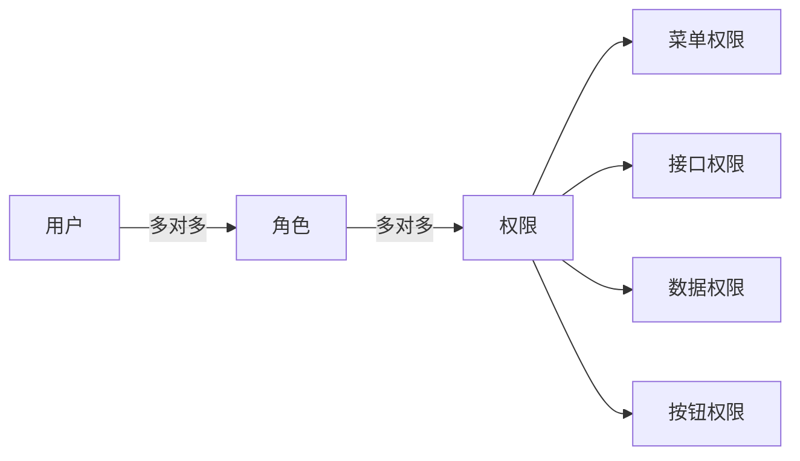

## 14.2 角色定义

| 角色 | 编码 | 说明 |
|---|---|---|
| 系统管理员 | admin | 最高权限，系统配置与运维 |
| 授课教师 | teacher | 实训管理、成果审核、班级报表、标准制定、知识库管理、全院教学分析（原教研负责人职能已合并） |
| 实训学生 | student | 任务查看、成果提交、个人报表 |

注：PRD v2.0 已将教研负责人（RESEARCH）角色合并到授课教师（TEACHER）中。教师同时承担教研职能。

## 14.3 页面权限矩阵

| 页面 | admin | teacher | student |
|---|---|---|---|
| 首页/工作台 | ✓ | ✓ | ✓ |
| 课程管理 | - | ✓ | ✓（仅自己） |
| 实训管理 | - | ✓ | ✓（仅任务） |
| 任务中心 | - | - | ✓ |
| 成果提交 | - | - | ✓ |
| AI分析结果 | - | ✓ | ✓（仅自己） |
| 教师审核 | - | ✓ | - |
| 成长中心 | - | - | ✓ |
| 评价标准 | - | ✓ | - |
| 知识库 | - | ✓ | ✓（查看） |
| 教学分析 | - | ✓（全院） | - |
| 报表中心 | - | ✓（全院/班级） | ✓（个人） |
| 系统管理 | ✓ | - | - |
| 运维中心 | ✓ | - | - |

## 14.4 接口权限

| 接口前缀 | admin | teacher | student |
|---|---|---|---|
| /api/v1/auth/** | ✓（公开） | ✓（公开） | ✓（公开） |
| /api/v1/user/profile | ✓ | ✓ | ✓ |
| /api/v1/courses/** | - | ✓ | ✓（仅关联课程） |
| /api/v1/training-tasks/** | - | ✓ | ✓（仅查看） |
| /api/v1/submissions/** | - | ✓ | ✓（仅自己） |
| /api/v1/ai/** | - | ✓ | ✓（仅自己） |
| /api/v1/reviews/** | - | ✓ | - |
| /api/v1/reports/** | - | ✓（全院/班级） | ✓（个人） |
| /api/v1/standards/** | - | ✓ | - |
| /api/v1/knowledge-bases/** | - | ✓ | ✓（查看） |
| /api/v1/admin/** | ✓ | - | - |
| /api/v1/notifications/** | ✓ | ✓ | ✓ |

## 14.5 数据权限

| 角色 | 数据范围 |
|---|---|
| admin | 全部数据 |
| teacher | 授课班级数据 + 全院/全校数据（教研职能，按学期/课程筛选） |
| student | 个人数据 |

## 14.6 按钮权限

| 按钮 | 权限要求 |
|---|---|
| 创建课程 | teacher |
| 编辑课程 | teacher |
| 归档课程 | teacher |
| 创建实训 | teacher |
| 发布实训 | teacher |
| 提交成果 | student |
| 确认评分 | teacher |
| 发布成绩 | teacher |
| 退回重交 | teacher |
| 批量导入用户 | admin |
| 禁用用户 | admin |
| 配置权限 | admin |
| 创建评价标准 | teacher |
| 上传知识文档 | teacher |
| 导出报表 | teacher |
| 数据备份 | admin |
# 15 开发规范

## 15.1 Git Flow 分支策略

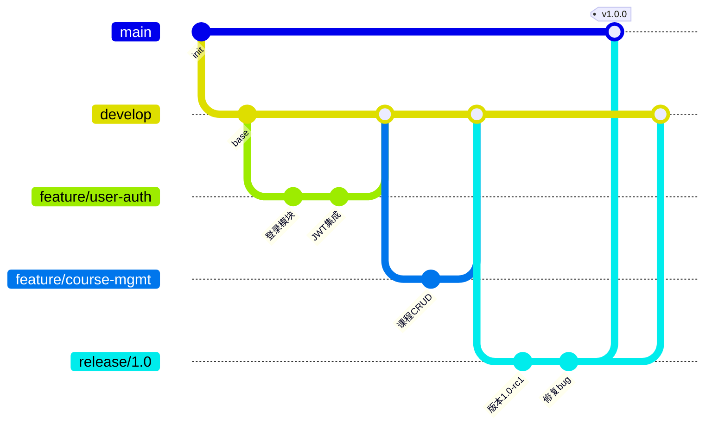

## 15.2 分支命名规范

| 分支类型 | 命名格式 | 示例 |
|---|---|---|
| main | main | main |
| develop | develop | develop |
| feature | feature/{模块}-{描述} | feature/user-auth |
| bugfix | bugfix/{模块}-{描述} | bugfix/submission-upload |
| release | release/{版本号} | release/1.0.0 |
| hotfix | hotfix/{版本号}-{描述} | hotfix/1.0.1-token-expire |

## 15.3 Commit 规范

```
<type>(<scope>): <subject>

type:
  feat     - 新功能
  fix      - Bug修复
  docs     - 文档
  style    - 格式（不影响代码运行）
  refactor - 重构
  perf     - 性能优化
  test     - 测试
  chore    - 构建/工具变动

scope: 模块名（user/course/training/submission/ai/review/report/standard/knowledge/admin/log/file/notify）

subject: 简短描述（中文，不超过50字）

示例:
  feat(user): 实现JWT登录与Token刷新
  fix(submission): 修复大文件上传OOM问题
  refactor(ai): 重构Agent编排器，支持并行分析
  chore(build): 添加Docker Compose编排配置
  docs(readme): 更新项目README与部署说明
```

## 15.4 项目目录结构

### 后端（SpringBoot）

```
server/
├── pom.xml
├── src/main/java/com/b1/
│   ├── B1Application.java
│   ├── common/
│   │   ├── config/        # 配置类（Security/CORS/MyBatis/Redis）
│   │   ├── exception/     # 统一异常处理
│   │   ├── result/        # 统一响应封装
│   │   ├── interceptor/   # 拦截器（认证/日志/限流）
│   │   └── util/          # 工具类
│   ├── module/
│   │   ├── auth/          # 认证模块
│   │   │   ├── controller/
│   │   │   ├── service/
│   │   │   ├── dto/
│   │   │   └── vo/
│   │   ├── user/          # 用户模块
│   │   ├── course/        # 课程模块
│   │   ├── training/      # 实训模块
│   │   ├── submission/    # 成果提交模块
│   │   ├── ai/            # AI分析模块
│   │   ├── review/        # 教师审核模块
│   │   ├── report/        # 报表模块
│   │   ├── standard/      # 评价标准模块
│   │   ├── knowledge/     # 知识库模块
│   │   ├── file/          # 文件管理模块
│   │   ├── notify/        # 通知模块
│   │   ├── log/           # 日志模块
│   │   └── admin/         # 系统管理模块
│   └── infrastructure/
│       ├── security/      # Spring Security配置
│       ├── persistence/   # MyBatis Mapper
│       ├── redis/         # Redis配置与工具
│       ├── minio/         # MinIO配置与工具
│       └── ai/            # AI服务HTTP客户端
├── src/main/resources/
│   ├── application.yml
│   ├── application-dev.yml
│   ├── application-prod.yml
│   └── mapper/            # MyBatis XML映射文件
└── src/test/java/
```

### 前端（Vue3）

```
web/
├── package.json
├── vite.config.ts
├── src/
│   ├── main.ts
│   ├── App.vue
│   ├── api/               # API请求封装
│   │   ├── request.ts     # Axios实例+拦截器
│   │   ├── auth.ts
│   │   ├── course.ts
│   │   ├── training.ts
│   │   ├── submission.ts
│   │   ├── review.ts
│   │   ├── report.ts
│   │   └── ...
│   ├── router/            # 路由配置
│   │   ├── index.ts
│   │   └── permission.ts  # 动态路由+权限守卫
│   ├── stores/            # Pinia状态管理
│   │   ├── user.ts
│   │   ├── app.ts
│   │   └── ...
│   ├── views/             # 页面组件
│   │   ├── login/
│   │   ├── home/
│   │   ├── course/
│   │   ├── training/
│   │   ├── submission/
│   │   ├── review/
│   │   ├── report/
│   │   ├── growth/
│   │   ├── standard/
│   │   ├── knowledge/
│   │   ├── analysis/
│   │   ├── admin/
│   │   └── ops/
│   ├── components/        # 公共组件
│   ├── composables/       # 组合式函数
│   ├── utils/             # 工具函数
│   ├── types/             # TypeScript类型定义
│   └── assets/            # 静态资源
└── public/
```

### AI服务（Python）

```
ai-service/
├── requirements.txt
├── main.py                # FastAPI入口
├── config.py              # 配置（模型/API Key）
├── agents/
│   ├── __init__.py
│   ├── base_agent.py      # Agent基类
│   ├── doc_agent.py       # 文档分析
│   ├── code_agent.py      # 代码分析
│   ├── req_agent.py       # 需求对照
│   ├── score_agent.py     # 评分计算
│   ├── summary_agent.py   # 结果汇总
│   └── report_agent.py    # 报告生成
├── orchestrator.py        # Agent编排器
├── prompts/               # Prompt模板目录
├── tools/
│   ├── checker.py         # Checkstyle/PMD调用
│   ├── parser.py          # 文档解析（Tika/PDFBox）
│   └── git_client.py      # JGit封装
└── models/                # 数据模型
```

## 15.5 命名规范

| 层级 | Java命名 | 前端命名 | 示例 |
|---|---|---|---|
| 包/目录 | 小写点分隔 | 小写连字符 | `com.b1.module.user` |
| 类/组件 | PascalCase | PascalCase | `UserController` / `UserList.vue` |
| 方法/函数 | camelCase | camelCase | `getUserById` / `fetchUserList` |
| 常量 | UPPER_SNAKE | UPPER_SNAKE | `MAX_RETRY_COUNT` |
| 变量 | camelCase | camelCase | `userName` |
| 数据库表 | lower_snake | - | `training_task` |
| 数据库字段 | lower_snake | - | `create_time` |
| REST API | kebab-case | - | `/api/training-tasks` |
| Redis Key | lower:snake | - | `user:info:10001` |

## 15.6 代码规范

| 维度 | 规则 |
|---|---|
| Controller | 仅负责参数校验、调用Service、返回Result，不含业务逻辑 |
| Service | 业务逻辑层，事务边界在此定义（`@Transactional`） |
| Mapper | 单表操作，复杂查询走XML |
| DTO | 请求参数对象，与Controller一一对应 |
| VO | 响应视图对象，与接口一一对应 |
| 异常 | 业务异常统一抛`BusinessException`，由全局异常处理器捕获 |
| 日志 | Service层用`@Slf4j`，关键操作日志通过AOP切面自动记录 |
| 注释 | 复杂业务逻辑加注释，简单CRUD不写注释 |
| 魔法值 | 禁止硬编码，枚举/常量类统一管理 |
| SQL | 禁止SELECT *，指定字段名；禁止字符串拼接，使用`#{}` |

## 15.7 异常处理策略

| 异常类型 | 处理策略 |
|---|---|
| AI分析异常 | 重试3次（指数退避），失败后标记FAILED，通知教师人工处理 |
| Git拉取异常 | 检查仓库可达性、分支有效性，返回明确错误信息给学生 |
| 文件上传失败 | 检查MinIO连接与Bucket权限，返回错误码40001 |
| Token失效 | 前端拦截401，自动调用refresh接口，失败则跳转登录 |
| Redis失效 | 降级策略：跳过缓存，直接查数据库（性能下降但功能可用） |
| 数据库异常 | 连接池自动重连，事务回滚，记录ERROR日志并告警 |
| 网络异常 | 外部API调用设置超时（连接5s/读取30s），失败返回503 |
| 大模型限流 | 分析任务排队（Redis Queue），超过阈值返回"系统繁忙"提示 |

## 15.8 日志规范

| 日志类型 | 级别 | 记录内容 | 存储 |
|---|---|---|---|
| 业务操作 | INFO | 用户创建课程/发布实训/审核评分等 | MySQL operation_log表 |
| 审计日志 | INFO | 登录/登出/权限变更/数据导出 | MySQL operation_log表 |
| AI调用 | INFO | 请求模型/Token消耗/耗时/成功与否 | MySQL ai_score表+operation_log表 |
| 接口访问 | DEBUG | 请求路径/参数/响应/耗时 | 文件日志 |
| 异常日志 | ERROR | 异常堆栈/请求上下文/用户信息 | 文件日志+告警 |
| 系统启停 | INFO | 服务启动/关闭/健康检查 | 文件日志 |

## 15.9 非功能需求保障

| 维度 | 目标 | 保障措施 |
|---|---|---|
| 性能 | 页面加载<2s，API响应<500ms | Redis缓存+Nginx静态资源+数据库索引+连接池 |
| 稳定性 | 可用性99.5% | Docker健康检查+自动重启+优雅关闭 |
| 安全性 | 无高危漏洞 | Spring Security+JWT+HTTPS+SQL注入防护(XSS过滤)+文件上传类型校验 |
| 扩展性 | 支持水平扩展 | 无状态服务设计+负载均衡+模块独立部署 |
| 可维护性 | 新人3天可上手开发 | 统一目录结构+命名规范+接口文档+README |
| 高可用 | 单节点故障不影响服务 | 多实例部署+Nginx负载均衡+MySQL主从+Redis哨兵 |

---

> **文档结束**
> 
> 版本：v1.0 | 日期：2026-06-30 | 状态：初稿
> 
> 本文档涵盖系统架构、数据库、API、开发规范四大模块，可直接指导后续开发工作。
