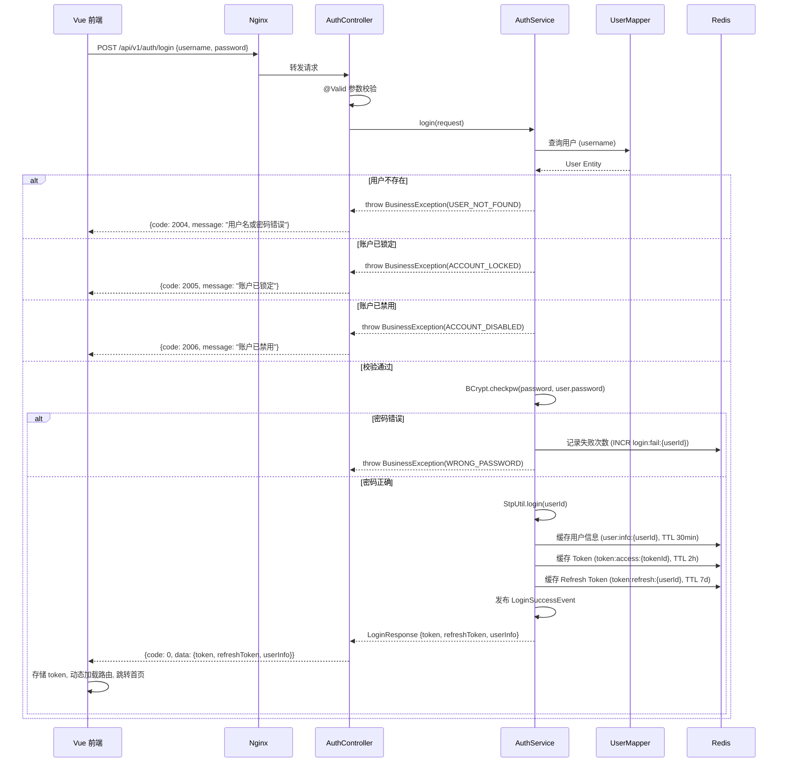
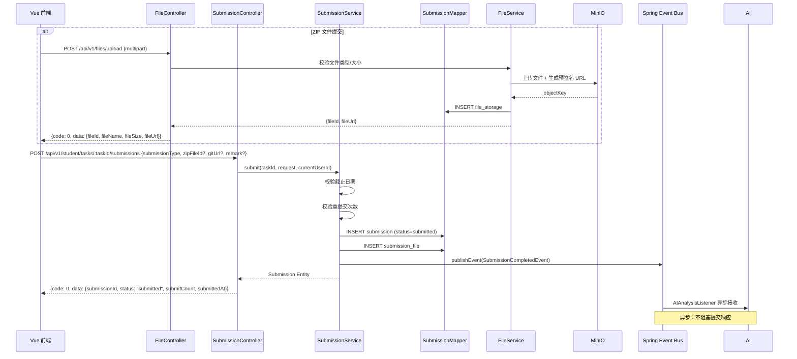
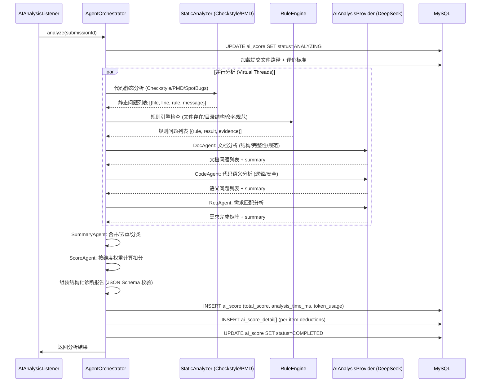
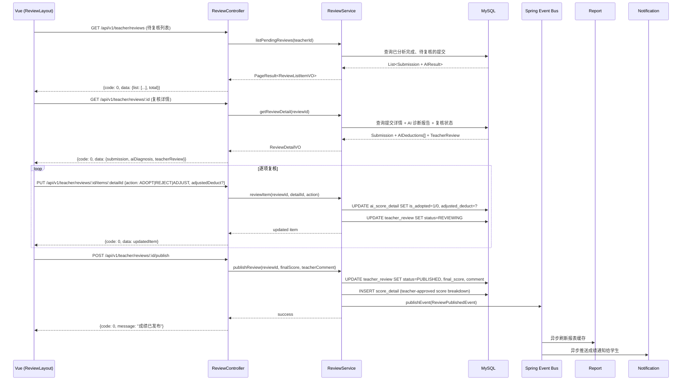
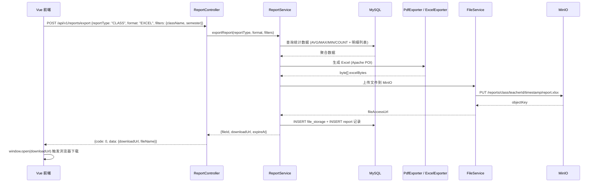

# Backend Architecture Design v1.0

## 基于大模型的软件实训教学检查评价与报表系统

---

## 1. Document Information

| 字段 | 值 |
|---|---|
| **文档名称** | Backend Architecture Design |
| **文档版本** | v1.0 |
| **文档状态** | Formal Release |
| **作者** | Senior Backend Architect |
| **审核人** | TBD |
| **最后更新** | 2026-07-04 |
| **适用 Sprint** | Sprint 1（基础设施） → Sprint 7（上线） |
| **前置文档** | PRD v2.0, SDS v1.0, UI Design System v1.0, Component Library v1.0, Frontend Specification v1.0, API Mock Specification v1.0, FIP v1.0, MVP, Definition of Done, ADR-001 ~ ADR-011 |
| **适用范围** | 后端全部开发工作 |

### Revision History

| 版本 | 日期 | 作者 | 变更说明 |
|---|---|---|---|
| v1.0 | 2026-07-04 | Senior Backend Architect | 初始版本，覆盖 MVP 全部后端架构设计 |

---

## 2. Architecture Goals

### 2.1 核心设计目标

本系统的后端架构设计围绕以下 7 项核心目标展开。每一项目标的取舍均记录在 ADR 中，本章仅阐述最终决策。

#### 2.1.1 可维护性（Maintainability）

**目标**：新开发人员入职 3 天内可在本系统上产出代码。

**实现策略**：
- 统一的目录结构：所有模块遵循 `controller → service → mapper → entity` 四层标准布局
- 统一的命名约定：类名 PascalCase，方法名 camelCase，URL kebab-case，数据库 lower_snake_case
- 统一的代码风格：Lombok 消除样板代码，MapStruct 消除手写转换，MyBatis Plus 消除基础 CRUD SQL
- 统一的异常处理：所有异常经 `GlobalExceptionHandler` 统一转换为标准响应
- Knife4j 自动生成 OpenAPI 3.0 文档，代码即文档

#### 2.1.2 可扩展性（Extensibility）

**目标**：MVP 阶段模块化单体，未来可平滑拆分为微服务，无需重写业务逻辑。

**实现策略**：
- 模块间通过接口通信，不直接依赖实现类
- AI 服务通过抽象接口 `AIAnalysisProvider` 隔离具体 LLM 厂商
- 文件存储通过抽象接口 `FileStorageProvider` 隔离 MinIO / 本地 / S3
- 包结构预留：每个业务模块有独立的 `controller`、`service`、`mapper` 子包，拆分时仅需调整包路径并添加远程调用层
- 配置外部化：`application.yml` 按 dev / test / prod 环境分离，容器化部署时通过环境变量覆盖

#### 2.1.3 高内聚低耦合（High Cohesion, Low Coupling）

**目标**：修改一个模块不影响其他模块。

**实现策略**：
- 每个模块有明确的职责边界（见第 6 章）
- 模块间通过事件驱动解耦：提交完成 → 发布 `SubmissionCompletedEvent` → AI 分析模块订阅
- 共享类型（DTO / 枚举 / 异常码）集中在 `common` 包，不跨模块直接引用 Entity
- 禁止跨层调用：Controller → Service → Mapper，不可跳过 Service 直接调 Mapper

#### 2.1.4 模块化（Modularity）

**目标**：10 个核心模块职责清晰，可独立开发、测试、部署。

```
Module Dependency Rule:
  Auth Module   → depends on → User Module
  Course Module → depends on → User Module
  Training Module → depends on → Course Module, Standard Module
  Submission Module → depends on → Training Module, File Module
  AI Module     → depends on → Submission Module, File Module, Standard Module
  Review Module → depends on → Submission Module, AI Module
  Report Module → depends on → Submission Module, Review Module
  Standard Module → depends on → (none)
  System Module → depends on → User Module
  Log Module    → depends on → (none, consumes events)
```

#### 2.1.5 AI 服务独立（AI Service Independence）

**目标**：AI 厂商切换不影响核心业务。

**实现策略**：
- 定义 `AIAnalysisProvider` 接口，封装 LLM 调用细节
- MVP 阶段：Java 内嵌调用（RestTemplate / WebClient + OpenAI Compatible 协议），不部署独立 Python 服务
- 远期扩展：可将 AI 模块抽取为 Python FastAPI 服务，业务模块通过 HTTP 调用，无需修改业务逻辑
- AI 分析任务异步化：提交后立即返回，后台队列处理，前端轮询 / SSE 获取进度

#### 2.1.6 静态分析独立（Static Analysis Independence）

**目标**：代码风格检查独立于大模型调用，确保确定性规则零幻觉。

**实现策略**：
- 代码规范检查（命名、格式、复杂度）由静态分析引擎完成，不消耗 LLM Token
- 文档结构检查（章节完整性、图表编号）由规则引擎完成
- 仅语义分析（逻辑缺陷、需求匹配）调用 LLM
- 静态分析 → 规则引擎 → LLM 语义分析 三层递进

#### 2.1.7 文件服务独立（File Service Independence）

**目标**：存储介质切换不影响业务。

**实现策略**：
- `FileStorageProvider` 接口封装上传 / 下载 / 删除 / 预签名 URL 操作
- MVP 阶段使用 MinIO，可通过配置切换为本地文件系统或阿里云 OSS
- 前端通过预签名 URL 直传 MinIO，减少后端带宽消耗

---

## 3. Overall Architecture

### 3.1 系统架构总览

```
┌─────────────────────────────────────────────────────────────┐
│                      Client Layer                            │
│  Browser (Vue 3 SPA)  │  Mobile (P1)  │  External Systems    │
└────────────────────────┬────────────────────────────────────┘
                         │  HTTPS / WSS
                         ▼
┌─────────────────────────────────────────────────────────────┐
│                    Access Layer                               │
│  Nginx (Reverse Proxy / Static Files / Rate Limiting)        │
│  Port: 80/443                                                │
└────────────────────────┬────────────────────────────────────┘
                         │
                         ▼
┌─────────────────────────────────────────────────────────────┐
│                 Application Layer (Spring Boot 3 / JDK 21)    │
│                                                              │
│  ┌──────────┐ ┌──────────┐ ┌──────────┐ ┌──────────┐       │
│  │ Auth     │ │ Course   │ │ Training │ │Submission│       │
│  │ Module   │ │ Module   │ │ Module   │ │ Module   │       │
│  └──────────┘ └──────────┘ └──────────┘ └──────────┘       │
│  ┌──────────┐ ┌──────────┐ ┌──────────┐ ┌──────────┐       │
│  │ AI       │ │ Review   │ │ Report   │ │Standard  │       │
│  │ Module   │ │ Module   │ │ Module   │ │ Module   │       │
│  └──────────┘ └──────────┘ └──────────┘ └──────────┘       │
│  ┌──────────┐ ┌──────────┐ ┌──────────┐ ┌──────────┐       │
│  │ User     │ │ System   │ │ Log      │ │ File     │       │
│  │ Module   │ │ Module   │ │ Module   │ │ Module   │       │
│  └──────────┘ └──────────┘ └──────────┘ └──────────┘       │
│                                                              │
│  Cross-cutting: Security (Sa-Token) │ Validation (Spring)    │
│  Cross-cutting: Exception Handling  │ Logging (AOP)          │
└────────────────────────┬────────────────────────────────────┘
                         │
          ┌──────────────┼──────────────┐
          ▼              ▼              ▼
┌──────────────┐ ┌──────────────┐ ┌──────────────┐
│   MySQL 8    │ │    Redis     │ │    MinIO     │
│  (Primary)   │ │  (Cache /    │ │  (Object     │
│   Port:3306  │ │   Session)   │ │   Storage)   │
│              │ │  Port:6379   │ │ Port:9000    │
└──────────────┘ └──────────────┘ └──────────────┘
                         │
                         ▼
┌─────────────────────────────────────────────────────────────┐
│                 External Services                             │
│  ┌──────────────────┐  ┌──────────────────┐                  │
│  │ DeepSeek API     │  │ OpenAI Compatible │                 │
│  │ (Primary LLM)    │  │ (Secondary LLM)   │                 │
│  └──────────────────┘  └──────────────────┘                  │
│  ┌──────────────────┐  ┌──────────────────┐                  │
│  │ Python AI Service │  │ JGit / Checkstyle│                 │
│  │ (Future/P1)       │  │ (Static Analysis)│                 │
│  └──────────────────┘  └──────────────────┘                  │
└─────────────────────────────────────────────────────────────┘
```

### 3.2 架构决策：模块化单体 vs 微服务

| 维度 | 模块化单体（MVP 选择） | 微服务（远期目标） |
|---|---|---|
| 开发效率 | 高：单 IDE 启动，统一调试 | 低：多服务启动，链路追踪 |
| 部署复杂度 | 低：单个 JAR 部署 | 高：容器编排，服务发现 |
| 团队要求 | 3-5 人团队可维护 | 需 8+ 人，需 DevOps |
| 性能 | 高：进程内调用，零网络开销 | 中：RPC 序列化 + 网络延迟 |
| 扩展性 | 水平扩展（多实例 + Nginx LB） | 独立扩缩容 |
| 拆分路径 | 包结构预留，渐进拆分 | 初始即分离 |

**决策**：MVP 采用模块化单体。包结构（`com.b1.module.xxx`）和接口设计为未来微服务拆分预留。拆分时仅需：(1) 新建独立 Spring Boot 应用，(2) 复制模块包，(3) 将模块间调用从本地方法调用改为 HTTP/gRPC。

### 3.3 模块间通信机制

```
同步调用（主流）:
  Controller → Service → Mapper → Database

异步事件（解耦）:
  SubmissionCompletedEvent → AIAnalysisListener
  ReviewPublishedEvent    → ReportRefreshListener
                            NotificationListener
  FileUploadedEvent       → VirusScanListener (P1)

外部调用:
  RestTemplate / WebClient → DeepSeek API (OpenAI Compatible)
  MinIO Client             → MinIO Server (S3 Compatible)
  JGit                     → Git Repository
```

---

## 4. Project Directory Structure

```
server/
├── pom.xml
├── Dockerfile
├── docker-compose.yml
└── src/
    ├── main/
    │   ├── java/com/b1/
    │   │   ├── B1Application.java              # Spring Boot 入口
    │   │   │
    │   │   ├── common/                          # 公共基础设施
    │   │   │   ├── config/                      # 全局配置
    │   │   │   │   ├── SaTokenConfig.java       # Sa-Token 认证配置
    │   │   │   │   ├── MyBatisPlusConfig.java   # MyBatis Plus 分页/乐观锁
    │   │   │   │   ├── RedisConfig.java         # Redis 序列化/连接池
    │   │   │   │   ├── MinioConfig.java         # MinIO 客户端配置
    │   │   │   │   ├── WebMvcConfig.java        # CORS / 拦截器注册
    │   │   │   │   ├── Knife4jConfig.java       # OpenAPI 3.0 文档配置
    │   │   │   │   ├── AsyncConfig.java         # 异步任务线程池
    │   │   │   │   └── JacksonConfig.java       # JSON 序列化配置
    │   │   │   ├── exception/                   # 统一异常处理
    │   │   │   │   ├── BusinessException.java   # 业务异常基类
    │   │   │   │   ├── ErrorCode.java           # 错误码枚举（50+）
    │   │   │   │   ├── GlobalExceptionHandler.java # @RestControllerAdvice
    │   │   │   │   └── Assert.java              # 业务断言工具
    │   │   │   ├── result/                      # 统一响应
    │   │   │   │   ├── Result.java              # Result<T> 响应体
    │   │   │   │   └── PageResult.java          # 分页响应体
    │   │   │   ├── interceptor/                 # 拦截器
    │   │   │   │   ├── LogInterceptor.java      # 操作日志记录
    │   │   │   │   └── RateLimitInterceptor.java # 接口限流
    │   │   │   ├── aspect/                      # AOP 切面
    │   │   │   │   ├── OperationLogAspect.java  # @OperationLog 注解切面
    │   │   │   │   └── AILogAspect.java         # AI 调用日志切面
    │   │   │   ├── util/                        # 工具类
    │   │   │   │   ├── JwtUtil.java             # Sa-Token 辅助
    │   │   │   │   ├── FileUtil.java            # 文件类型/大小校验
    │   │   │   │   ├── ZipUtil.java             # ZIP 解压/压缩
    │   │   │   │   ├── Md5Util.java             # 文件 MD5 计算
    │   │   │   │   └── SnowflakeUtil.java       # 分布式 ID 生成
    │   │   │   ├── constant/                    # 常量
    │   │   │   │   ├── RedisKeys.java           # Redis Key 常量
    │   │   │   │   └── SystemConstants.java     # 系统常量
    │   │   │   └── enums/                       # 公共枚举
    │   │   │       ├── RoleEnum.java            # STUDENT / TEACHER / ADMIN
    │   │   │       ├── SubmissionStatus.java    # 提交状态
    │   │   │       └── AnalysisStatus.java      # AI 分析状态
    │   │   │
    │   │   ├── module/                          # 业务模块
    │   │   │   ├── auth/                        # 认证模块
    │   │   │   │   ├── controller/
    │   │   │   │   │   └── AuthController.java  # /api/v1/auth/*
    │   │   │   │   ├── service/
    │   │   │   │   │   ├── AuthService.java
    │   │   │   │   │   └── impl/AuthServiceImpl.java
    │   │   │   │   ├── dto/
    │   │   │   │   │   ├── LoginRequest.java
    │   │   │   │   │   ├── LoginResponse.java
    │   │   │   │   │   └── RefreshTokenRequest.java
    │   │   │   │   └── vo/
    │   │   │   │       └── UserInfoVO.java
    │   │   │   │
    │   │   │   ├── user/                        # 用户模块
    │   │   │   │   ├── controller/
    │   │   │   │   │   └── UserController.java  # /api/v1/user/*
    │   │   │   │   ├── service/
    │   │   │   │   │   ├── UserService.java
    │   │   │   │   │   └── impl/UserServiceImpl.java
    │   │   │   │   ├── mapper/
    │   │   │   │   │   └── UserMapper.java
    │   │   │   │   ├── entity/
    │   │   │   │   │   ├── User.java
    │   │   │   │   │   └── UserRole.java
    │   │   │   │   ├── dto/
    │   │   │   │   │   ├── UpdateProfileRequest.java
    │   │   │   │   │   └── ChangePasswordRequest.java
    │   │   │   │   └── vo/
    │   │   │   │       └── UserProfileVO.java
    │   │   │   │
    │   │   │   ├── course/                      # 课程模块
    │   │   │   │   ├── controller/
    │   │   │   │   │   ├── CourseController.java    # /api/v1/courses/*
    │   │   │   │   │   └── StudentCourseController.java # /api/v1/student/courses/*
    │   │   │   │   ├── service/
    │   │   │   │   │   ├── CourseService.java
    │   │   │   │   │   └── impl/CourseServiceImpl.java
    │   │   │   │   ├── mapper/
    │   │   │   │   │   ├── CourseMapper.java
    │   │   │   │   │   ├── CourseTeacherMapper.java
    │   │   │   │   │   └── CourseStudentMapper.java
    │   │   │   │   ├── entity/
    │   │   │   │   │   ├── Course.java
    │   │   │   │   │   ├── CourseTeacher.java
    │   │   │   │   │   └── CourseStudent.java
    │   │   │   │   └── dto/ & vo/
    │   │   │   │
    │   │   │   ├── training/                    # 实训任务模块
    │   │   │   │   ├── controller/
    │   │   │   │   │   ├── TrainingController.java       # /api/v1/teacher/tasks/*
    │   │   │   │   │   └── StudentTrainingController.java # /api/v1/student/tasks/*
    │   │   │   │   ├── service/
    │   │   │   │   │   ├── TrainingService.java
    │   │   │   │   │   └── impl/TrainingServiceImpl.java
    │   │   │   │   ├── mapper/
    │   │   │   │   │   ├── TrainingTaskMapper.java
    │   │   │   │   │   └── TrainingClassMapper.java
    │   │   │   │   ├── entity/
    │   │   │   │   │   ├── TrainingTask.java
    │   │   │   │   │   └── TrainingClass.java
    │   │   │   │   └── dto/ & vo/
    │   │   │   │
    │   │   │   ├── submission/                  # 提交模块
    │   │   │   │   ├── controller/
    │   │   │   │   │   ├── SubmissionController.java       # /api/v1/student/tasks/:taskId/submissions/*
    │   │   │   │   │   └── TeacherSubmissionController.java # /api/v1/teacher/submissions/*
    │   │   │   │   ├── service/
    │   │   │   │   │   ├── SubmissionService.java
    │   │   │   │   │   └── impl/SubmissionServiceImpl.java
    │   │   │   │   ├── mapper/
    │   │   │   │   │   ├── SubmissionMapper.java
    │   │   │   │   │   └── SubmissionFileMapper.java
    │   │   │   │   ├── entity/
    │   │   │   │   │   ├── Submission.java
    │   │   │   │   │   └── SubmissionFile.java
    │   │   │   │   ├── dto/ & vo/
    │   │   │   │   └── event/
    │   │   │   │       └── SubmissionCompletedEvent.java
    │   │   │   │
    │   │   │   ├── ai/                          # AI 分析模块
    │   │   │   │   ├── controller/
    │   │   │   │   │   └── AIController.java    # /api/v1/student/submissions/:sid/ai-*
    │   │   │   │   ├── service/
    │   │   │   │   │   ├── AIAnalysisService.java
    │   │   │   │   │   └── impl/AIAnalysisServiceImpl.java
    │   │   │   │   ├── provider/                # LLM 厂商抽象
    │   │   │   │   │   ├── AIAnalysisProvider.java      # 接口
    │   │   │   │   │   ├── DeepSeekProvider.java        # DeepSeek 实现
    │   │   │   │   │   └── OpenAICompatProvider.java    # OpenAI 兼容实现
    │   │   │   │   ├── agent/                   # Multi-Agent 编排
    │   │   │   │   │   ├── AgentOrchestrator.java
    │   │   │   │   │   ├── CodeAgent.java
    │   │   │   │   │   ├── DocAgent.java
    │   │   │   │   │   ├── ReqAgent.java
    │   │   │   │   │   ├── ScoreAgent.java
    │   │   │   │   │   └── SummaryAgent.java
    │   │   │   │   ├── staticanalysis/          # 静态分析
    │   │   │   │   │   ├── StaticAnalyzer.java
    │   │   │   │   │   ├── CheckstyleRunner.java
    │   │   │   │   │   └── RuleEngine.java
    │   │   │   │   ├── mapper/
    │   │   │   │   │   ├── AIScoreMapper.java
    │   │   │   │   │   └── AIScoreDetailMapper.java
    │   │   │   │   ├── entity/
    │   │   │   │   │   ├── AIScore.java
    │   │   │   │   │   └── AIScoreDetail.java
    │   │   │   │   ├── dto/ & vo/
    │   │   │   │   └── listener/
    │   │   │   │       └── AIAnalysisListener.java  # 监听 SubmissionCompletedEvent
    │   │   │   │
    │   │   │   ├── review/                      # 教师复核模块
    │   │   │   │   ├── controller/
    │   │   │   │   │   └── ReviewController.java # /api/v1/teacher/reviews/*
    │   │   │   │   ├── service/
    │   │   │   │   │   ├── ReviewService.java
    │   │   │   │   │   └── impl/ReviewServiceImpl.java
    │   │   │   │   ├── mapper/
    │   │   │   │   │   ├── TeacherReviewMapper.java
    │   │   │   │   │   └── ScoreDetailMapper.java
    │   │   │   │   ├── entity/
    │   │   │   │   │   ├── TeacherReview.java
    │   │   │   │   │   └── ScoreDetail.java
    │   │   │   │   └── dto/ & vo/
    │   │   │   │
    │   │   │   ├── report/                      # 报表模块
    │   │   │   │   ├── controller/
    │   │   │   │   │   ├── StudentReportController.java  # /api/v1/student/reports/*
    │   │   │   │   │   └── TeacherReportController.java  # /api/v1/teacher/reports/*
    │   │   │   │   ├── service/
    │   │   │   │   │   ├── ReportService.java
    │   │   │   │   │   └── impl/ReportServiceImpl.java
    │   │   │   │   ├── exporter/
    │   │   │   │   │   ├── PdfExporter.java
    │   │   │   │   │   └── ExcelExporter.java
    │   │   │   │   └── dto/ & vo/
    │   │   │   │
    │   │   │   ├── standard/                    # 评价标准模块
    │   │   │   │   ├── controller/
    │   │   │   │   │   └── StandardController.java # /api/v1/teacher/standards/*
    │   │   │   │   ├── service/
    │   │   │   │   │   ├── StandardService.java
    │   │   │   │   │   └── impl/StandardServiceImpl.java
    │   │   │   │   ├── mapper/
    │   │   │   │   │   ├── StandardMapper.java
    │   │   │   │   │   ├── StandardDimensionMapper.java
    │   │   │   │   │   └── StandardRuleMapper.java
    │   │   │   │   ├── entity/
    │   │   │   │   │   ├── EvaluationStandard.java
    │   │   │   │   │   ├── StandardDimension.java
    │   │   │   │   │   └── StandardRule.java
    │   │   │   │   └── dto/ & vo/
    │   │   │   │
    │   │   │   ├── system/                      # 系统管理模块
    │   │   │   │   ├── controller/
    │   │   │   │   │   ├── AdminController.java  # /api/v1/admin/users/*
    │   │   │   │   │   ├── AdminDashboardController.java # /api/v1/admin/dashboard
    │   │   │   │   │   ├── AdminClassController.java    # /api/v1/admin/classes/*
    │   │   │   │   │   ├── AdminLogController.java      # /api/v1/admin/logs
    │   │   │   │   │   └── AdminMonitorController.java  # /api/v1/admin/monitor
    │   │   │   │   ├── service/
    │   │   │   │   │   ├── AdminService.java
    │   │   │   │   │   └── impl/AdminServiceImpl.java
    │   │   │   │   ├── mapper/
    │   │   │   │   │   ├── SystemConfigMapper.java
    │   │   │   │   │   └── ClassMapper.java
    │   │   │   │   └── entity/
    │   │   │   │       ├── SystemConfig.java
    │   │   │   │       └── ClassEntity.java
    │   │   │   │
    │   │   │   ├── file/                        # 文件模块
    │   │   │   │   ├── controller/
    │   │   │   │   │   └── FileController.java  # /api/v1/files/*
    │   │   │   │   ├── service/
    │   │   │   │   │   ├── FileService.java
    │   │   │   │   │   └── impl/FileServiceImpl.java
    │   │   │   │   ├── provider/
    │   │   │   │   │   ├── FileStorageProvider.java    # 接口
    │   │   │   │   │   ├── MinioStorageProvider.java   # MinIO 实现
    │   │   │   │   │   └── LocalStorageProvider.java   # 本地文件系统（测试用）
    │   │   │   │   ├── mapper/
    │   │   │   │   │   └── FileStorageMapper.java
    │   │   │   │   └── entity/
    │   │   │   │       └── FileStorage.java
    │   │   │   │
    │   │   │   ├── log/                         # 日志模块
    │   │   │   │   ├── service/
    │   │   │   │   │   ├── OperationLogService.java
    │   │   │   │   │   └── impl/OperationLogServiceImpl.java
    │   │   │   │   ├── mapper/
    │   │   │   │   │   └── OperationLogMapper.java
    │   │   │   │   ├── entity/
    │   │   │   │   │   └── OperationLog.java
    │   │   │   │   └── listener/
    │   │   │   │       └── LogEventListener.java  # 监听全局事件写入日志
    │   │   │   │
    │   │   │   ├── notification/                # 通知模块（P1 完整实现，MVP 预留）
    │   │   │   │   ├── service/
    │   │   │   │   ├── mapper/
    │   │   │   │   └── entity/
    │   │   │   │
    │   │   │   └── git/                         # Git 模块
    │   │   │       ├── service/
    │   │   │       │   ├── GitService.java
    │   │   │       │   └── impl/GitServiceImpl.java
    │   │   │       └── dto/
    │   │   │           └── GitVerifyResult.java
    │   │   │
    │   │   └── infrastructure/                  # 基础设施层
    │   │       ├── security/
    │   │       │   ├── SaTokenConfig.java       # Sa-Token 配置（StpUtil）
    │   │       │   ├── StpInterfaceImpl.java    # 权限加载实现
    │   │       │   └── GlobalSaTokenListener.java # 认证事件监听
    │   │       ├── persistence/
    │   │       │   ├── MyMetaObjectHandler.java # 自动填充 create_time / update_time
    │   │       │   └── MyBatisPlusConfig.java
    │   │       ├── redis/
    │   │       │   ├── RedisTemplateConfig.java
    │   │       │   └── RedisCacheManager.java
    │   │       └── minio/
    │   │           └── MinioProperties.java
    │   │
    │   └── resources/
    │       ├── application.yml                  # 公共配置
    │       ├── application-dev.yml              # 开发环境
    │       ├── application-test.yml             # 测试环境
    │       ├── application-prod.yml             # 生产环境
    │       ├── mapper/                          # MyBatis XML（复杂查询）
    │       │   ├── AIScoreMapper.xml
    │       │   ├── ReportMapper.xml
    │       │   └── OperationLogMapper.xml
    │       └── db/
    │           └── migration/                   # 数据库迁移脚本（Flyway）
    │               ├── V1__init_schema.sql
    │               ├── V2__init_data.sql
    │               └── V3__add_indexes.sql
    │
    └── test/
        └── java/com/b1/
            ├── module/
            │   ├── auth/AuthControllerTest.java
            │   ├── submission/SubmissionServiceTest.java
            │   └── ai/AIAnalysisServiceTest.java
            └── integration/
                ├── SubmissionFlowTest.java
                └── ReviewFlowTest.java
```

### 4.1 目录职责说明

| 目录 | 职责 | 约束 |
|---|---|---|
| `common/config/` | Spring Bean 配置、第三方库初始化 | 不含业务逻辑 |
| `common/exception/` | 统一异常类、错误码枚举、全局异常处理器 | 每个业务异常必须对应一个 ErrorCode |
| `common/result/` | `Result<T>` 和 `PageResult<T>` 响应体 | 所有 Controller 返回值必须包装为 Result |
| `common/interceptor/` | HTTP 拦截器（日志、限流） | 不含业务判断 |
| `common/aspect/` | AOP 切面（操作日志、AI 日志） | 仅用于横切关注点 |
| `common/util/` | 纯工具函数 | 无状态，不依赖 Spring Bean |
| `common/constant/` | Redis Key、系统常量 | 避免魔法值 |
| `common/enums/` | 公共枚举 | 跨模块使用的枚举，模块专属枚举放在模块内 |
| `module/{name}/controller/` | REST 接口定义、参数校验 | 不写业务逻辑，仅做参数绑定和结果返回 |
| `module/{name}/service/` | 业务逻辑、事务管理 | 接口 + 实现分离（便于测试 Mock） |
| `module/{name}/mapper/` | 数据库操作 | 单表用 MyBatis Plus BaseMapper，复杂查询写 XML |
| `module/{name}/entity/` | 数据库实体 | 纯 POJO，使用 Lombok @Data，MyBatis Plus @TableName |
| `module/{name}/dto/` | 请求参数对象 | 1:1 对应 Controller 入参 |
| `module/{name}/vo/` | 响应视图对象 | 1:1 对应 Controller 出参 |
| `module/{name}/event/` | Spring 事件定义 | 模块间异步通信 |
| `module/{name}/listener/` | Spring 事件监听器 | 异步处理，不阻塞主流程 |
| `module/{name}/provider/` | 外部服务抽象接口 | 隔离第三方依赖 |
| `infrastructure/` | 基础设施实现 | 不包含业务逻辑 |

---

## 5. Layer Design

### 5.1 分层架构

```
┌─────────────────────────────────────────────┐
│              Controller Layer                │
│  - 接收 HTTP 请求                            │
│  - 参数校验（@Valid）                        │
│  - 调用 Service                              │
│  - 返回 Result<T>                            │
│  - 禁止：直接调用 Mapper、包含业务逻辑      │
└──────────────────┬──────────────────────────┘
                   │ DTO ←→ Entity 转换 (MapStruct)
                   ▼
┌─────────────────────────────────────────────┐
│              Service Layer                   │
│  - 业务逻辑编排                              │
│  - 事务管理（@Transactional）                │
│  - 调用 Mapper / 外部服务 / 其他 Service      │
│  - 抛出 BusinessException                    │
│  - 禁止：处理 HTTP 请求/响应、直接操作 JDBC  │
└──────────────────┬──────────────────────────┘
                   │
                   ▼
┌─────────────────────────────────────────────┐
│              Mapper Layer                    │
│  - 数据库 CRUD（MyBatis Plus）               │
│  - 复杂查询 XML                              │
│  - 禁止：包含业务逻辑、跨表业务判断         │
└──────────────────┬──────────────────────────┘
                   │
                   ▼
┌─────────────────────────────────────────────┐
│              Data Layer                      │
│  MySQL 8 (Primary) / Redis (Cache) / MinIO   │
└─────────────────────────────────────────────┘
```

### 5.2 各层职责详解

#### 5.2.1 Controller Layer

```java
// 示例：AuthController
@RestController
@RequestMapping("/api/v1/auth")
@Tag(name = "认证模块", description = "登录、登出、Token 刷新")
public class AuthController {

    @PostMapping("/login")
    @Operation(summary = "用户登录")
    @RateLimit(max = 10, window = 60)  // 每分钟最多 10 次
    public Result<LoginResponse> login(@Valid @RequestBody LoginRequest request) {
        LoginResponse response = authService.login(request);
        return Result.ok(response);
    }
}
```

**规范**：
- 所有接口使用 `@Valid` / `@Validated` 进行参数校验
- 所有返回值统一包装为 `Result<T>`
- 角色权限通过 `@SaCheckRole("teacher")` 控制
- 使用 Knife4j 注解 `@Tag` / `@Operation` 生成文档

#### 5.2.2 Service Layer

```java
// 接口
public interface AuthService {
    LoginResponse login(LoginRequest request);
    void logout(String token);
    LoginResponse refreshToken(String refreshToken);
}

// 实现
@Service
@Slf4j
public class AuthServiceImpl implements AuthService {

    @Override
    @Transactional
    public LoginResponse login(LoginRequest request) {
        // 1. 查询用户
        // 2. BCrypt 密码校验
        // 3. Sa-Token 登录（StpUtil.login）
        // 4. 生成 Token
        // 5. 记录登录日志（事件发布）
        // 6. 返回 LoginResponse
    }
}
```

**规范**：
- 接口 + 实现分离（`service/AuthService.java` + `service/impl/AuthServiceImpl.java`）
- 写操作加 `@Transactional`
- 业务异常使用 `throw new BusinessException(ErrorCode.xxx)`
- 日志使用 `@Slf4j`，关键操作记录 INFO 日志
- 接口注释写清楚"做什么"，实现注释写清楚"怎么做"

#### 5.2.3 Mapper Layer

```java
@Mapper
public interface UserMapper extends BaseMapper<User> {
    // 单表操作：BaseMapper 自动提供 CRUD
    // 复杂查询：定义方法 + 对应 XML
    IPage<UserVO> selectUserPage(Page<User> page, @Param("role") String role, @Param("keyword") String keyword);
}
```

**规范**：
- 继承 `BaseMapper<Entity>`，自动获得基础 CRUD
- 复杂查询（多表 JOIN / 聚合统计）写在 XML 中
- 禁止在 Mapper 中调用 Service
- 禁止在 XML 中写业务判断逻辑

#### 5.2.4 Entity Layer

```java
@Data
@TableName("user")
public class User {
    @TableId(type = IdType.ASSIGN_ID)  // Snowflake 分布式 ID
    private Long id;

    private String username;
    private String password;  // BCrypt 加密存储
    private String realName;
    private String email;
    private String phone;
    private String avatarUrl;
    private Integer status;  // 1=启用 0=禁用

    @TableLogic  // 逻辑删除
    private Integer isDeleted;

    @TableField(fill = FieldFill.INSERT)
    private LocalDateTime createTime;

    @TableField(fill = FieldFill.INSERT_UPDATE)
    private LocalDateTime updateTime;
}
```

**规范**：
- 使用 Lombok `@Data`，禁止手写 getter/setter
- 主键使用 `IdType.ASSIGN_ID`（Snowflake 算法）
- 逻辑删除使用 `@TableLogic`
- 时间字段使用 `@TableField(fill = ...)` 自动填充
- 枚举字段使用 `VARCHAR(32)` 存储枚举名，代码层映射

#### 5.2.5 DTO / VO

| 类型 | 位置 | 方向 | 示例 |
|---|---|---|---|
| **DTO** (Data Transfer Object) | `module/{name}/dto/` | Client → Server | `LoginRequest`, `CreateCourseRequest` |
| **VO** (View Object) | `module/{name}/vo/` | Server → Client | `UserInfoVO`, `CourseDetailVO` |

**规范**：
- DTO/VO 使用 Lombok `@Data`
- 字段加 `@Schema(description = "...")` 生成 API 文档
- 使用 Jakarta Validation 注解（`@NotBlank`, `@NotNull`, `@Email`, `@Size`）
- Entity → VO 转换使用 MapStruct `@Mapper(componentModel = "spring")`

#### 5.2.6 禁止跨层调用

| 禁止行为 | 原因 |
|---|---|
| Controller 直接调用 Mapper | 绕过业务逻辑和事务管理 |
| Service 直接操作 HttpServletRequest | 污染 Service 的可测试性 |
| Mapper 调用 Service | 循环依赖，职责颠倒 |
| Entity 直接返回给前端 | 暴露数据库结构，VO 应屏蔽敏感字段（password 等） |
| DTO 直接传给 Mapper | DTO 是接口层对象，Mapper 应接收 Entity 或基本类型参数 |

---

## 6. Core Modules

### 6.1 Module Overview

| 模块 | 包路径 | 职责 | 对应前端页面 | 对应 Mock |
|---|---|---|---|---|
| **Auth** | `module.auth` | 登录、登出、Token 刷新、验证码（P1） | LoginPage | auth.ts |
| **User** | `module.user` | 个人信息、修改密码、头像上传 | ProfilePage | user.ts |
| **Course** | `module.course` | 课程 CRUD、教师/学生关联 | CourseListPage, CourseDetailPage | teacher.ts, student.ts |
| **Training** | `module.training` | 任务创建、发布、分发、进度监控 | TrainingPage, TaskListPage | teacher.ts, student.ts |
| **Submission** | `module.submission` | 提交、Git 验证、文件上传 | SubmitPage, TaskDetailPage | student.ts |
| **AI** | `module.ai` | AI 分析、静态分析、评分 | AIResultPage, GradePage | student.ts |
| **Review** | `module.review` | 教师复核、评分、发布 | SubmissionsPage | teacher.ts |
| **Report** | `module.report` | 个人/班级/学院报表、PDF/Excel 导出 | ReportsPage, StudentReportsPage, GrowthPage | teacher.ts, student.ts |
| **Standard** | `module.standard` | 评价标准模板管理 | StandardsPage, StandardsLibraryPage | teacher.ts |
| **System** | `module.system` | 用户管理、班级管理、系统配置、监控 | DashboardPage, UsersPage, ClassesPage, SystemPage, MonitorPage | admin.ts |
| **Log** | `module.log` | 操作日志记录与查询 | LogsPage | admin.ts |
| **File** | `module.file` | 文件上传/下载、MinIO 管理 | (全局复用) | file.ts |
| **Git** | `module.git` | Git 仓库验证、克隆 | (Submission 子模块) | student.ts |

### 6.2 模块详细设计

#### 6.2.1 Auth Module（认证模块）

| 维度 | 描述 |
|---|---|
| **职责** | 用户登录认证、Token 签发与刷新、登出、验证码（P1） |
| **依赖** | User Module（用户查询） |
| **边界** | 不处理用户信息修改（由 User Module 负责），不处理权限配置（由 System Module 负责） |
| **输入** | `POST /api/v1/auth/login` { username, password } |
| **输出** | { token, refreshToken, userInfo: { id, username, realName, role, avatar } } |
| **核心流程** | 用户名密码校验 → BCrypt 对比 → Sa-Token 登录（StpUtil.login）→ 生成 Token → 缓存用户信息到 Redis → 返回 |
| **安全策略** | 登录失败 5 次锁定 30 分钟；Token 有效期 2 小时；Refresh Token 有效期 7 天；登出时 Token 加入黑名单 |

**Sa-Token 集成要点**：

Sa-Token 替代传统的 Spring Security + JWT 手动集成。关键配置：

- `sa-token.token-name=Authorization`：Token 从 Header 中读取
- `sa-token.timeout=7200`：Token 有效期 2 小时（秒）
- `sa-token.is-concurrent=true`：允许同账号多地登录
- `sa-token.is-share=false`：每次登录生成独立 Token
- `sa-token.token-style=uuid`：Token 格式为 UUID
- `sa-token.is-log=false`：关闭 Sa-Token 默认日志
- `sa-token.token-prefix=Bearer`：Token 前缀

#### 6.2.2 User Module（用户模块）

| 维度 | 描述 |
|---|---|
| **职责** | 当前用户信息查询、个人信息修改、密码修改、头像上传 |
| **依赖** | File Module（头像存储） |
| **边界** | 不处理其他用户的信息（管理员通过 System Module 管理） |
| **输入** | `PUT /api/v1/user/profile` { realName, email, phone } |
| **输出** | { id, realName, email, phone } |
| **安全** | 修改密码需验证旧密码；密码 BCrypt 加密；密码强度校验（8+ 位，大小写+数字） |

#### 6.2.3 Course Module（课程模块）

| 维度 | 描述 |
|---|---|
| **职责** | 课程 CRUD、教师关联、学生关联、班级关联 |
| **依赖** | User Module（教师/学生信息） |
| **边界** | 不处理课程内的实训任务（由 Training Module 负责） |
| **输入** | `POST /api/v1/teacher/courses` { courseCode, courseName, className, semester, credits } |
| **输出** | `GET /api/v1/student/courses` { list: [{ courseId, courseName, teacherName, semester, credits, taskCount }], page, pageSize, total } |
| **约束** | 课程删除为逻辑删除（归档），已有提交记录的课程不可物理删除 |

#### 6.2.4 Training Module（实训任务模块）

| 维度 | 描述 |
|---|---|
| **职责** | 任务 CRUD、发布（draft→published）、班级分发、进度监控、截止日期管理 |
| **依赖** | Course Module（课程信息）、Standard Module（评价标准） |
| **边界** | 不处理学生提交（由 Submission Module 负责），不处理评分（由 Review Module 负责） |
| **输入** | `POST /api/v1/teacher/tasks` { taskName, courseId, description, dueDate, weight, priority } |
| **输出** | `GET /api/v1/teacher/tasks/:taskId/progress` { submittedCount, unsubmittedCount, lateCount, totalCount } |
| **状态机** | draft → published → ended（截止日期过后自动/手动结束） |
| **事件** | 任务发布时发布 `TaskPublishedEvent`（触发通知） |

#### 6.2.5 Submission Module（提交模块）

| 维度 | 描述 |
|---|---|
| **职责** | 学生提交实训成果（ZIP/Git/代码文本）、提交历史查询、截止日期校验、重提交限制 |
| **依赖** | Training Module（任务信息）、File Module（文件上传）、Git Module（Git 验证） |
| **边界** | 不处理 AI 分析（提交完成后发布事件，AI Module 订阅处理） |
| **输入** | `POST /api/v1/student/tasks/:taskId/submissions` { submissionType, gitUrl?, gitBranch?, zipFileId?, remark? } |
| **输出** | { submissionId, taskId, submissionType, status, submitCount, maxSubmitCount, submittedAt } |
| **状态机** | submitted → analyzing → completed → reviewed（由 AI / Review 模块推进） |
| **事件** | 提交完成时发布 `SubmissionCompletedEvent` |
| **校验** | 截止日期检查（逾期标记 is_late），重提交次数限制，文件格式白名单 |

#### 6.2.6 AI Analysis Module（AI 分析模块）

| 维度 | 描述 |
|---|---|
| **职责** | 三层递进分析（静态分析 → 规则引擎 → LLM 语义）、多 Agent 协作、评分计算、扣分明细生成 |
| **依赖** | Submission Module（提交文件路径）、File Module（文件读取）、Standard Module（评价标准） |
| **边界** | 不直接修改成绩（最终成绩由 Review Module 确认） |
| **输入** | `SubmissionCompletedEvent` 触发；`POST /api/v1/student/submissions/:sid/ai-evaluate` 手动触发 |
| **输出** | `GET /api/v1/student/submissions/:sid/ai-result-detail` { aiScore, deductions: [{ agentType, severity, issueType, suggestDeduct, reason, filePath, lineNumber, confidence }], codeSummary, docSummary, reqSummary } |
| **核心流程** | 见 8.3 节 AI 分析流程 |
| **异步策略** | 提交完成后异步触发分析；`ai_score` 表记录分析状态（PENDING → ANALYZING → COMPLETED / FAILED）；前端通过轮询 `ai-result` 获取进度 |
| **幻觉防控** | 静态分析优先（Checkstyle/PMD 确定性规则）；规则引擎约束（文件存在/目录结构）；知识库锚定（提交时注入评分标准）；JSON Schema 约束 LLM 输出格式；置信度标注（低置信度项突出标记） |

**AI Provider 抽象**：

```java
public interface AIAnalysisProvider {
    /**
     * 调用 LLM 进行分析
     * @param prompt 组装好的完整 Prompt（含系统指令 + 用户内容 + 评价标准）
     * @param modelName 模型名称（deepseek-chat / gpt-4o 等）
     * @return LLM 原始响应文本
     */
    String chat(String prompt, String modelName);

    /**
     * 调用 LLM 进行结构化输出
     * @param prompt 完整 Prompt
     * @param jsonSchema JSON Schema 字符串（约束输出格式）
     * @param modelName 模型名称
     * @return 符合 JSON Schema 的 JSON 字符串
     */
    String chatWithJsonSchema(String prompt, String jsonSchema, String modelName);

    /**
     * 估算 Token 用量
     */
    int estimateTokens(String text);

    /**
     * 检查模型可用性
     */
    boolean healthCheck();
}
```

#### 6.2.7 Teacher Review Module（教师复核模块）

| 维度 | 描述 |
|---|---|
| **职责** | AI 诊断结果展示、逐项复核（通过/拒绝/调整）、手动加扣分、评语编辑、成绩发布/退回 |
| **依赖** | AI Module（诊断报告）、Submission Module（提交详情）、Report Module（发布后刷新报表） |
| **边界** | 不直接修改 AI 评分明细（通过复核流程确认后写入 score_detail） |
| **输入** | `PUT /api/v1/teacher/reviews/:id/items/:detailId` { action: "ADOPT"|"REJECT"|"ADJUST", adjustedDeduct? } |
| **输出** | `GET /api/v1/teacher/reviews/:id` { submission + aiDiagnosis + teacherReview } |
| **状态机** | PENDING → REVIEWING → PUBLISHED / RETURNED |
| **事件** | 成绩发布时发布 `ReviewPublishedEvent`（触发通知 + 报表刷新） |

#### 6.2.8 Report Module（报表模块）

| 维度 | 描述 |
|---|---|
| **职责** | 个人报表（分数趋势 + 能力雷达）、班级报表（成绩分布 + 均分对比）、学院报表（跨班对比 + 学期趋势）、PDF/Excel 导出 |
| **依赖** | Submission Module（提交数据）、Review Module（最终成绩）、File Module（导出文件存储） |
| **边界** | 不直接查询 AI 分析结果（通过 Review 聚合后的 score_detail 获取） |
| **输入** | `GET /api/v1/student/reports`；`GET /api/v1/teacher/reports?className=` |
| **输出** | { stats: {...}, scoreTrend: {...}, radarData: {...}, rows: [...] } |
| **导出** | `POST /api/v1/reports/export` { reportType, format: "PDF"|"EXCEL", filters } → 生成文件 → 上传 MinIO → 返回下载 URL |

#### 6.2.9 Standard Module（评价标准模块）

| 维度 | 描述 |
|---|---|
| **职责** | 评价标准模板 CRUD、维度与权重管理、评分规则配置、版本管理、模板复制 |
| **依赖** | 无（独立模块，被 Training 和 AI 依赖） |
| **边界** | 不直接参与评分计算（AI Module 读取标准作为输入参数） |
| **输入** | `POST /api/v1/teacher/standards` { standardName, dimensions: [{ name, weight }] } |
| **输出** | `GET /api/v1/teacher/standards/:id/dimensions` { standardId, standardName, dimensions: [{ name, weight }] } |
| **约束** | 维度权重总和必须 = 100%；模板修改后版本号 +1；已被训练任务引用的模板不可删除（归档） |

#### 6.2.10 System Module（系统管理模块）

| 维度 | 描述 |
|---|---|
| **职责** | 用户管理、班级管理、系统配置、仪表盘统计、操作日志查询、服务监控 |
| **依赖** | User Module、Log Module |
| **边界** | 仅 admin 角色可访问 |
| **输入** | `POST /api/v1/admin/users` { name, role, className?, email?, status? } |
| **输出** | `GET /api/v1/admin/dashboard` { stats, recentLogs, health } |

#### 6.2.11 File Module（文件模块）

| 维度 | 描述 |
|---|---|
| **职责** | 文件上传/下载、预签名 URL 生成、MD5 去重、文件类型校验、临时文件清理 |
| **依赖** | MinIO |
| **边界** | 不关心文件内容（由 AI Module / Submission Module 解析） |
| **输入** | `POST /api/v1/files/upload` (multipart, max 50MB) |
| **输出** | { fileId, fileName, fileSize, fileUrl } |
| **存储结构** | `{submissions}/{trainingId}/{userId}/{submissionId}/` |

#### 6.2.12 Git Module（Git 模块）

| 维度 | 描述 |
|---|---|
| **职责** | Git URL 可达性验证、仓库信息查询、克隆（供 AI 分析用） |
| **依赖** | JGit 库 |
| **边界** | 仅处理 Git 操作，不存储代码（克隆到临时目录，分析完成后清理） |
| **输入** | `POST /api/v1/student/tasks/:taskId/git-verify` { gitUrl, gitBranch?, accessToken? } |
| **输出** | { valid, repoName, defaultBranch, branches[], latestCommit: { commitId, message, author, committedAt } } |

#### 6.2.13 Log Module（日志模块）

| 维度 | 描述 |
|---|---|
| **职责** | 操作日志异步写入（通过事件监听）、日志查询与筛选 |
| **依赖** | 无 |
| **边界** | 不阻塞主业务流程（全部异步写入） |
| **输入** | 监听全局 `OperationLogEvent` |
| **输出** | `GET /api/v1/admin/logs?type=` { list: [{ id, type, message, detail, operator, createdAt }] } |

---

## 7. Permission Architecture

### 7.1 角色定义

| 角色 | 角色码 | 权限范围 | 说明 |
|---|---|---|---|
| **学生** | `student` | 仅查看和操作自己的数据 | 查看任务、提交成果、查看个人成绩与报告 |
| **教师** | `teacher` | 所授班级数据 + 全院统计数据 | 管理课程/任务/标准、复核评分、查看报表 |
| **管理员** | `admin` | 全部数据 | 用户管理、系统配置、日志审计、系统监控 |

### 7.2 Sa-Token 权限模型

```
请求 → Sa-Token 过滤器 → 认证检查（Token 有效性）
                        → 权限检查（@SaCheckRole / @SaCheckPermission）
                        → 数据隔离（Service 层按角色过滤）
```

**Sa-Token 注解使用**：

| 注解 | 用途 | 示例 |
|---|---|---|
| `@SaCheckLogin` | 要求已登录 | 所有 `/api/v1/**` 接口默认要求 |
| `@SaCheckRole("teacher")` | 角色检查 | 教师专属接口 |
| `@SaCheckPermission("course:create")` | 权限码检查 | 细粒度按钮级权限（P1） |
| `@SaCheckOr(@SaCheckRole("teacher"), @SaCheckRole("admin"))` | 多角色 | 教师和管理员都可访问 |

**公开接口（无需认证）**：
- `POST /api/v1/auth/login`
- `GET /api/v1/auth/captcha`（P1）
- `/error`（Spring Boot 错误页）

### 7.3 权限加载实现

```java
@Component
public class StpInterfaceImpl implements StpInterface {

    @Override
    public List<String> getPermissionList(Object loginId, String loginType) {
        // 从数据库加载用户的权限码列表
        // MVP 阶段：基于角色返回固定权限码集合
        // 未来扩展：从 role_permission 表动态加载
    }

    @Override
    public List<String> getRoleList(Object loginId, String loginType) {
        // 从数据库加载用户的角色列表
        // 用户 → user_role → role → role_code
    }
}
```

### 7.4 数据隔离策略

| 角色 | 数据隔离规则 |
|---|---|
| **student** | 只能查询自己的提交记录、成绩、报告；`WHERE user_id = currentUserId` |
| **teacher** | 只能查询自己所授班级的学生数据；`WHERE class_id IN (SELECT class_id FROM course_teacher WHERE user_id = currentUserId)` |
| **admin** | 无限制，可查询全部数据 |

**实现方式**：数据隔离不在 Controller 做，而在 Service 层通过 MyBatis Plus 的「数据权限拦截器」自动注入 SQL 条件。

### 7.5 API 权限矩阵（按角色 + URL 前缀）

| URL 前缀 | Student | Teacher | Admin |
|---|---|---|---|
| `/api/v1/auth/**` | 公开 | 公开 | 公开 |
| `/api/v1/user/**` | 已登录 | 已登录 | 已登录 |
| `/api/v1/student/**` | ✅ | ❌ | ❌ |
| `/api/v1/teacher/**` | ❌ | ✅ | ❌ |
| `/api/v1/admin/**` | ❌ | ❌ | ✅ |
| `/api/v1/files/upload` | ✅ | ✅ | ✅ |
| `/api/v1/files/download/**` | 已登录 | 已登录 | 已登录 |

---

## 8. Data Flow

### 8.1 登录流程



### 8.2 提交流程



### 8.3 AI 分析流程



### 8.4 教师评分流程



### 8.5 报表导出流程



---

## 9. Exception Handling

### 9.1 异常体系

```
RuntimeException
  └── BusinessException           # 所有业务异常的基类
        ├── AuthException         # 认证异常 (2000-2999)
        ├── PermissionException   # 权限异常 (3000-3999)
        ├── ValidationException   # 参数校验异常 (4000-4999)
        ├── AIException           # AI 调用异常 (6000-6999)
        ├── FileException         # 文件异常 (7000-7999)
        ├── GitException          # Git 异常 (8000-8999)
        └── ExportException       # 导出异常 (9000-9999)
```

### 9.2 ErrorCode 枚举

```java
public enum ErrorCode {
    // 成功
    SUCCESS(0, "success"),

    // 通用业务错误 (1000-1999)
    NOT_FOUND(1001, "资源不存在"),
    SUBMIT_LIMIT_EXCEEDED(1005, "提交次数已达上限"),
    DEADLINE_PASSED(1006, "已超过提交截止日期"),

    // 认证错误 (2000-2999)
    NOT_LOGGED_IN(2001, "未登录"),
    TOKEN_EXPIRED(2002, "Token 已过期"),
    TOKEN_INVALID(2003, "Token 无效"),
    WRONG_PASSWORD(2004, "用户名或密码错误"),
    ACCOUNT_LOCKED(2005, "账户已锁定"),
    ACCOUNT_DISABLED(2006, "账户已禁用"),
    REFRESH_TOKEN_EXPIRED(2008, "Refresh Token 已过期"),
    OLD_PASSWORD_WRONG(2009, "原密码错误"),

    // 权限错误 (3000-3999)
    NO_PERMISSION(3001, "无访问权限"),
    RESOURCE_ACCESS_VIOLATION(3003, "无权访问该资源"),

    // 参数校验错误 (4000-4999)
    PARAM_ERROR(4001, "参数校验失败"),

    // 系统错误 (5000-5999)
    INTERNAL_ERROR(5001, "服务器内部错误"),
    DB_ERROR(5002, "数据库操作失败"),

    // AI 错误 (6000-6999)
    AI_MODEL_CALL_FAILED(6002, "AI 模型调用失败"),
    AI_ANALYSIS_TIMEOUT(6003, "AI 分析超时"),

    // 文件错误 (7000-7999)
    FILE_TOO_LARGE(7001, "文件大小超过限制"),
    FILE_TYPE_UNSUPPORTED(7002, "不支持的文件类型"),

    // Git 错误 (8000-8999)
    GIT_REPO_NOT_FOUND(8001, "Git 仓库不存在"),
    GIT_NO_PERMISSION(8002, "无 Git 仓库访问权限"),
    GIT_CLONE_FAILED(8003, "Git 仓库克隆失败"),
    GIT_BRANCH_NOT_FOUND(8004, "分支不存在"),

    // 导出错误 (9000-9999)
    EXPORT_FAILED(9001, "报表导出失败"),
    EXPORT_DATA_TOO_LARGE(9002, "导出数据量过大");

    private final int code;
    private final String message;
}
```

### 9.3 GlobalExceptionHandler

```java
@RestControllerAdvice
@Slf4j
public class GlobalExceptionHandler {

    // 业务异常
    @ExceptionHandler(BusinessException.class)
    public Result<Void> handleBusinessException(BusinessException e) {
        log.warn("业务异常: code={}, message={}", e.getCode(), e.getMessage());
        return Result.err(e.getCode(), e.getMessage());
    }

    // 参数校验异常
    @ExceptionHandler(MethodArgumentNotValidException.class)
    public Result<Void> handleValidation(MethodArgumentNotValidException e) {
        String msg = e.getBindingResult().getFieldErrors().stream()
                .map(f -> f.getField() + ": " + f.getDefaultMessage())
                .collect(Collectors.joining("; "));
        return Result.err(ErrorCode.PARAM_ERROR.getCode(), msg);
    }

    // Sa-Token 认证异常
    @ExceptionHandler(NotLoginException.class)
    public Result<Void> handleNotLogin(NotLoginException e) {
        return Result.err(ErrorCode.NOT_LOGGED_IN.getCode(), "未登录或 Token 已过期");
    }

    // Sa-Token 权限异常
    @ExceptionHandler(NotPermissionException.class)
    public Result<Void> handleNotPermission(NotPermissionException e) {
        return Result.err(ErrorCode.NO_PERMISSION.getCode(), "无访问权限");
    }

    // 兜底异常
    @ExceptionHandler(Exception.class)
    public Result<Void> handleUnknown(Exception e) {
        log.error("未知异常: ", e);
        return Result.err(ErrorCode.INTERNAL_ERROR.getCode(), "服务器内部错误");
    }
}
```

### 9.4 Result 响应体

```java
@Data
public class Result<T> {
    private int code;
    private String message;
    private T data;
    private boolean success;
    private long timestamp;
    private String traceId;  // 分布式链路追踪 ID

    public static <T> Result<T> ok(T data) {
        Result<T> r = new Result<>();
        r.code = 0;
        r.message = "success";
        r.data = data;
        r.success = true;
        r.timestamp = System.currentTimeMillis();
        r.traceId = MDC.get("traceId");
        return r;
    }

    public static <T> Result<T> err(int code, String message) {
        Result<T> r = new Result<>();
        r.code = code;
        r.message = message;
        r.success = false;
        r.timestamp = System.currentTimeMillis();
        r.traceId = MDC.get("traceId");
        return r;
    }
}
```

---

## 10. Logging Strategy

### 10.1 日志分类

| 日志类型 | 日志级别 | 记录方式 | 存储位置 | 保留策略 |
|---|---|---|---|---|
| **操作日志** | INFO | AOP 切面 + `@OperationLog` 注解 | MySQL `operation_log` 表 | 永久（可归档） |
| **异常日志** | ERROR | `GlobalExceptionHandler` + log.error | 文件 `logs/error.log` | 30 天滚动 |
| **AI 调用日志** | INFO | AOP 切面 + `@AILog` 注解 | MySQL `ai_score` + 文件 | AI 记录永久，文件 90 天 |
| **接口访问日志** | DEBUG | `LogInterceptor` | 文件 `logs/access.log` | 7 天滚动 |
| **安全日志** | INFO | Sa-Token 事件监听器 | 文件 `logs/security.log` | 90 天滚动 |

### 10.2 操作日志 AOP 实现

```java
@Target(ElementType.METHOD)
@Retention(RetentionPolicy.RUNTIME)
public @interface OperationLog {
    String module();       // 模块名: COURSE / TRAINING / SUBMISSION / REVIEW
    String operation();    // 操作: CREATE / UPDATE / DELETE / PUBLISH / EXPORT
    String description();  // 描述: "创建实训任务"
}

@Aspect
@Component
@Slf4j
public class OperationLogAspect {

    @Around("@annotation(operationLog)")
    public Object around(ProceedingJoinPoint joinPoint, OperationLog operationLog) {
        // 1. 获取当前用户信息 (StpUtil.getLoginId())
        // 2. 记录请求参数
        // 3. 执行目标方法
        // 4. 记录执行结果 & 耗时
        // 5. 异步写入 operation_log 表
    }
}
```

### 10.3 日志格式

```
%d{yyyy-MM-dd HH:mm:ss.SSS} [%thread] [%X{traceId}] %-5level %logger{50} - %msg%n
```

每个请求入口由 `LogInterceptor` 生成唯一的 `traceId`（UUID 前 8 位），通过 `MDC.put("traceId", ...)` 传递给全链路，便于日志检索和问题排查。

---

## 11. Configuration Strategy

### 11.1 环境隔离

| 环境 | 配置文件 | 数据库 | Redis | MinIO | LLM | 日志级别 |
|---|---|---|---|---|---|---|
| **dev** | `application-dev.yml` | localhost:3306 (b1_dev) | localhost:6379 (db0) | localhost:9000 | DeepSeek (mock 可选) | DEBUG |
| **test** | `application-test.yml` | test-server:3306 (b1_test) | test-server:6379 (db1) | test-server:9000 | DeepSeek (real, rate-limited) | INFO |
| **prod** | `application-prod.yml` | prod-cluster:3306 (b1_prod) | prod-cluster:6379 (db2) | prod-cluster:9000 | DeepSeek (real) + OpenAI (fallback) | WARN |

### 11.2 配置项结构

```yaml
# application.yml (公共配置)
spring:
  application:
    name: b1-platform
  profiles:
    active: ${SPRING_PROFILES_ACTIVE:dev}
  datasource:
    driver-class-name: com.mysql.cj.jdbc.Driver
    hikari:
      minimum-idle: 5
      maximum-pool-size: 20
      idle-timeout: 300000
  servlet:
    multipart:
      max-file-size: 50MB
      max-request-size: 100MB

mybatis-plus:
  global-config:
    db-config:
      logic-delete-field: isDeleted
      logic-delete-value: 1
      logic-not-delete-value: 0

sa-token:
  token-name: Authorization
  timeout: 7200
  is-concurrent: true
  is-share: false
  token-style: uuid
  token-prefix: Bearer

knife4j:
  enable: true
  setting:
    language: zh-CN

# 业务配置
b1:
  upload:
    max-size: 52428800       # 50MB
    allowed-types: zip, pdf, doc, docx, xls, xlsx, java, py, c, cpp, txt, md, png, jpg, jpeg
  ai:
    provider: deepseek        # deepseek / openai-compat
    deepseek:
      api-key: ${DEEPSEEK_API_KEY}
      base-url: https://api.deepseek.com/v1
      model: deepseek-chat
      timeout: 120000         # 120s
      max-retries: 3
    openai-compat:
      api-key: ${OPENAI_API_KEY}
      base-url: ${OPENAI_BASE_URL}
      model: gpt-4o
      timeout: 120000
  git:
    clone-dir: /tmp/b1-git-clones   # Git 临时克隆目录
    clone-timeout: 60000            # 克隆超时 60s
  report:
    export-dir: /tmp/b1-exports     # 报表导出临时目录
```

---

## 12. Security

### 12.1 认证与授权

| 层面 | 方案 |
|---|---|
| **认证框架** | Sa-Token（替代 Spring Security），轻量级、自带 Session/权限/二级认证 |
| **密码加密** | BCrypt（强度 10），不可逆 |
| **Token 策略** | UUID 格式 Token，有效期 2 小时，Refresh Token 有效期 7 天 |
| **Token 传输** | `Authorization: Bearer {token}` 请求头 |
| **Token 存储** | Redis（`token:access:{uuid}`），支持分布式会话 |
| **登出处理** | Token 加入 Redis 黑名单（`token:blacklist:{uuid}`，TTL = Token 剩余有效期） |

### 12.2 常见攻击防护

| 攻击类型 | 防护措施 |
|---|---|
| **SQL 注入** | MyBatis `#{}` 预编译，禁止 `${}` 拼接用户输入 |
| **XSS** | 前端输出编码；后端 JSON 响应 `Content-Type: application/json` 不触发 HTML 解析 |
| **CSRF** | Sa-Token 的 Token 机制天然防 CSRF（非 Cookie 传输） |
| **文件上传** | 白名单校验文件类型（魔数检查 + 扩展名校验双重验证）；大小限制 50MB；MinIO 直传隔离；禁止可执行文件 |
| **暴力破解** | 登录失败 5 次锁定 30 分钟；登录接口限流（每分钟 10 次） |
| **越权** | 数据隔离在 Service 层根据角色自动过滤；API 权限注解 `@SaCheckRole` |
| **敏感信息泄露** | VO 返回字段白名单（password 字段永远不返回）；异常信息不包含堆栈（仅返回统一错误码） |
| **DDoS** | Nginx 层限流；接口级别 `@RateLimit` 注解；超大请求 body 限制 |

### 12.3 接口限流

```java
@Target(ElementType.METHOD)
@Retention(RetentionPolicy.RUNTIME)
public @interface RateLimit {
    int max();       // 最大请求次数
    int window();    // 时间窗口（秒）
}

// Interceptor 实现：Redis INCR + EXPIRE
// Key: ratelimit:{userId}:{requestURI}
// 超限返回 HTTP 429 + ErrorCode
```

---

## 13. Performance

### 13.1 缓存策略

| 缓存对象 | Redis Key | TTL | 更新策略 |
|---|---|---|---|
| 用户信息 | `user:info:{userId}` | 30 min | 用户修改信息时主动删除 |
| 用户权限 | `user:perm:{userId}` | 30 min | 权限变更时主动删除 |
| 评价标准 | `standard:{standardId}` | 1 hour | 标准修改时主动删除 |
| 课程信息 | `course:{courseId}` | 1 hour | 课程修改时主动删除 |
| 任务进度 | `training:progress:{trainingId}` | 5 min | 短 TTL 自然过期 |
| AI 分析状态 | `ai:status:{submissionId}` | 1 hour | 分析完成后更新 |
| 仪表盘统计 | `dashboard:{role}:{userId}` | 5 min | 短 TTL |
| 报表数据 | `report:{reportType}:{paramsHash}` | 30 min | 成绩发布时批量失效 |
| 分布式锁 | `lock:{resourceKey}` | 30 sec | 自动释放 |

### 13.2 分页策略

- 所有列表查询强制分页（`page` + `pageSize`，默认 20）
- MyBatis Plus `PaginationInnerInterceptor` 自动分页
- `pageSize` 上限 100（防止单次查询过大）
- 分页查询同时返回 `total`（总数），前端可渲染分页组件

### 13.3 异步处理

| 场景 | 方式 | 线程池 |
|---|---|---|
| AI 分析任务 | `@Async` + Spring Event | `ai-analysis-executor`（核心 4，最大 8） |
| 操作日志写入 | `@Async` + Spring Event | `log-executor`（核心 2，最大 4） |
| 报表文件生成 | `@Async` | `report-executor`（核心 2，最大 4） |
| 通知推送 | `@Async` + Spring Event | `notify-executor`（核心 2，最大 4） |

```java
@Configuration
@EnableAsync
public class AsyncConfig {
    @Bean("ai-analysis-executor")
    public Executor aiAnalysisExecutor() {
        ThreadPoolTaskExecutor executor = new ThreadPoolTaskExecutor();
        executor.setCorePoolSize(4);
        executor.setMaxPoolSize(8);
        executor.setQueueCapacity(50);
        executor.setThreadNamePrefix("ai-analysis-");
        executor.setRejectedExecutionHandler(new CallerRunsPolicy());
        return executor;
    }
}
```

### 13.4 数据库优化

- 所有表核心查询字段建索引（`username`, `status`, `create_time`, `course_id`, `training_id`, `user_id`）
- 读写分离（P1）：MyBatis Plus 多数据源配置
- 慢查询日志阈值：200ms
- 连接池 HikariCP：最大 20 连接

### 13.5 JDK 21 Virtual Threads

JDK 21 虚拟线程（Virtual Threads）适用于本系统的高 I/O 并发场景：

```yaml
spring:
  threads:
    virtual:
      enabled: true   # 启用虚拟线程
```

适用场景：
- AI 分析任务（大量等待 LLM API 响应）
- 文件上传/下载（大量等待 MinIO I/O）
- 批量操作（批量导出、批量通知）

虚拟线程极轻量（每个 ~1KB），可创建数十万个虚拟线程而不耗尽系统资源，显著提升高并发吞吐量。

---

## 14. Scalability

### 14.1 向微服务演进

**当前状态（MVP）**：模块化单体

**演进路径**：
1. **Phase 1（Sprint 1-7）**：模块化单体，包结构预留微服务拆分
2. **Phase 2（v2.0）**：将 AI 模块独立为 Python FastAPI 服务，Java 通过 HTTP 调用
3. **Phase 3（v2.1）**：按业务域拆分（Auth + User / Course + Training / Submission + AI / Review + Report），使用 Spring Cloud 或 Dubbo 通信
4. **Phase 4（v3.0）**：全微服务架构，Kubernetes 编排

**拆分原则**：
- 先拆高频变更模块（AI、Report）
- 再拆资源密集型模块（Submission、File）
- 最后拆稳定的核心模块（Auth、User、Course）

### 14.2 RAG 知识库扩展（P1）

**预留接口**：`KnowledgeBaseService` + `KnowledgeDocumentService`

```
扩展点:
  1. 文档上传 → 解析（Tika/PDFBox）→ 文本分块 → Embedding（向量化）
  2. 存储: PGVector / Milvus / Elasticsearch
  3. 检索: POST /api/v1/knowledge/search → Embedding → 向量相似度 → Top-K 返回
  4. AI 分析注入: 在 AI Prompt 中附加检索到的相关知识片段（Few-shot 示例、评分规范、优秀案例）
```

### 14.3 Agent 扩展（P1）

当前 MVP 的 6 个 Agent（Code/Doc/Req/Score/Summary/Report）通过 `AgentOrchestrator` 编排。

扩展点：
- **SecurityAgent**：代码安全漏洞检测（SQL 注入、XSS、硬编码密钥）
- **PlagiarismAgent**：代码/报告相似度检测（JPlag / Simian 集成）
- **TutorAgent**：基于扣分项生成个性化学习建议
- **Agent 热插拔**：通过 Spring Bean 动态注册/移除 Agent

### 14.4 MOSS 查重集成（P1）

**预留接口**：`PlagiarismChecker` 接口

```java
public interface PlagiarismChecker {
    PlagiarismResult check(String submissionPath, String referencePoolPath);
}
```

MVP 阶段返回 `null`（不执行查重），P1 集成 MOSS API 或本地 JPlag。

### 14.5 知识图谱扩展（P2）

**预留接口**：`KnowledgeGraphService`

扩展点：
- 基于学生历史提交和扣分明细构建知识点掌握图谱
- 节点：知识点（变量命名、异常处理、SQL 编写...），边：掌握程度（0.0-1.0）
- 前端可视化：ECharts Graph 图

### 14.6 独立 Python AI 服务扩展（P2）

**当前做法**：Java 内嵌调用 OpenAI Compatible API

**扩展方案**：
```
                        ┌──────────────────────┐
                        │  Python AI Service    │
                        │  (FastAPI)            │
                        │                       │
Java Backend ──HTTP──▶  │  /analyze             │
                        │  /analyze/status      │
                        │  /analyze/result      │
                        │                       │
                        │  内部: LangChain       │
                        │  内部: 多 Agent 编排    │
                        │  内部: 向量检索         │
                        └──────────────────────┘
```

### 14.7 关键技术栈扩展计划

| 阶段 | 新增技术 | 用途 |
|---|---|---|
| **v1.0 (MVP)** | (当前技术栈) | 核心业务闭环 |
| **v1.1** | Spring AI | 统一 LLM 调用抽象层，替换自研 AIAnalysisProvider |
| **v2.0** | Python FastAPI | 独立 AI 服务 |
| **v2.0** | LangChain / LlamaIndex | 多 Agent 编排 + RAG |
| **v2.1** | Spring Cloud / Dubbo | 微服务通信 |
| **v2.1** | Elasticsearch | 知识库全文检索 |
| **v2.2** | Milvus / PGVector | 向量数据库（RAG） |
| **v3.0** | Kubernetes | 容器编排 |
| **v3.0** | Prometheus + Grafana | 全链路监控 |

---

## Appendix A: Key Architectural Decisions Summary

| ADR | 决策 | 权衡 |
|---|---|---|
| 模块化单体 | MVP 使用模块化单体，非微服务 | 牺牲独立部署，换取开发速度和运维简单 |
| Sa-Token | 替代 Spring Security + JWT | 牺牲 Spring Security 生态兼容性，换取轻量级和快速集成 |
| 同步 + 异步混合 | 核心流程同步，AI 分析异步 | 牺牲简单性，换取用户体验（提交不阻塞） |
| 静态分析优先 | LLM 前先执行 Checkstyle/PMD | 牺牲灵活性，换取确定性（零幻觉）和 Token 成本 |
| 事件驱动解耦 | 模块间通过 Spring Event 通信 | 牺牲同步调用的直观性，换取模块独立性和可扩展性 |
| MapStruct | Entity ↔ VO 转换 | 引入编译期依赖，但消除手写转换代码 |
| Flyway | 数据库版本管理 | 引入额外学习成本，但确保数据库变更可追溯、可回滚 |
| Role-Scoped API | URL 按角色前缀分组（/student/ /teacher/ /admin/） | 牺牲部分 RESTful 纯粹性，换取 API 网关路由和权限拦截的简单性 |

---

## Appendix B: Document Cross-Reference Matrix

| 本文档章节 | 关联文档 | 关联章节 |
|---|---|---|
| 3. Overall Architecture | SDS | 1.1-1.5 Architecture Design |
| 4. Directory Structure | SDS | 15.4 Directory Structure |
| 5. Layer Design | SDS | 3.1-3.2 Layered Architecture |
| 6. Core Modules | SDS | 4.1-4.12 Module Detailed Design |
| 6.2.6 AI Analysis Module | SDS | 5.1-5.5 AI Architecture Design |
| 7. Permission Architecture | SDS | 14.1-14.6 Permission Design |
| 7.4 Data Isolation | PRD | 5.1-5.4 Functional Requirements by Role |
| 8. Data Flow | SDS | 6.1-6.8 System Flow Design |
| 9. Exception Handling | SDS | 12.4 Unified Error Codes |
| 10. Logging Strategy | SDS | 15.8 Logging Standards |
| 12. Security | SDS | 15.9 Non-Functional Requirements |
| 13. Performance | SDS | 10.1-10.3 Redis Cache Strategy |
| 14. Scalability | MVP | 二 Optional Extensions |

---

## Appendix C: Technology Stack Verification

| 技术 | 版本 | 用途 | 必选/可选 |
|---|---|---|---|
| Java | 21 (LTS) | 运行环境 | 必选 |
| Spring Boot | 3.x | 应用框架 | 必选 |
| MyBatis Plus | 3.5.x | ORM / CRUD 增强 | 必选 |
| MySQL | 8.0 | 主数据库 | 必选 |
| Redis | 7.x | 缓存 / Token 存储 / 分布式锁 | 必选 |
| Sa-Token | 1.38+ | 认证与权限 | 必选 |
| Knife4j | 4.x | OpenAPI 3.0 文档 | 必选 |
| Lombok | 1.18.x | 样板代码消除 | 必选 |
| MapStruct | 1.5.x | Entity ↔ VO 对象映射 | 必选 |
| Spring Validation | (内置) | 参数校验 | 必选 |
| Hutool | 5.8.x | 通用工具集 | 必选 |
| JGit | 6.x | Git 仓库操作 | 必选 |
| MinIO Client | 8.x | 对象存储客户端 | 必选 |
| Apache POI | 5.x | Excel 报表生成 | 必选 |
| iText / OpenPDF | (最新) | PDF 报表生成 | 必选 |
| Flyway | 9.x | 数据库迁移 | 必选 |
| Maven | 3.9+ | 构建与依赖管理 | 必选 |
| Docker | 24+ | 容器化部署 | 必选 |
| Spring AI | 1.0+ | LLM 调用抽象（v1.1） | 可选（P1） |
| Elasticsearch | 8.x | 知识库全文检索（v2.1） | 可选（P2） |

---

*本架构文档基于 PRD v2.0、SDS v1.0、FIP v1.0、API Mock Specification v1.0、MVP、ADR-001~011 编写，所有设计决策与已有文档保持一致。冲突项已在本章附录中标注并给出处理方案。*
