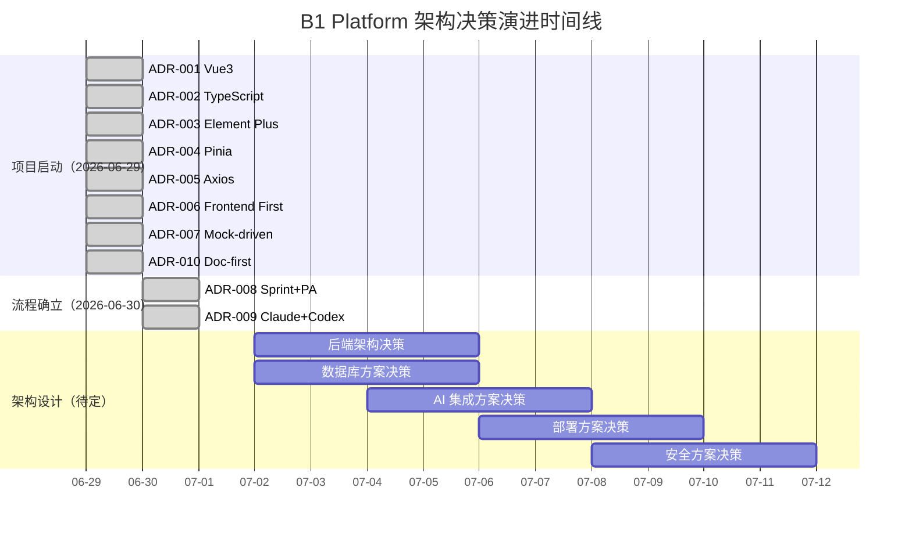

# 架构决策记录（ADR）

> **项目名称：** 基于大模型的软件实训教学检查评价与报表系统（B1 Platform）
> **受众：** 开发团队 / 未来维护者 / 竞赛评委
> **语言：** 中文
> **版本：** v1.0

---

## 1. 目的

### 为什么架构决策必须被记录

软件架构是项目中最难逆转的部分。一个架构决策的影响可能贯穿整个项目生命周期——从开发效率、代码可维护性，到部署运维成本。当团队成员更替、项目交接或数月后回溯"当初为什么这样设计"时，若无记录，决策背后的上下文将永久丢失。

ADR（Architecture Decision Record）正是为解决这一问题而存在的轻量级工程文档。

### ADR 与技术文档的区别

| 维度 | ADR | 技术文档 |
|------|-----|---------|
| **回答的问题** | "为什么选择了 A 而不是 B" | "A 是什么、怎么用" |
| **时间属性** | 记录某个时间点的决策快照 | 随代码持续更新 |
| **内容** | 上下文、备选方案、权衡、后果 | 架构描述、API 参考、使用指南 |
| **不可变性** | 一经 Accepted 不可修改 | 持续迭代演进 |
| **典型读者** | 需要理解设计意图的开发者 | 需要实现功能的开发者 |

### ADR 与 PRD 的区别

| 维度 | ADR | PRD |
|------|-----|-----|
| **关注点** | 技术"怎么做" | 产品"做什么" |
| **受众** | 工程团队 | 产品经理 + 工程团队 |
| **驱动力** | 技术约束、非功能需求 | 用户需求、业务目标 |
| **典型问题** | Vue3 vs React、Pinia vs Vuex | 用户角色、功能模块、交互流程 |

> PRD 定义"我们要建什么"，ADR 记录"我们为什么用这种方式建"。

---

## 2. ADR 撰写规范

每一条架构决策记录必须包含以下字段：

| 字段 | 必填 | 说明 |
|------|------|------|
| **ADR ID** | ✅ | 唯一编号，格式 `ADR-XXX`（三位数字） |
| **标题** | ✅ | 决策的简洁概括 |
| **日期** | ✅ | 决策日期（YYYY-MM-DD） |
| **状态** | ✅ | Proposed / Accepted / Deprecated / Superseded / Rejected |
| **决策者** | ✅ | 做出最终决定的人或角色 |
| **上下文** | ✅ | 面临的技术问题、约束条件、业务需求 |
| **决策** | ✅ | 明确的决策陈述（"我们将使用 X"） |
| **备选方案** | ✅ | 至少列出 1-2 个被考虑但未采纳的方案 |
| **权衡** | ✅ | 采纳方案的优势与代价 |
| **后果** | ✅ | 该决策带来的正面影响和潜在风险 |
| **参考资料** | — | 支撑决策的文档链接、讨论记录 |

---

## 3. 当前已批准决策

---

### ADR-001：前端框架选择 —— Vue 3

- **日期：** 2026-06-29
- **状态：** Accepted
- **决策者：** 技术负责人

#### 上下文

项目定位为企业级 SaaS 智慧教育平台，需支持三个角色（学生 / 教师 / 管理员）的后台管理界面。前端需快速交付 MVP 用于软件杯竞赛评审，同时保证代码质量满足长期维护需求。团队对 React 和 Vue 均有经验。

#### 决策

**采用 Vue 3（Composition API）作为前端框架。**

#### 备选方案

| 方案 | 未采纳原因 |
|------|-----------|
| React 18 | 学习曲线较陡（Hooks 心智模型、闭包陷阱）；生态碎片化（状态管理、路由需额外选型）；对中小团队不够友好 |
| Angular | 过于笨重，不适合竞赛场景的快速迭代；模板语法学习成本高 |
| Svelte | 生态不成熟，UI 组件库选择有限，不适合企业级项目 |

#### 权衡

| 优势 | 代价 |
|------|------|
| `.vue` 单文件组件天然分离模板/逻辑/样式，降低新人上手门槛 | 大型应用中 TSX 灵活性不如 React |
| Composition API 提供比 React Hooks 更直观的逻辑复用 | 第三方库生态规模略小于 React |
| 官方生态完善（Vue Router、Pinia、Vite）无需额外选型 | |
| Element Plus 提供企业级中文 UI 组件库 | |
| uni-app 跨端能力为未来移动端扩展保留可能性 | |

#### 后果

- ✅ 团队可快速产出高质量页面原型
- ✅ 官方工具链降低配置和维护成本
- ⚠️ 若未来需要 React Native 等 React 生态能力，需承担迁移成本

#### 参考资料

- `rules/FRONTEND-SPEC-GUIDE.md`
- [Vue 3 官方文档](https://cn.vuejs.org/)

---

### ADR-002：类型系统选择 —— TypeScript

- **日期：** 2026-06-29
- **状态：** Accepted
- **决策者：** 技术负责人

#### 上下文

项目涉及多角色权限控制、复杂表单校验、Mock 数据结构定义和 API 类型推导。随着功能增长，纯 JavaScript 的维护成本将指数级上升。竞赛评委也会关注代码工程质量。

#### 决策

**所有前端代码使用 TypeScript 编写，启用 strict 模式。**

#### 备选方案

| 方案 | 未采纳原因 |
|------|-----------|
| JavaScript + JSDoc | 类型提示弱，无法在编译期拦截类型错误，重构风险高 |
| Flow | 社区萎缩，Vue 生态无官方支持 |

#### 权衡

| 优势 | 代价 |
|------|------|
| 编译期类型检查，减少运行时 Bug | 初期编写类型定义增加开发时间约 15-20% |
| IDE 智能提示大幅提升开发体验 | 团队成员需掌握 TypeScript 进阶类型 |
| 接口类型可直接复用为前后端契约 | |
| 重构安全性和代码可读性显著提升 | |

#### 后果

- ✅ Mock API 类型定义可与后端接口类型保持一致
- ✅ Sprint Spec 中定义的 Props/Emits 类型可直接翻译为代码
- ⚠️ 需在 Sprint 1 中预留 TypeScript 学习时间

#### 参考资料

- `rules/FRONTEND-SPEC-GUIDE.md`（TypeScript 规范章节）

---

### ADR-003：UI 组件库选择 —— Element Plus

- **日期：** 2026-06-29
- **状态：** Accepted
- **决策者：** 技术负责人

#### 上下文

项目需要大量后台管理类组件：表格、表单、对话框、日期选择器、文件上传、树形控件等。自研全部组件不现实（时间约束），必须选择成熟的第三方组件库。项目面向中文用户。

#### 决策

**采用 Element Plus 作为主 UI 组件库。**

#### 备选方案

| 方案 | 未采纳原因 |
|------|-----------|
| Ant Design Vue | 设计风格偏国际，中文文档质量不如 Element；竞赛场景下 Element 更"眼熟" |
| Naive UI | 社区规模较小，企业级场景验证不足 |
| Vuetify | Material Design 风格与中国高校后台审美不匹配 |
| 自研组件库 | 人力成本不可接受，偏离核心业务交付 |

#### 权衡

| 优势 | 代价 |
|------|------|
| Vue 3 + TypeScript 原生支持 | 组件定制化受限于库的设计，深度定制需覆盖样式 |
| 丰富的中文文档和社区生态 | 包体积较大（需按需引入） |
| Table / Form / Dialog 等复杂组件开箱即用 | |
| 中文企业级产品中广泛验证，评委认可度高 | |

#### 后果

- ✅ 表单、表格类页面可快速搭建
- ✅ 内置 i18n 支持为未来国际化预留空间
- ⚠️ 需在 Vite 中配置 `unplugin-vue-components` 实现按需引入

#### 参考资料

- `rules/DESIGN-SYSTEM-GUIDE.md`
- `rules/COMPONENT-LIBRARY-GUIDE.md`

---

### ADR-004：状态管理选择 —— Pinia

- **日期：** 2026-06-29
- **状态：** Accepted
- **决策者：** 技术负责人

#### 上下文

项目需管理多角色登录态、全局配置、页面间共享数据（如当前课程、实训任务状态）。需要一个类型安全、与 Vue 3 深度集成的状态管理方案。

#### 决策

**采用 Pinia 作为全局状态管理库。**

#### 备选方案

| 方案 | 未采纳原因 |
|------|-----------|
| Vuex 4 | Vue 官方已推荐 Pinia 作为默认方案；Vuex 的 mutations 概念冗余，TypeScript 支持差 |
| 纯 Composition API（provide/inject） | 缺乏 DevTools 调试支持，跨模块共享状态困难 |
| 自研 EventBus | 不类型安全，难以追踪数据流 |

#### 权衡

| 优势 | 代价 |
|------|------|
| Vue 官方推荐，与 Vue DevTools 深度集成 | 需团队成员学习 Store 组织模式 |
| 完整 TypeScript 支持，类型推导无需额外配置 | |
| API 简洁（无 mutations），模块化天然支持 | |
| 体积小（约 1KB），对首屏影响可忽略 | |

#### 后果

- ✅ 按角色拆分 Store（`useStudentStore` / `useTeacherStore` / `useAdminStore`）清晰隔离业务逻辑
- ✅ DevTools 时间旅行调试便于排查状态 Bug
- ✅ 与 Vue Router 配合可实现路由级状态守卫

---

### ADR-005：HTTP 客户端选择 —— Axios

- **日期：** 2026-06-29
- **状态：** Accepted
- **决策者：** 技术负责人

#### 上下文

前端需要与后端 RESTful API 及 Mock 服务通信，需要统一的请求拦截（Token 注入）、响应拦截（统一错误处理）、请求取消等能力。

#### 决策

**采用 Axios 作为 HTTP 客户端，封装统一的请求实例。**

#### 备选方案

| 方案 | 未采纳原因 |
|------|-----------|
| Fetch API | 缺少请求/响应拦截器，需大量自行封装；不支持请求超时设置（需 AbortController）；错误处理不直观（404/500 不 reject） |
| TanStack Query (Vue Query) | 定位为服务端状态缓存库而非 HTTP 客户端，可与 Axios 叠加使用但不替代 |

#### 权衡

| 优势 | 代价 |
|------|------|
| 拦截器机制天然适合 Token 注入和统一错误处理 | 额外的包体积（约 14KB gzipped） |
| 广泛使用，团队无需额外学习 | |
| 与 Mock.js 可无缝配合（通过 adapter 或 baseURL 切换） | |

#### 后果

- ✅ 单例 Axios 实例统一管理 baseURL、timeout、headers
- ✅ Mock 模式只需切换 `baseURL` 即可切换数据源
- ✅ 拦截器中可统一处理 401 跳转登录页

---

### ADR-006：MVP 交付策略 —— 前端优先

- **日期：** 2026-06-29
- **状态：** Accepted
- **决策者：** 项目负责人

#### 上下文

软件杯竞赛评审侧重于 UI 展示、交互体验和产品完整度。在 8 周的项目周期内，前后端并行开发会因接口协商和联调产生大量等待时间。需要确保在评审截止前交付外观完整、交互流畅的系统。

#### 决策

**MVP 阶段采用"前端优先（Frontend First）"策略：前端先完成全部页面和交互，后端接口用 Mock 数据模拟。**

#### 备选方案

| 方案 | 未采纳原因 |
|------|-----------|
| 前后端并行开发 | 接口定义需前置协商，联调阶段阻塞严重，竞赛周期内风险高 |
| 后端优先 | 竞赛评委无法直接体验后端 API，前端未完成则产品"看不见" |

#### 权衡

| 优势 | 代价 |
|------|------|
| 前端可独立全速推进，不受后端进度制约 | Mock 数据与真实接口可能存在差异，后期联调需修正 |
| 评审时可展示完整产品形态 | 部分复杂交互（如文件上传）Mock 模拟有限 |
| UI/UX 问题可早期发现并迭代 | |

#### 后果

- ✅ 每个 Sprint 产出可演示的前端页面
- ✅ 评审前确保产品"看起来完整"
- ⚠️ 后端集成阶段需集中处理 Mock → 真实接口的切换
- ⚠️ 需在 Sprint Spec 中严格定义 Mock 数据结构，缩小与真实 API 的差异

#### 参考资料

- `rules/FIP-GUIDE.md`

---

### ADR-007：开发模式 —— Mock 驱动开发

- **日期：** 2026-06-29
- **状态：** Accepted
- **决策者：** 技术负责人

#### 上下文

承接 ADR-006（前端优先），需要一个系统化的方案来模拟后端 API，使得前端在无后端的情况下可完整运行和演示。Mock 数据不仅是占位符，而是 Sprint Spec 中定义的类型契约。

#### 决策

**采用 Mock.js 作为 Mock 数据生成引擎，在 Vite 开发服务器中通过中间件拦截 API 请求。**

#### 备选方案

| 方案 | 未采纳原因 |
|------|-----------|
| JSON Server | 需单独启动服务，增加开发环境复杂度；缺乏随机数据生成能力 |
| MSW (Mock Service Worker) | 功能强大但引入 Service Worker 概念，团队学习成本高 |
| 硬编码 JSON 文件 | 数据单一无法模拟多种场景，边界条件测试困难 |
| Apifox / Swagger Mock | 需额外平台依赖，离线开发不便 |

#### 权衡

| 优势 | 代价 |
|------|------|
| Mock.js 可生成随机中文数据，接近真实场景 | Mock 规则语法需团队学习 |
| Vite 中间件模式无需额外进程 | 无法模拟 WebSocket（项目当前无此需求） |
| 通过 `baseURL` 一键切换真实/Mock 模式 | |
| Sprint Spec 定义的类型即 Mock 模板 | |

#### 后果

- ✅ Mock API 规范文档化（`rules/API-MOCK-SPEC-GUIDE.md`）
- ✅ 每个 Sprint 交付时可做完整功能演示
- ⚠️ 后端集成时需逐接口验证 Mock 数据与真实 API 的一致性

#### 参考资料

- `rules/API-MOCK-SPEC-GUIDE.md`

---

### ADR-008：开发流程 —— Sprint + Page Analysis 工作流

- **日期：** 2026-06-30
- **状态：** Accepted
- **决策者：** 技术负责人

#### 上下文

项目由 Claude（规划层）与 Codex（执行层）的 AI 协作模式驱动。传统开发流程中"需求 → 设计稿 → 代码"的链路在 AI 协作中存在信息衰减：规划层输出的 Sprint Plan 过于宏观，执行层需要大量"猜测"才能写出代码。需要一个中间层文档来消除歧义。

#### 决策

**采用四层工业级流程：FIP → Sprint Spec → Page Analysis → Vue3 代码。**

```
LAYER 1: FIP v1.0           ← Why & What（规划层）
LAYER 2: Sprint Spec        ← How（执行契约）
LAYER 3: Page Analysis      ← 页面设计蓝图（人审门禁）
LAYER 4: Vue3 Code          ← Do（执行层）
```

#### 备选方案

| 方案 | 未采纳原因 |
|------|-----------|
| PRD → 直接编码 | AI 执行层输出不可控，代码质量参差不齐 |
| FIP → 直接编码 | Sprint Spec 不够细，AI 猜测空间大 |
| 传统敏捷（User Story → 编码） | 无法充分利用 AI 协作优势 |

#### 权衡

| 优势 | 代价 |
|------|------|
| 每一层的输出是下一层的精确输入，消除歧义 | 增加了 Page Analysis 这一层的文档工作量 |
| Page Analysis 定义到 Props/Emits/States 级别，AI 可 1:1 翻译为代码 | 初期建立规范需额外时间 |
| 人工审批节点（Page Analysis 门禁）保证质量 | |
| 换一个 Coding Agent 也能产出一致代码 | |

#### 后果

- ✅ Sprint 1 已按此流程产出完整交付物
- ✅ 代码风格和组件结构高度一致
- ⚠️ 对 Sprint 周期较短的简单页面，Page Analysis 可能显得"过度设计"

#### 参考资料

- `rules/SPRINT-SPEC-GUIDE.md`
- `rules/PAGE-ANALYSIS-GUIDE.md`

---

### ADR-009：AI 协作模式 —— Claude + Codex 双引擎

- **日期：** 2026-06-30
- **状态：** Accepted
- **决策者：** 项目负责人

#### 上下文

项目需要在 8 周竞赛周期内完成通常需要 3-4 人月的前端工作量。传统"开发者手写代码"模式效率不足以满足时间约束。需要利用 AI 工具加速，但同时要保证代码质量和一致性。

#### 决策

**采用 Claude（规划层）+ Codex（执行层）的双引擎协作模式。**

Claude 负责：
- 需求分析与 PRD 重构
- 设计系统和组件库定义
- Sprint Spec 和 Page Analysis 生成

Codex 负责：
- 根据 Page Analysis 1:1 翻译为 Vue3 代码
- Mock 数据和 API 层实现
- 代码审查和 Bug 修复

#### 备选方案

| 方案 | 未采纳原因 |
|------|-----------|
| 纯手工开发 | 时间不可行，8 周无法完成全部 20+ 页面 |
| 纯 AI（单一 Agent）开发 | 缺乏规划/执行分层，代码一致性差 |
| GitHub Copilot 辅助 | 辅助能力强但无法承担完整开发任务 |

#### 权衡

| 优势 | 代价 |
|------|------|
| 规划层专注"想清楚"，执行层专注"写对" | 需建立两套 Agent 的规范文档体系（初期投入大） |
| Page Analysis 作为中间契约保证两端对齐 | Claude 与 Codex 的上下文传递依赖文档质量 |
| 大幅缩短开发周期 | 复杂交互（拖拽、富文本）AI 执行质量不稳定 |

#### 后果

- ✅ Sprint 1 已完成且质量达标
- ✅ 建立了完整的双引擎协作规范体系
- ⚠️ 复杂业务逻辑页面仍需人工介入微调
- ⚠️ 两个 Agent 的提示词体系需持续维护更新

#### 参考资料

- `CLAUDE.md`
- `.codex/init.md`
- `.codex/rules.md`

---

### ADR-010：工程方法论 —— 文档优先开发

- **日期：** 2026-06-29
- **状态：** Accepted
- **决策者：** 项目负责人

#### 上下文

软件杯竞赛评审不仅考察产品功能，还重点考察工程文档质量。此外，ADR-009（AI 双引擎）模式下，AI 间协作的精度直接取决于文档的完整性和准确性。文档不是"开发完之后补的"，而是"开发之前就要有的"。

#### 决策

**采用"文档优先（Documentation-first Development）"方法论：在任何代码编写之前，先完成对应的规范文档。**

文档编写顺序：

```
PRD → SDS → Design System → Component Library
    → Frontend Spec → FIP → Sprint Spec → Page Analysis → 代码
```

#### 备选方案

| 方案 | 未采纳原因 |
|------|-----------|
| 代码优先（先写后补文档） | 文档滞后于代码，容易过时且质量低；评审时突击补文档不可靠 |
| 并行（代码与文档同时） | AI 执行层缺少精确输入，产出质量不可控 |

#### 权衡

| 优势 | 代价 |
|------|------|
| 每个规范文档都是后续步骤的精确输入 | 项目前 3-4 天无可见代码产出 |
| AI 执行层有据可依，代码一致性高 | 文档撰写需要较强的抽象和表达能力 |
| 竞赛文档得分有保障 | |
| 未来维护者可通过文档体系快速理解项目 | |

#### 后果

- ✅ 目前已完成 10 份规范文档（`rules/` 目录）
- ✅ 与 ADR-008、ADR-009 形成完整的工程方法论闭环
- ⚠️ 文档维护本身成为一项持续性工作

#### 参考资料

- `rules/PRD-RESTRUCTURE.md`
- `rules/SDS-GUIDE.md`
- `rules/DESIGN-SYSTEM-GUIDE.md`

---

## 4. 未来 ADR 模板

```markdown
### ADR-XXX：决策标题

- **日期：** YYYY-MM-DD
- **状态：** Proposed
- **决策者：** [姓名/角色]

#### 上下文

[描述面临的技术问题、约束条件和业务需求。回答：当前处于什么情境下，为什么需要做出选择？]

#### 决策

[明确的决策陈述。使用"我们将采用 X 方案"的句式，一句话说清决定。]

#### 备选方案

| 方案 | 未采纳原因 |
|------|-----------|
| 方案 A | [为什么不行] |
| 方案 B | [为什么不行] |

#### 权衡

| 优势 | 代价 |
|------|------|
| [采纳方案的好处 1] | [采纳方案的代价 1] |
| [采纳方案的好处 2] | [采纳方案的代价 2] |

#### 后果

- ✅ [正面影响 1]
- ⚠️ [潜在风险 1]
- ⚠️ [潜在风险 2]

#### 参考资料

- [相关文档路径或链接]
```

---

## 5. 决策维护规则

### 何时创建新的 ADR

满足以下任一条件时，必须创建 ADR：

1. **技术选型：** 引入新的第三方库、框架或工具
2. **架构变更：** 修改系统分层、模块划分、通信模式
3. **范式变更：** 改变开发模式、测试策略、部署方式
4. **跨模块影响：** 决策影响 2 个以上模块
5. **不可逆决策：** 一旦实施后回滚成本高的选择
6. **争议决策：** 团队对方案存在分歧，需文档化讨论过程

### ADR 状态流转

```
Proposed ──→ Accepted ──→ Deprecated
    │            │
    └──→ Rejected│
                 │
            Superseded
```

| 状态 | 含义 | 变更条件 |
|------|------|---------|
| **Proposed** | 已提出，等待讨论和审批 | 初始状态 |
| **Accepted** | 已批准，正在执行 | 团队达成共识，Tech Lead 批准 |
| **Deprecated** | 已废弃，不再适用 | 决策对应的技术/场景已不存在 |
| **Superseded** | 被新的 ADR 取代 | 新 ADR 引用本 ADR，说明为何替代 |
| **Rejected** | 已否决，不执行 | 讨论结论为不采纳 |

> **重要规则：** ADR 一旦标记为 Accepted，不可修改正文。如需改变决策，必须新建 ADR 并将旧 ADR 标记为 Superseded，在 Consequences 中引用新旧关系。

### 审核流程

1. 开发者草拟 ADR（状态：Proposed），提交 PR
2. Tech Lead 组织讨论，评估备选方案和权衡
3. 达成共识后更新状态为 Accepted 并合并
4. 若未通过，更新状态为 Rejected 并归档原因

---

## 6. 决策演进时间线



### 决策集群概览

| 集群 | ADR 编号 | 主题 | 确立日期 |
|------|---------|------|---------|
| 🔧 **前端技术栈** | ADR-001 ~ ADR-005 | Vue3 / TS / Element Plus / Pinia / Axios | 2026-06-29 |
| 🚀 **交付策略** | ADR-006 ~ ADR-007 | 前端优先 + Mock 驱动 | 2026-06-29 |
| 🔄 **开发流程** | ADR-008 ~ ADR-009 | Sprint+PA 流程 + AI 双引擎 | 2026-06-30 |
| 📐 **工程哲学** | ADR-010 | 文档优先开发 | 2026-06-29 |
| 🔮 **待定** | ADR-011+ | 后端架构、数据库、AI 集成、部署、安全 | 2026-07-02+ |

> **注：** ADR-001 至 ADR-010 在同一天（2026-06-29）集中确立，反映了项目启动阶段对前端技术栈的快速收敛。后续 ADR 将随架构设计阶段逐步补充。

---

> **最后更新：** 2026-07-02 | **维护者：** B1 Platform 开发团队
